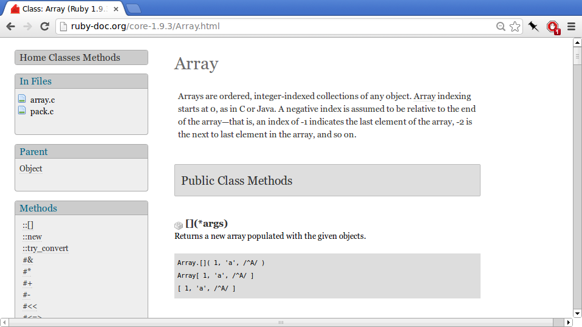

# Learning to Learn
{:.railsgirls}

by Arne Brasseur / [plexus](https://github.com/plexus)

---
{:.big}

## Anecdote

> "I learned MongoDB over the weekend"

---
{:.bigsections}

There will not always be a coach

There will always be more stuff to learn

Becoming confident in learning will be your most important skill

---
{:.heading}

# Words, so many words

---
{:.bigsections}

## Words, so many words

Programmers use many special words

It's like learning a new language

Luckily, the 80/20 rule applies

---
{:.bigsections}

These words make things seem more complex then they are

Most of this stuff is not rocket science

Find material that is at your level

Gradually build up your vocab

---
{:.bigsections}

## In a couple of words

**Rspec** is a popular unit testing framework

**Unit-tests** are automated tests to check if your program is correct

A **framework** is makes it easy to achieve a task by providing structure

---
{:.heading}

# Play, Feel, Experience

---
{:.bigsections}

## Play, Feel, Experience

Don't start out with dry theory

Try stuff out, play, become engaged

Be on the lookout for the moment where it's time to dig deeper

---
{:.big}

## Anecdote

> "Git got us in a mess"

---
{:.heading}

# Types of documentation

---
{:.bigsections}

## Tutorials

Great starting point

Just search for "... tutorial"

Make sure to challenge yourself

---
{:.bigsections}

## Screencasts

Very engaging

Look over the shoulder of experts

Well known examples : Railscasts, Peepcode, Ruby Tapas

---
{:.bigsections}

## Manuals

For when you really want to dig in to a subject

All the pros and cons of "technical documentation"

---
{:.bigsections}

## API documentation

Generated from the source code

Explains every class/method

Indispensable reference for day-to-day programming

---
{:.bigsections}

## Source Code

The ultimate documentation

Not very beginner friendly

But possible to find stuff for every level

Don't be afraid to read some code from time to time

---
{:.bigsections}

## Conclusion

Don't get discouraged!

Find what works for you

Have fun!
