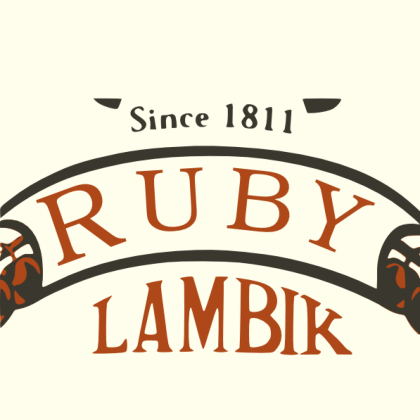
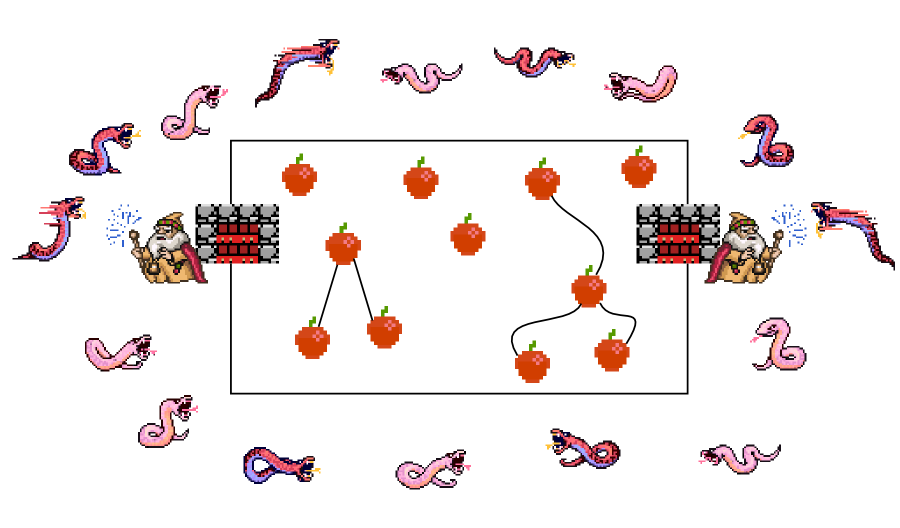
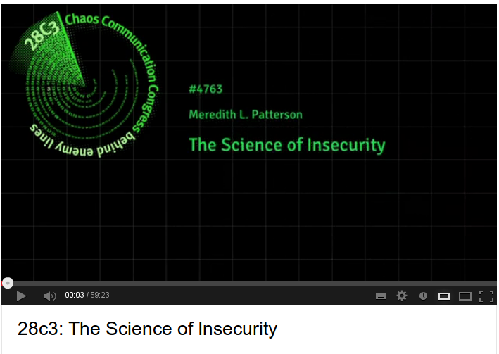
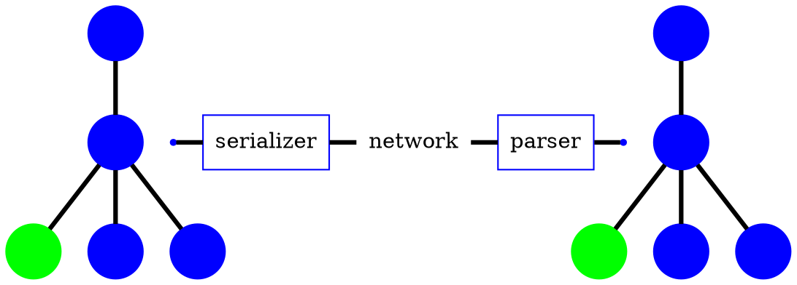
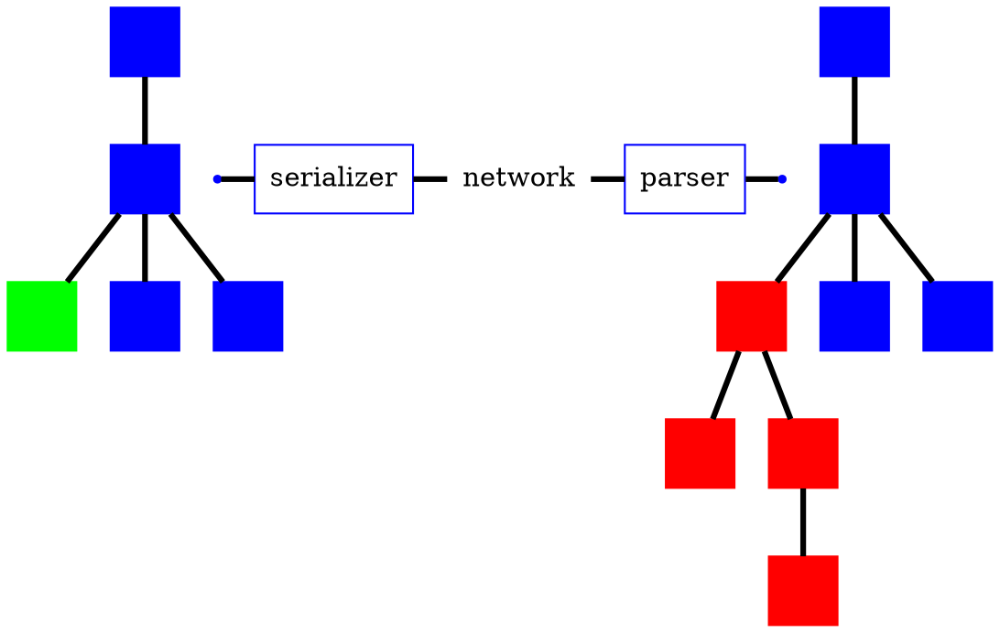

# Web Linguistics
{:.eurucamp}

## Towards Higher Fluency

by Arne Brasseur / [plexus](https://github.com/plexus)

---
{: .noborder .whoami}

### Who am I?

Arne Brasseur

Freelance Ruby Dev

Twitter / Github : @plexus

  

---
{:.heading}

# Stop using strings to handle structured data!

---
{:.big}

## Why do we do this anyway?

Plain text == Universal data type

It's **"Pragmatic"!**

---
{:.big}

## What's the alternative?

Input & output are **formal languages**

We have tools for those

---
{:.bigsections}

## Apples and Snakes

Keep the **snakes** out of the app

parse/generate at the app boundary

Inside the app, only **apples**

---
{:.noborder}



---

# #langsec

---


---

## WATCH THIS TALK!



---
{:.bigsections}

## Langsec

Stop ad-hoc recognition / validation / processing


Photoshopped by <a href="http://www.anevern.com">Kythera of Anevern</a>.
{:.aside}


Photoshopped by <a href="http://www.anevern.com">Kythera of Anevern</a>.
{:.aside}

---
{: .heading}

# XSS

## Cross site scripting

---
{:.big}

## XSS

The most common vulnerability

More common than buffer overflows

---
{:.bigheadings}

## Preventing XSS

"Classic" solution : `escape_html`

Rails 3 : SafeBuffer + `html_safe`

---
{:.big}

Whitelist > Blacklist

But : **We're still manually deciding what (not) to escape**

---
{:.big}

## The problem

What is a String?

* a piece of text
* a textual representation of HTML
* a piece of text that is HTML escaped

---
{:.big}

HTML is structured data,
let's treat it as such

---
{:.heading}

# Language

## langue, taal, sprache, 語言

---
{:.noborder}


---
{:.noborder}


---

````dot
graph platypus {
  node[shape=none color=blue fontname="Lato"]
  edge[dir=none color=black penwidth=3]

  s[label=sentence shape=none];
  subject[];
  action[];
  place[];
  verb[];
  object[];

  platypus[fontcolor=red shape=circle];
  carry[fontcolor=red shape=circle];
  chicken[fontcolor=red shape=circle];
  forest[fontcolor=red shape=circle];

  s -- subject
  subject -- platypus
  s -- action
  action -- verb
  action -- object
  verb -- carry
  object -- chicken
  s -- place
  place -- forest;
}
````

---

<span class="box">A platypus</span><span class="box">is carrying</span><span class="box">a chicken</span><span class="box">in the forest</span>

---


---
{:.big}

## Magic of language

Identical "tree" is shared between speakers

Because we speak the same language

---
{:.heading}

# XSS is a Failure at the Language Level

---



---



---
{:.heading}

# Abolish Your Templates, Burn Your Helpers

---
{:.big}

## So what if we ...

Create a HTML **data structure**
Serialize it **in one pass**
In **pure Ruby**

---
{:.bigsections}

## Benefits

HTML generation is no longer ad-hoc

Output is guaranteed well-formed

Output is strict (because browsers)

A new world of programming opportunities!

---
{:.heading}

# Hexp

---
{:.big}

An API for **generating**
and **manipulating**
**HTML** syntax trees

[http://github.com/plexus/hexp](http://github.com/plexus/hexp)

---
{:.big}

What **Rack** does for **HTTP**
**Hexp** does for **HTML**

---
{:.big}

Hexp objects are **immutable**
API **inspired by jQuery**

---

# Creating nodes

---

## Objects

```ruby
div = Hexp::Node.new(:div, class: 'strong')
```

---

## Builder syntax

```ruby
list = Hexp.build do
  ul do
   3.times do |i|
     li i.to_s
   end
  end
end
```

---

## S-expressions

```ruby
toc = H[:ol, {class: 'toc'}, [
    H[:li, 'Language Theory'],
    H[:li, 'XSS'],
    H[:li, 'Applications']
  ]
]
```

---
{:.big}

## Reusable 'Middleware'

* Lint / validate
* Populate forms
* Add admin links
* Inline CSS/JS/images

---
{:.big}

## Reusable Widgets

* Menus
* Breadcrumbs
* Forms

---

## Example Widget

```ruby
class BookWidget < Struct.new(:book, :tag)
  include Hexp

  def to_hexp
    H[tag, {class: 'book', id: "book-#{book.id}"}, [
        H[:h2, book.title],
        H[:img, src: book.image.url]
      ]
    ]
  end
end
```

---
{:.big}

## Modules

Great for CRM / e-commerce, or for modularizing your own app

---

## Example : discount module

```ruby
doc.replace('form.checkout') do |form|
  form.add_child(discount_field)
end

discount_field = H[:div, [
    H[:label, {for: 'discount'}, 'Discount code'],
    H[:input, {type: 'text', name: 'discount'}]
  ]
]

```

---

## Hexpress

[http://github.com/plexus/hexpress](http://github.com/plexus/hexpress)

* Converts Markdown to Hexp
* Contains a bunch of 'Middleware'
  * AddImpressJs
  * GraphvizDotToSVG
  * MakeSelfContained
* Powers this presentation

---
{:.center}

# Thank you!

* [github.com/plexus/hexp](http://github.com/plexus/hexp)
* [twitter.com/plexus](http://twitter.com/plexus)
* [arnebrasseur.net](http://arnebrasseur.net)

---
{:.center}

# References

---

## Blog posts

* [Safe String Theory for the web](http://acko.net/blog/safe-string-theory-for-the-web/) by Steven Wittens
* [Structurally Fixing Injection Bugs](http://www.more-magic.net/posts/structurally-fixing-injection-bugs.html) by Peter Bex
* [Working with HTML in Haskell](http://adit.io/posts/2012-04-14-working_with_HTML_in_haskell.html) by Aditya Bhargava
* [A type-based solution to the “strings problem”: a fitting end to XSS and SQL-injection holes?](http://blog.moertel.com/posts/2006-10-18-a-type-based-solution-to-the-strings-problem.html) by Tom Moertel
* [The Devil in Plain Text](http://devblog.arnebrasseur.net/2013-04-plain-text) by Arne Brasseur

---

## Books

* Speaking by Willem J.M. Levelt
* An Introduction to Formal Languages and Automata by Peter Linz

---

## Security

* [Langsec](http://langsec.org/)
* [The Science of Insecurity](http://www.youtube.com/watch?v=3kEfedtQVOY) by Meredith L. Patterson
* [XSS Filter Evasion Cheat Sheet](https://www.owasp.org/index.php/XSS_Filter_Evasion_Cheat_Sheet)

---

## Software

Ruby

* [Formless](https://github.com/Wardrop/Formless)
  Completely transparent, unobtrusive form populator for web applications and content scrapers
* [Loofah](https://github.com/flavorjones/loofah)
  HTML/XML manipulation and sanitization based on Nokogiri
* [Living Style Guide](https://github.com/hagenburger/livingstyleguide)

Common Lisp

* [CL-WHO](http://jandmworks.com/cl-who-ext.html)

---

## Software

Haskell

* [BlazeHtml](http://jaspervdj.be/blaze/tutorial.html)
* [Yesod framework](http://www.yesodweb.com/book/widgets)
* HXT

General

* [Showpiece](http://begriffs.github.io/showpiece/)
