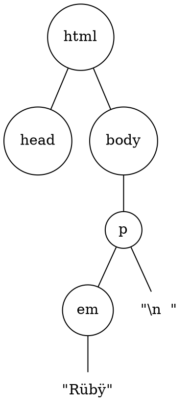
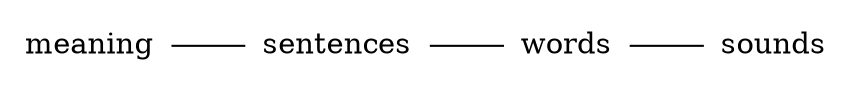

---
defaults:
  data-x: '+1000'
  data-y: '+0'
---

# Web Linguistics
## Towards Higher Fluency

by [@plexus](http://twitter.com/plexus)

---
## tl;dr (in Haiku)

For formal language

Avoid plain strings at all cost

Use data structures

````notes
I want to make this point up front, if nothing else, at least take this point with you.
````

---
# XSS
## Cross site scripting

```notes
This is where our story starts.
```

---

> [CVE-2013-1857] XSS Vulnerability<br/> in the `sanitize` helper of Ruby on Rails

&nbsp; &mdash; @tenderlove on rails-security-ann

<p></p>

> Given all the fun we've had with security issues

&nbsp; &mdash; Rails 4 beta announcement

```notes
It's been an interesting winter for Rails security issues, and hopefully security is still at the front of peoples minds.
```

---

## XSS

Code like this

```html
<div>#{ @post.body }</div>
```

&nbsp;
&nbsp;

Will lead to malicious injection

```html
<div>
  <script>evil code</script>
</div>
```

```notes
So what exactly is XSS? This is an example of a 'persisted' XSS attack. Anyone who can sneak HTML in our pages can do nasty stuff.

This gives an attacker all privileges the current user of your app has.
```

---
## Escape!

The common wisdom is to "escape" the inserted value

```html
<div>#{ html_escape(@post.body) }</div>
```

&nbsp;
&nbsp;

Now the code is harmless

```html
<div>
  &lt;script&gt;evil code&lt;/script&gt
</div>
```

```notes
So what to do? This is what you learn in Web security 101, make sure you HTML escape whatever you don't trust, and you'll be fine.
```

---
## XSS

Is a more common

vulnerability as

buffer overflows

```notes
So if it's that simple, why is it still that common?
```

---

Manual escaping? **hard**

Let's automate!

```html
# using HTML::SafeBuffer
<div><%= @post.body %></div>
```

And it **just works**

```notes
This is (at least in Ruby) the state of the art of XSS prevention, it's part of Rails 'secure by default' philosophy.
```

---

We've turned the problem around

Whitelist instead of blacklist

```ruby
def helper
  "<p> haikus are pretty <p>".html_safe
end
```

&nbsp;

**We're still manually deciding what (not) to escape**

```notes
It is a step forward, less strings will be left unescaped, but you can hardly call this a structural solution.
```

---
# SQLi
## The mother of all injection attacks

```notes
XSS is just one type of injection attack, another one, SQL injection, has been with us for even longer. It seems we are better at preventing this one, why is that?
```

---
## ActiveRecord 3 / Arel

```ruby
@users = User.where(name: params[:query])

# => #<ActiveRecord::Relation>
```

&nbsp;

See also [Sequel](https://github.com/jeremyevans/sequel)

```ruby
posts.where(stamp:
  (Date.today - 14)..(Date.today - 7))

# WHERE stamp >= '2010-06-30'
# AND stamp <= '2010-07-07'
```


```notes
How is this different? At the surface this may seem not much different from the SafeBuffer approach, but the difference runs much deeper. But to really understand what's going on here, we need to say a few words about languages.
```

---

# Language
## langue, taal, sprache, 語言

---
## Language

An **alphabet** to

construct **words** and **sentences**

that convey **meaning**


````notes
This is true of both natural and formal languages. Let's go through this from bottom to top.

In CS there is usually more emphasis on the understanding (parsing) of languages, but here I want to go what it takes to generate language. Hence we'll start from meaning (an idea) and see how we get to spoken/written language.
````

---
## Meaning

&ldquo; Lisa writes good code. &rdquo;

````notes
Suppose I want to convey this message. Before I can say this, or even have the words in my mind, I need to have this as an idea in my mind.
````

---
= data-x="+0" data-y="+400"

````dot
graph lisa {
  LISA[shape="none"  weight=11];
  WRITE[shape="none"];
  GOOD[shape="none"];
  CODE[shape="none"];
  s[shape="circle" weight=10];
  p[shape="circle" weight=10];
  m[shape="circle"];
  s -- LISA
  s -- p
  p -- WRITE
  p -- m
  m -- GOOD;
  m -- CODE;
}
````

````notes
At this point we have identified the components that make up our message, and have determined how they relate to each other. Now we can go on and serialize this message.
````

---
= data-x="+0" data-y="+400"

<span class="box">LISA</span>
<span class="box">WRITE</span>
<span class="box">GOOD</span>
<span class="box">CODE</span>

````notes
Now we can turn this tree into a linear list of words, ready to be uttered.
````

---
= data-x="+0" data-y="+400"


````notes
And turn these words into sounds.
````


---


# Ruby

 &nbsp; | &nbsp;
--- | ---
<strong>alphabet</strong> | character set (UTF-8)
<strong>words</strong> | keywords, var names, symbols, ...
<strong>sentences</strong> | expressions
<strong>meaning</strong> | what it does

---

# HTML

 &nbsp; | &nbsp;
--- | ---
<strong>alphabet</strong> | character set (UTF-8)
<strong>words</strong> | tags, attr names, symbols, ...
<strong>sentences</strong> | DOM tree
<strong>meaning</strong> | How it is rendered

----

## Levels of interpretation

* Characters
* Tokens
* Syntax tree
* Semantics

----
= data-x="+0" data-y="+400"

## Bytes

```ruby
[ "R", "\xC3", "\xBC", "b", "\xC3", "\xBF" ]
````

----
= data-x="+0" data-y="+400"

## Characters

```ruby
[ "R", "ü", "b", "ÿ" ]
````

----
= data-x="+0" data-y="+400"

## Tokens

```ruby
["<p>", "\n  ", "<em>", "Rübÿ", "</em>", "</p>"]
````

----
= data-x="+0" data-y="+400"



---
## Semantics

* What does it mean
* What does it do

````
<p>
  <strong>Rübÿ</strong>
  needs more
  <abbr title="Heavy Metal Umlauts">HMÜ</abbr>
</p>
````

<p>
  <strong>Rübÿ</strong>
  needs more
  <abbr title="Heavy Metal Umlauts">HMÜ</abbr>
</p>

---

The closest we get to representing semantics

is through syntax trees

and yet we are dealing with HTML at the character level

---

## Security

* XSS, SQLi
* Common wisdom : proper escaping

---

## The problem

````ruby
<p>#{@text}</p>"
````

---

## We think we're doing this

Add a single text node inside the paragraph

````dot
graph para {
  p[shape="circle"];
  text[label="\"text\"" shape="box"];

  p -- text;
}
````

---

## Instead we're doing this

Add an arbitrary subtree in our HTML

````dot
graph para {
  p[shape="circle"];
  script[shape="circle"];
  evil_code[label="evil_code();" shape="box"];
  p -- script;
  script -- evil_code;
}
````

---

## The problem

Semantics of string are twofold

* a string
* a textual representation of HTML

---


What side of the escape are we on?

````html
&amp;amp;amp;amp;amp;amp;amp;amp;amp;amp;gt;
&amp;amp;amp;amp;amp;amp;amp;amp;amp;amp;lt;
&amp;amp;amp;amp;amp;amp;amp;amp;amp;amp;quot;
&amp;amp;amp;amp;amp;amp;amp;amp;amp;amp;amp;
&amp;amp;amp;amp;amp;amp;amp;amp;amp;amp;gt;
````

---

## Rails Templates
### Pidgin vs Creole

````erb
<ul class="nav">
  <% unless @cart.empty? %>
    <li>
      <%= link_to raw(
            "<p class='icon-cart'>Cart</p>"
          ), cart_path %>
    </li>
  <% end -%>
</ul>
````

---

## Pidgin

* Ad-hoc mix of two languages
* No fixed rules or grammar
* No native speakers

---

### Creole

* Second generation
* One language begins to dominate
* Proper grammar emerges

---

## In Summary

Manually escaping is hard

Generating correct HTML is hard

Strings are very low level when reasoning<br />
about application semantics

---

## Try something different

* Plain text coming in?
* => parse to data structure
* Plain text going out?
* => Generate from data structure

---

## Inside the application
### No more strings

---

## Fringe Benefits

MOAR POWER

---

````ruby
class Nav
  def initialize(cart)
    @cart=cart
  end

  def to_dom
    [:ul, [
        home_link,
        cart_link
      ].compact
    ]
  end

  def cart_link
    unless @cart.empty?
      [:li, {class: 'cart-icon'}, link_to('Cart', cart_path)]
    end
  end
end
````

---

````ruby
class MyController
  def index
    page = SignupPage.new
    if request.post?
      page = page.rewrite(PopulateFormFields.new(params))
    end
    render Layout.new(page)
  end
end
````

---
# scratch


