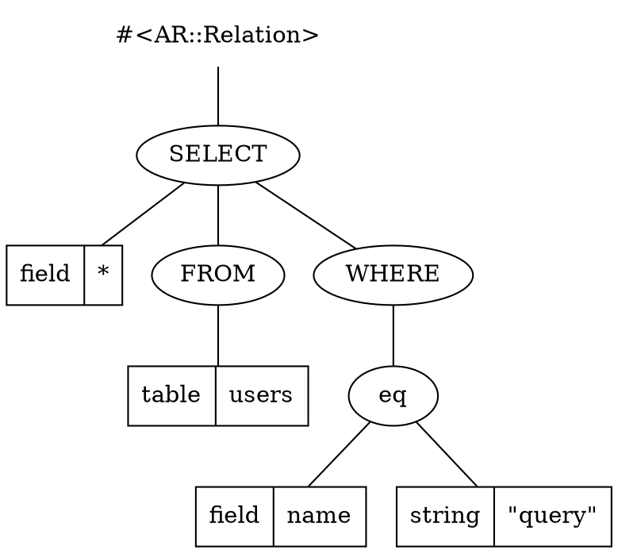
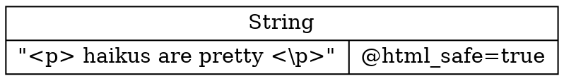
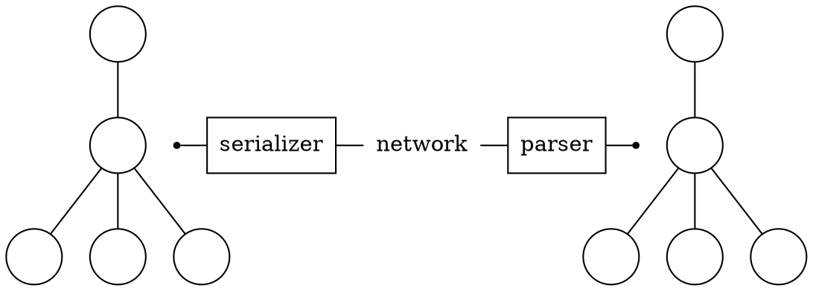

# Web Linguistics
## Towards Higher Fluency

by Arne Brasseur / [@plexus](http://twitter.com/plexus)

---
= class='haiku'

## tl;dr (in Haiku)

For formal language

Avoid plain strings at all cost

Use data structures

````notes
- make this point up front
- talk in 3 parts : What do I mean? Why do I say this? How do we that?
````

---

# Language
## langue, taal, sprache, 語言

---
= class='center'


---
= class='center'


<!-- --- -->

<!-- = class='haiku' -->

<!-- ## Language -->

<!-- An **alphabet** to -->

<!-- construct **words** and **sentences** -->

<!-- that convey **meaning** -->


<!-- ````notes -->
<!-- This is true of both natural and formal languages. Let's go through this from bottom to top. -->

<!-- In CS there is usually more emphasis on the understanding (parsing) of languages, but here I want to go what it takes to generate language. Hence we'll start from meaning (an idea) and see how we get to spoken/written language. -->
<!-- ```` -->

---
## Meaning

&ldquo; Lisa writes good code. &rdquo;

````notes
Suppose I want to convey this message. Before I can say this, or even have the words in my mind, I need to have this as an idea in my mind.
````

---
= data-x="+0" data-y="+400"

````dot
graph lisa {
  LISA[shape="none"  weight=11];
  WRITE[shape="none"];
  GOOD[shape="none"];
  CODE[shape="none"];
  s[shape="circle" weight=10];
  p[shape="circle" weight=10];
  m[shape="circle"];
  s -- LISA
  s -- p
  p -- WRITE
  p -- m
  m -- GOOD;
  m -- CODE;
}
````

````notes
At this point we have identified the components that make up our message, and have determined how they relate to each other. Now we can go on and serialize this message.
````

---
= data-x="+0" data-y="+400"

<span class="box">LISA</span>
<span class="box">WRITES</span>
<span class="box">GOOD</span>
<span class="box">CODE</span>

````notes
Now we can turn this tree into a linear list of words, ready to be uttered.
````

---
= data-x="+0" data-y="+400"


````notes
And turn these words into sounds.
````

---
= data-scale="2" data-y="-600" data-x="+0"

---

# Use vs mention

"Pentasyllabic" is pentasyllabic.

---

# Why ?

---

## Security

---

# XSS
## Cross site scripting

---

> [CVE-2013-1857] XSS Vulnerability<br/> in the `sanitize` helper of Ruby on Rails

&nbsp; &mdash; @tenderlove on rails-security-ann

<p></p>

> Given all the fun we've had with security issues

&nbsp; &mdash; Rails 4 beta announcement

```notes
It's been an interesting winter for Rails security issues, and hopefully security is still at the front of peoples minds.
```

---

## XSS

TODO make this more concrete ; find real life example

Code like this

```ruby
"<div>#{ @post.body }</div>"
```

&nbsp;
&nbsp;

Will lead to malicious injection

```html
<div>
  <script>evil code</script>
</div>
```

```notes
So what exactly is XSS? This is an example of a 'persisted' XSS attack. Anyone who can sneak HTML in our pages can do nasty stuff.

This gives an attacker all privileges the current user of your app has.
```

---
## Escape!

The common wisdom is to "escape" the inserted value

```html
<div>#{ html_escape(@post.body) }</div>
```

&nbsp;
&nbsp;

Now the code is harmless

```html
<div>
  &lt;script&gt;evil code&lt;/script&gt
</div>
```

```notes
So what to do? This is what you learn in Web security 101, make sure you HTML escape whatever you don't trust, and you'll be fine.
```

---
= class='haiku'

## XSS

Is a more common

vulnerability than

buffer overflows

```notes
So if it's that simple, why is it still that common?
```

---

What side of the escape are we on?


Steps to reproduce

```ruby
escape_html(
  escape_html(
    'ó'.force_encoding('ISO-8859-1')
       .encode('UTF-8')
       .sub('Ã', '&atilde;')
       .sub('³','&sup3;')))
```


```notes
This is a real life shipping label. This may seem silly but it happens all the time, we either escape too much or too little.

I actually noticed this myself although less extreme, when sending a parcel to a friend I wanted to add a middle name between quotes, these ended up on the parcel as HTML entity.
```

---

TODO this also need to be more clear, why is it hard? it's hard because it's not automated. We need to make it "physically" impossible for the programmer to get this wrong.

Manual escaping? **hard**

Let's automate!

```html
# using HTML::SafeBuffer
<div><%= @post.body %></div>
```

And it **just works**

```notes
This is (at least in Ruby) the state of the art of XSS prevention, it's part of Rails 'secure by default' philosophy.
```

---

We've turned the problem around

Whitelist instead of blacklist

```ruby
def helper
  "<p> haikus are pretty <p>".html_safe
end
```

&nbsp;

**We're still manually deciding what (not) to escape**

```notes
This is better because whitelist > blacklist. It is a step forward, less strings will be left unescaped, but you can hardly call this a structural solution.
```

---

## The problem

Semantics of string are twofold

* a string
* a textual representation of HTML


---

# SQLi
## The mother of all injection attacks

```notes
XSS is just one type of injection attack, another one, SQL injection, has been with us for even longer. It seems we are better at preventing this one, why is that?
```

---
## ActiveRecord 3 / Arel

```ruby
@users = User.where(name: params[:query])

# => #<ActiveRecord::Relation>
```

&nbsp;

See also [Sequel](https://github.com/jeremyevans/sequel)

```ruby
posts.where(stamp:
  (Date.today - 14)..(Date.today - 7))

# WHERE stamp >= '2010-06-30'
# AND stamp <= '2010-07-07'
```


```notes
How is this different? At the surface this may seem not much different from the SafeBuffer approach, but the difference runs much deeper. But to really understand what's going on here, we need to say a few words about languages.
```

---

# Injection, revisited

---

```ruby
@users = User.where(name: params[:query])
```

&nbsp;



```notes
Now we can revisit our injection attacks. In this case a syntax tree is built, this can then be used to generate the SQL dialect we need.

This is good because we can express our intent (semantics), and the data structure reflects those semantics.
```

---

```ruby
def helper
  "<p> haikus are pretty <p>".html_safe
end
```

&nbsp;



---
=  data-x="-500" data-y="-400" data-z="1000" class='center'
## Spot the differences

---
=  data-y="+500" data-z="1000" data-x="+0"


---
= data-x="+1500" class="center"



&nbsp;

Serializer and parser need to be symmetrical.

---

HTML "parsers" are realy rewriting engines.

To make sure the same tree gets reconstructed, we should stay within a strict subset.

Let someone else handle this hairy mess.

---

# Tooling ... what if?

---

* SQL
* HTML
* (S)CSS
* HTTP
* Javascript
* Coffeescript
* JSON
* XML
* YAML
* Ruby
* Regex
* URL

---

## What if for each we had

1. A solid data type for syntax trees
2. quality parsers/generator
3. problem domain specific APIs to deal with 1.

---

## Apples and snakes architecture

Keep the **snakes** (strings) out of the app

parse/generate at the app boundary

Inside the app, only **apples** (syntax trees)

`TODO insert hand-drawn schematic here`

---

## Welcome to the future

- SQL :: Sequel, Arel
- (S)CSS :: Sass::SCSS::CssParser / Sass::Tree::RootNode
- JSON, XML, YAML :: take your pick
- Ruby :: ParseTree, Melbourne, Parser gem
- URL :: standard library

```notes
There's already a lot out there, but still some missing pieces. Plus often tedious to work with.
```

---

# How?

---

Using data structures over trees

in this case is a must for security

but it buys us more

---

Consider HTML a serialization format

Generate HTML 4.01, HTML5, XHTML 1.0, XHTML5

all from the same DOM

```notes
HTML is hard, depending on context you need to html, url, css or json escape. And there are multiple versions, but conceptually the DOM hasn't changed.
```

---

## Nokogiri

```ruby
@doc = Nokogiri::HTML::Document.new
@html = Nokogiri::XML::Element.new('html', @doc)
@doc << @html
@doc.to_html
# => <!DOCTYPE html PUBLIC
#        -//W3C//DTD HTML 4.0 Transitional...
```

```notes
The default for doing these kind of things, but ; tedious to work with ; only HTML 4.01 (because of libxml2), optimized for parsing.
```

---

## Literal notations

Builder pattern

```ruby
HTML::Builder.new do
  html do
    body do
      p 'hello, world'
    end
  end
end
```

```notes
Can be a pain to keep track of `self`, some magic involved, but feels natural.

Important that the result can be recombined, not the case with nokogiri.
```

---

## Literal notations

S-expressions

```ruby
tag(:p, tag(:em, "hello, world"))
```

```notes
Simple, lightweight, easy to reason about.
```

---

Now you can actually program your HTML

````ruby
class MyController
  def index
    page = SignupPage.new
    if request.post?
      page.rewrite(PopulateFormFields.new(params))
    end
    render Layout.new(page)
  end
end
````

```notes
Other ideas : add file/line numbers in dev mode ; structural validation ; presentation vs data separation.
```

---

## Hexp

HTML Expressions

```ruby
class Widget < Struct.new(:user)
  def to_hexp
    if user.logged_in?
      H[:p, [
        [:a, {href: user_path(user), user.name}]
        "(#{user.karma})"
        ]
      ]
    else
      H[:a, {href: login_path}, "Sign in"]
    end
  end
end
```

!! <iframe src="https://github.com/plexus/hexp#readme" />

https://github.com/plexus/hexp

```notes
This is one attempt at making this a reality.
```

---

````ruby
class Nav
  def initialize(cart)
    @cart=cart
  end

  def to_dom
    [:ul, [
        home_link,
        cart_link
      ].compact
    ]
  end

  def cart_link
    unless @cart.empty?
      [:li, {class: 'cart-icon'}, link_to('Cart', cart_path)]
    end
  end
end
````

---
# In summary

---
## Don't serialize by hand


We're reinventing the wheel (badly)

We have serialization mixed with business logic. This violates the Single Responsibility Principle.

Let a library do the serialization for you.

---
## Aim high level

What the app cares about are the semantics of the output it produces. Semantics lie in the interpretation, but the closest representation is the syntax tree

---
## More expressive power

You can do more with data structures than with mere strings, so your code can be more powerful, more expressive.

Incidentally, this also largely prevents injection attacks, which alone is enough justification.

---


---
= class='center'


---
= class='center'

<div class='huge'>

Q ?

</div>

---

# Thank you!


---

# References

---

## Blog posts

* [Safe String Theory for the web](http://acko.net/blog/safe-string-theory-for-the-web/) by Steven Wittens
* [Structurally Fixing Injection Bugs](http://www.more-magic.net/posts/structurally-fixing-injection-bugs.html) by Peter Bex
* [Working with HTML in Haskell](http://adit.io/posts/2012-04-14-working_with_HTML_in_haskell.html) by Aditya Bhargava
* [A type-based solution to the “strings problem”: a fitting end to XSS and SQL-injection holes?](http://blog.moertel.com/posts/2006-10-18-a-type-based-solution-to-the-strings-problem.html) by Tom Moertel
* [The Devil in Plain Text](http://devblog.arnebrasseur.net/2013-04-plain-text) by Arne Brasseur

---

## Conference talks

* [The Science of Insecurity](http://www.youtube.com/watch?v=3kEfedtQVOY) by Meredith L. Patterson

---

## Books

* Speaking by Willem J.M. Levelt
* An Introduction to Formal Languages and Automata by Peter Linz

---

## Academia

* [Langsec](http://langsec.org/)

---

## Libraries

* [Formless](https://github.com/Wardrop/Formless)
  Completely transparent, unobtrusive form populator for web applications and content scrapers
* [Loofah](https://github.com/flavorjones/loofah)
  HTML/XML manipulation and sanitization based on Nokogiri

---

## In other languages

Common Lisp

* [CL-WHO](http://jandmworks.com/cl-who-ext.html)

Haskell

* [BlazeHtml](http://jaspervdj.be/blaze/tutorial.html)
* [Yesod framework](http://www.yesodweb.com/book/widgets)
* HXT

!!---
!!# Ruby
!!
!! &nbsp; | &nbsp;
!!--- | ---
!!**alphabet** | character set (UTF-8)
!!**words** | keywords, var names, symbols, ...
!!**sentences** | expressions
!!**meaning** | what it does
!!
!!---
!!# HTML
!!
!! &nbsp; | &nbsp;
!!--- | ---
!!**alphabet** | character set (UTF-8)
!!**words** | tags, attr names, symbols, ...
!!**sentences** | DOM tree
!!**meaning** | How it is rendered
!!
!!----
!!
!!
!!---
!!## Levels of interpretation
!!
!!* Characters
!!* Tokens
!!* Syntax tree
!!* Semantics
!! ----
!! = data-x="+0" data-y="+400" skip
!!
!! ## Bytes
!!
!! ```ruby
!! [ "R", "\xC3", "\xBC", "b", "\xC3", "\xBF" ]
!! ````
!!
!! ----
!! = data-x="+0" data-y="+400"
!!
!! ## Characters
!!
!! ```ruby
!! [ "R", "ü", "b", "ÿ" ]
!! ````
!!
!! ----
!! = data-x="+0" data-y="+400"
!!
!! ## Tokens
!!
!! ```ruby
!! ["<p>", "\n  ", "<em>", "Rübÿ", "</em>", "</p>"]
!! ````
!!
!! ----
!! = data-x="+0" data-y="+400"
!!
!! ## Syntax tree
!!
!! ```dot
!! graph foo {
!!   html[shape="circle"];
!!   head[shape="circle"];
!!   body[shape="circle"];
!!   d1[label="p" shape="circle"];
!!   d2[label="em" shape="circle"];
!!   d3[label="\"Rübÿ\"" shape="none"];
!!   n[label="\"\\n  \"" shape="none"]
!!   html -- head;
!!   html -- body;
!!   body -- d1;
!!   d1 -- d2;
!!   d1 -- n;
!!   d2 -- d3;
!! }
!! ```
!!
!! ---
!! ## Semantics
!!
!! * What does it mean
!! * What does it do
!!
!! ````
!! <p>
!!   <strong>Rübÿ</strong>
!!   needs more
!!   <abbr title="Heavy Metal Umlauts">HMÜ</abbr>
!! </p>
!! ````
!!
!! <p>
!!   <strong>Rübÿ</strong>
!!   needs more
!!   <abbr title="Heavy Metal Umlauts">HMÜ</abbr>
!! </p>
!!
!! ---
!!
!! The closest we get to representing semantics
!!
!! is through syntax trees
!!
!! and yet we are dealing with HTML at the character level
!!
!! ---
!!
!! ## Security
!!
!! * XSS, SQLi
!! * Common wisdom : proper escaping
!!
!! ---
!!
!! ## The problem
!!
!! ````ruby
!! <p>#{@text}</p>"
!! ````
!!
!! ---
!!
!! ## We think we're doing this
!!
!! Add a single text node inside the paragraph
!!
!! ````dot
!! graph para {
!!   p[shape="circle"];
!!   text[label="\"text\"" shape="box"];
!!
!!   p -- text;
!! }
!! ````
!!
!! ---
!!
!! ## Instead we're doing this
!!
!! Add an arbitrary subtree in our HTML
!!
!! ````dot
!! graph para {
!!   p[shape="circle"];
!!   script[shape="circle"];
!!   evil_code[label="evil_code();" shape="box"];
!!   p -- script;
!!   script -- evil_code;
!! }
!! ````
!!
!!
!! ---
!!
!! ## Rails Templates
!! ### Pidgin vs Creole
!!
!! ````erb
!! <ul class="nav">
!!   <% unless @cart.empty? %>
!!     <li>
!!       <%= link_to raw(
!!             "<p class='icon-cart'>Cart</p>"
!!           ), cart_path %>
!!     </li>
!!   <% end -%>
!! </ul>
!! ````
!!
!! ---
!!
!! ## Pidgin
!!
!! * Ad-hoc mix of two languages
!! * No fixed rules or grammar
!! * No native speakers
!!
!! ---
!!
!! ### Creole
!!
!! * Second generation
!! * One language begins to dominate
!! * Proper grammar emerges
!!
!! ---
!!
!! ## In Summary
!!
!! Manually escaping is hard
!!
!! Generating correct HTML is hard
!!
!! Strings are very low level when reasoning<br />
!! about application semantics
!!
!! ---
!!
!! ## Try something different
!!
!! * Plain text coming in?
!! * => parse to data structure
!! * Plain text going out?
!! * => Generate from data structure
!!
!! ---
!!
!! ## Inside the application
!! ### No more strings
!!
!! ---
!!
!! ## Fringe Benefits
!!
!! MOAR POWER
!!
!! ---
!! # scratch
!!
!! ```dot
!! graph lang {
!!   rankdir="LR";
!!   meaning[shape="none"];
!!   sentences[shape="none"];
!!   words[shape="none"];
!!   sounds[shape="none"];
!!   meaning -- sentences[shape="none"];
!!   sentences -- words[shape="none"];
!!   words -- sounds[shape="none"];
!! }
!! ```
!!

---
= class='hidden'


!!used from CSS, added here so it gets copied in
