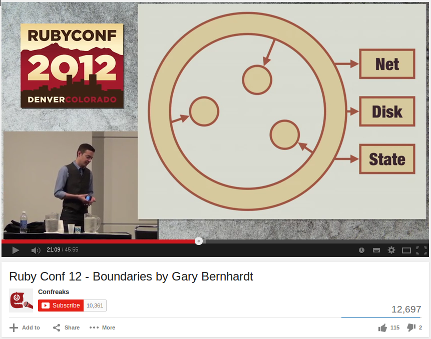
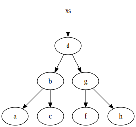

{:.center}
Use the space bar or arrow keys to browse the slide.

Some of the images are pretty big, so if you see an empty slide then wait a bit.

---
{:.center style="font-size: 70%"}

# Functional Programming in Ruby

## &nbsp;

## ArrrrCamp, Gent

## 2/3 October 2014

[http://arnebrasseur.net/talks/arrrrcamp2014](http://arnebrasseur.net/talks/arrrrcamp2014)

---

{: style="float: left; margin-left: 150px;"}


{: style="margin-top: 150px;"}
# @plexus

---
{:.center}


---
{:.heading.double}

# Programming Paradigms

---
{: .dark fullscreen-img="img/assembler.jpg"}

[Image: @pablobd/4760973863](https://www.flickr.com/photos/pablobd/4760973863)

---
{:.fragments}

## Imperative Programming

State + Instructions

Modeled after the machine

---
{:.fragments}

## Evolutionary Steps

Procedural, group instructions

Object oriented, group state

**Still imperative** at heart

---

## Place Oriented Programming

---

## PLOP

---
{:.fragments}

## PLOP

State is kept in "places"

Old information is **overwritten** with new

But real facts don't change, they incorporate time

```ruby
{ date: '2014-09-10', temperature: 19 }
{ date: '2014-09-11', temperature: 17 }
```

---
{: fullscreen-img="img/maths.jpg"}

[Image: @tkamenick/3950391591](https://www.flickr.com/photos/35064820@N00/3950391591)

---
{: .fragments}

## Values

Not state, but **Immutable Values**

Can be "simple": `42`, `:foo`

Or composite, lists, sets, maps

---
{: .fragments}

## Pure Functions

Same input ⇒ same output

No observable side effects

Follows naturally from using values

---

> An expression is said to be referentially transparent if it can be replaced with its value without changing the behavior of a program.

---
{: .fragments}

## Referential Transparency

Memoizable, Lazy evaluation

Parallelizable

Easy reasoning, refactoring, debugging, testing

---
{:.dark fullscreen-img="img/crystal.jpg"}

[Image: photoholic1](https://www.flickr.com/photos/lenbo/2220987208)


<!-- The combination of values and purity seems simple but has profound -->
<!-- implications. It helps both humans and machines to make assumptions -->
<!-- about, and hence reason about, the code. Referential transparency -->
<!-- makes many optimizations possible. -->

---
{: fullscreen-img="img/silicon.jpg" .dark}

[Image: rbulmahn/8028283618](https://www.flickr.com/photos/rbulmahn/8028283618)

---
{: fullscreen-img="img/tarpit.png"}

---

> Functional programming goes a long way towards avoiding the problems of state-derived complexity. This has very significant benefits.

---

> The main weakness of functional programming is that problems arise when the system to be built must maintain state of some kind.

---
{: .bullet-points }

## Times Are Changing

* 1995 Ruby
* 2003 Scala
* 2005 F#
* 2007 Clojure
* 2012 Elixir

{: .fragment}
The future is functional/multi-paradigm

---

## Multi-Paradigm

OOTTP: FP + Relational

Clojure: FP + Reference Types

Haskell: FP + Type System

Ruby: ?

---
{:.center}




<!-- --- -->
<!-- {: .bullet-points .fragments } -->

<!-- ## Times Are Changing -->

<!-- * Current CPU limit: 3-4 GHz -->
<!-- * < 2005, only single cores -->
<!-- * Now: 8, 16, 32 cores, and more -->
<!-- * New limit: Can our software parallelize? -->


<!-- --- -->
<!-- {: .bullet-points } -->

<!-- ## Multi-paradigm Examples -->

<!-- FP as information model -->

<!-- OO for organization -->

<!-- Reference types or relational storage to manage state -->

<!-- Actor model to manage concurrency -->

---
{: .heading }

# Data Structures

---
{:.center .big-image}


---
{:.center .big-image .bigger}



[Image by VineetKumar](http://commons.wikimedia.org/wiki/File:Purely_functional_tree_before.svg)

---
{:.center .big-image .bigger}


[Image by VineetKumar](http://commons.wikimedia.org/wiki/File:Purely_functional_tree_after.svg)

<!-- --- -->
<!-- {: .dark fullscreen-img="img/river.jpg"} -->

<!-- [Image: rowlandk/13899208228](https://www.flickr.com/photos/rowlandk/13899208228) -->

<!-- --- -->
<!-- {:.heading} -->

<!-- # Parallelism -->

<!-- --- -->
<!-- {: .dark fullscreen-img="img/threads.jpg"} -->

<!-- [Image: thomasfisherlibrary](https://www.flickr.com/photos/thomasfisherlibrary/6235265642) -->

<!-- --- -->

<!-- ## Pure Functions -->


<!-- --- -->
<!-- {: .fragments} -->

<!-- ## Dealing With Change -->

<!-- Programs are processes -->

<!-- They cause change over time -->

<!-- By overwriting old data OO loses sense of time -->

<!-- There is only "now" -->

<!-- Need to stop the world to get consistent data -->

<!-- --- -->
<!-- {:.fragments} -->

<!-- ## Identities -->

<!-- Name given to a sequence of values that are causally related -->

<!-- There is always one value "current". -->

<!-- Think of git branches -->

<!-- River = river04ca, river596d, river80e9, ... -->

<!-- A way of explicitly managing state over time -->

<!-- OO conflates values and identities -->

<!-- --- -->

<!-- ## Identities -->

<!-- ``` -->
<!-- (def river (atom -->
<!--   (for [_ (range 10)] -->
<!--     [(rand 100) (rand 100)]))) -->
<!-- ;; ([4.816 90.156] [32.374 33.889] ...) -->

<!-- (defn move-particle [[x y]] -->
<!--   [(+ 1 x) (+ (rand) y -0.5)]) -->

<!-- (defn flow [r] -->
<!--   (map move-particle r)) -->

<!-- (swap! river flow) -->
<!-- ;; ([5.816 90.419] [33.374 34.177] ...) -->

<!-- (swap! river flow) -->
<!-- ;; ([6.816 90.372] [34.374 33.938] ...) -->

<!-- ``` -->

---
{:.center}

## Object Orientation

### Sanity Through Encapsulation

---
{:.center}

## Functional Programming

### Sanity Through Purity

---
{: fullscreen-img="img/rubies.jpg"}

---
{:.fragments}

## Ruby

Some functional inspiration

Lambdas, blocks, map, reduce, freeze

Even lazy enumerators <span class="fragment">;)</span>

---
{:.fragments}

## Ruby

Still possible to code in a purely functional way

Use objects, but make them values

Have a core of "pure" domain logic

Handle state and side effects outside of that

---
{:.fragments}

## Values in Ruby

```ruby
true, false, nil
```

```ruby
23, 42, 5.9999
```

```ruby
:foo, :bar
```

```ruby
Time, Date, Pathname
```

---

## Gems

### Immutable Structs

anima, concord, adamantium,

value\_struct, value, values,

immutable\_struct, immutable, attr\_immutable,

value\_object\_struct, hamsterdam,

closed\_struct, functional\_accessor

---
{:.code}

```ruby
class Ukulele
  include Anima.new(:color, :tuning)

  # def initialize(attrs)
  # attr_reader :color, :tuning
  # def ==(other)
  # def eql?(other)
  # def equal?(other)
end

u1 = Ukulele.new(color: 'green',
                 tuning: [:G, :C, :E, :A])
u2 = Ukulele.new(color: 'green',
                 tuning: [:G, :C, :E, :A])
u1 == u2 # => true
```

---

## Gems

#### Hamster

Pure Ruby implementation of Vector, Set, Map, List

#### persitent-data-structures

Native implementation for JRuby

#### Clojr

Clojure data structures and reference types for JRuby

---
{:.code}

``` ruby
require 'hamster'

person = Hamster.hash(name: "Simon", gender: :male)
  # => {name: "Simon", gender: :male}

person[:name]
  # => "Simon"
person.get(:gender)
  # => :male
friend = person.put(:name, "James")
  # => {:name => "James", :gender => :male}
person
  # => {:name => "Simon", :gender => :male}
```

---
{:.code}

``` ruby
Hamster.interval(10_000, 1_000_000).filter do |number|
  prime?(number)
end.take(3)
  # => 0.0009s
```

``` ruby
(10_000..1_000_000).select do |number|
  prime?(number)
end.take(3)
  # => 10s
```

---
{:.code}

```ruby
list  = Clojr::STM::Ref.new
count = Clojr::STM::Ref.new

Clojr::STM.dosync do
  list.set(Clojr::Persistent::Vector.new(*1..100))
  count.set(0)
end
```

---
{:.code}

```ruby
10.times.map do
  Thread.new do
    10.times do
      Clojr::STM.dosync do
        i1, i2 = rand(100), rand(100)
        old_list = list.deref
        new_list.assoc(i1, old_list[i2])
        new_list.assoc(i2, old_list[i1])
        list.set(new_list)
        count.set(count.deref + 1)
      end
    end
  end
end.map(&:join)
```

---
{:.code}

```ruby
p list.deref
# => [99, 10, 79, 64, 40, 59, ...]
p count.deref
# => 100
```

---
{: .dark fullscreen-img="img/road.jpg" }

[Image: Daniel Weinand](https://www.flickr.com/photos/weinand/5313296821)

<!-- --- -->
<!-- {: .bullet-points} -->

<!-- ## Ruby: a bit of everything -->

<!-- It's a Smalltalk -->
<!-- It's a Bash -->
<!-- It's a Perl -->
<!-- It's a LISP -->

<!-- --- -->
<!-- {: .bullet-points .fragments } -->

<!-- ## Ruby: a Bit of Everything -->

<!-- Most obvious trait: OOP -->

<!-- But also some functional: lambdas, map, reduce -->

<!-- But: no functional culture -->

<!-- --- -->
<!-- {: .bullet-points .fragments } -->

<!-- ## Functional Ruby? -->

<!-- * Values + Pure functions are the exception -->
<!-- * Recursion is discouraged -->
<!-- * No generalized laziness -->
<!--   * evaluation must be strict because pure functions are the exception -->

<!-- --- -->
<!-- {: .bullet-points .fragments } -->

<!-- ## Functional Ruby? -->

<!-- * No functional batteries included (compose, curry, partial, juxt, etc.) -->
<!--   * Limited built-in higher order functions -->
<!-- * Mixing lambdas+blocks is awkward -->

<!-- --- -->
<!-- {: .bullet-points .fragments } -->

<!-- ## Risks of encapsulation -->

<!-- * False sense of security (is it threadsafe?) -->
<!-- * Limited reuse and extension -->
<!--   * data is invisible, use cases have to be thought of up front -->
<!-- * Result: subclassing, redefining private/protected API, monkey patching -->
<!-- * All because: I don't trust you handling my (mutable) data -->

<!-- --- -->
<!-- {: .bullet-points .fragments } -->

<!-- ## Sanity through purity -->

<!-- * Values ⇒ Pure Functions ⇒ Persistent Data Structures -->
<!-- * These go hand in hand, you have to have all three -->
<!-- * Not revolutionary in itself, but huge enabler -->

<!-- --- -->
<!-- {: .bullet-points .fragments } -->

<!-- ## Sanity through purity -->

<!-- * Sharing is safe, always, with anyone -->
<!-- * A value is always consistent: no need for read locks -->

<!-- --- -->
<!-- {: .bullet-points .fragments } -->

<!-- ## Sane Concurrency -->

<!-- * STM, Compare-and-swap, Actors -->
<!-- * Because of referential transparency -->
<!-- * Doable in (J)Ruby -->

<!-- --- -->
<!-- {: .bullet-points .fragments } -->

<!-- ## Parallelizable By Default -->

<!-- Because of referential transparency -->

<!-- Doable in (J)Ruby -->

<!-- --- -->
<!-- {: .bullet-points .fragments } -->

<!-- ## Memoizable By Default -->

<!-- Because of referential transparency -->

<!-- Doable in Ruby -->

<!-- --- -->

<!-- It's a dependency graph! -->

<!-- The system can reorder statements, optimize them away -->

<!-- Not doable in Ruby -->

<!-- --- -->

<!-- The Reporting Problem -->

<!-- How to view a consistent snapshot of the world? Stop the world? -->

<!-- --- -->

<!-- Presents! -->

<!-- Undo/Redo for free -->

<!-- Savepoints for free -->

<!-- --- -->

<!-- But, cultural problem: ruby core believes in "one true Array, one true Hash" -->

<!-- We risk creating isolated mini-ecosystems with their own data structures, libraries, semantics -->

<!-- --- -->

<!-- Examples/Refactorings: -->

<!-- STM with Clojr -->
