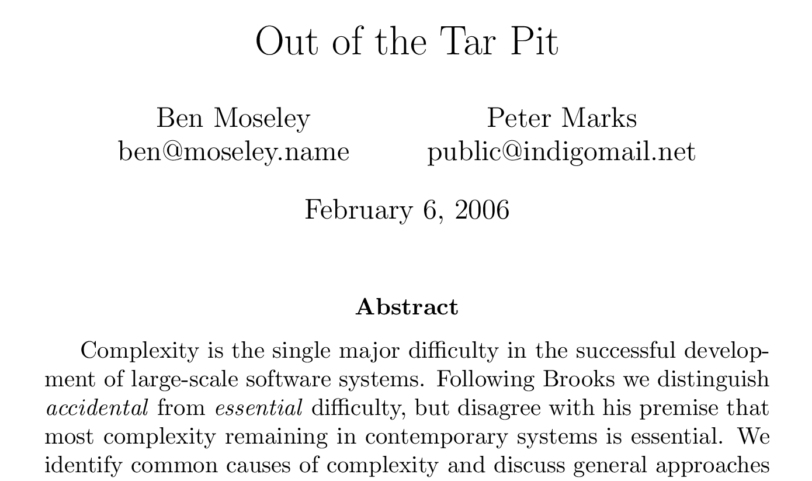

# Functional Programming in Ruby

## &nbsp;

## Frozen Rails, Helsinki

## 11/12 September 2014

---

{: style="float: left; margin-left: 150px;"}

{: style="margin-top: 150px;"}
# @plexus

---
{: .dark fullscreen-img="img/assembler.jpg"}

[Image: @pablobd/4760973863](https://www.flickr.com/photos/pablobd/4760973863)

---
{:.fragments}

## Imperative Programming

* What we've done since forever
* All about state
* Statements change the state

---
{:.fragments}

## State = Place

An area where you can store some data

Register, Memory, Variable

---
{:.fragments}

## Imperative Evolved

* Procedural programming
  * Group statements together in procedures
* Object Oriented Programming
  * Group mutable state in objects

---
{: fullscreen-img="img/maths.jpg"}

[Image: @tkamenick/3950391591](https://www.flickr.com/photos/35064820@N00/3950391591)

---
{: .bullet-points .fragments}

## Functional Programming

Programming with **Values**

No mutable state

Once "born" a value is completely determined

---
{: .bullet-points .fragments}

## Functional Programming

Programming with **Pure Functions**

Only relies on arguments, not on state

No observable side effects

---
{: .heading}

# Why Functional?

---

---

> Functional programming goes a long way towards avoiding the problems of state-derived complexity. This has very significant benefits for testing, as well as for reasoning.

---
{: .bullet-points }

## Times Are Changing

* 1995 Ruby
* 2003 Scala
* 2005 F#
* 2007 Clojure
* 2012 Elixir

{: .fragment}
The future is multi-paradigm

---
{: .bullet-points }

## Multi-paradigm

FP as information model

OO for organization

Reference types to manage state

Actor model to manage concurrency

---

## Multi-paradigm

> The main weakness of functional programming is the flip side of its main strength — namely that problems arise when (as is often the case) the system to be built must maintain state of some kind.

---
{: .bullet-points .fragments }

## Times Are Changing

* Current CPU limit: 3-4 GHz
* < 2005, only single cores
* Now: 8, 16, 32 cores, and more
* New limit: Can our software parallelize?

---
{: .heading }

# Information Model

---
{: .bullet-points }

## Information Model

OO has a flawed concept of

* Value
* State
* Identity
* Time
* Behavior

This leads to accidental complexity

---
{: .bullet-points }

## Values

In OO only the most basic entities are immutable

Information consists of facts

What fact does a mutable object represent?

---
{: .bullet-points }

OO: There is only one river

FP: I can never step in the same river twice

---

---
{: .bullet-points}

## Ruby: a bit of everything

It's a Smalltalk
It's a Bash
It's a Perl
It's a LISP

---
{: .bullet-points .fragments }

## Ruby: a Bit of Everything

Most obvious trait: OOP

But also some functional: lambdas, map, reduce

But: no functional culture

---
{: .bullet-points .fragments }

## Functional Ruby?

* Values + Pure functions are the exception
* Recursion is discouraged
* No generalized laziness
  * evaluation must be strict because pure functions are the exception

---
{: .bullet-points .fragments }

## Functional Ruby?

* No functional batteries included (compose, curry, partial, juxt, etc.)
  * Limited built-in higher order functions
* Mixing lambdas+blocks is awkward

---
{: .bullet-points .fragments }

## Risks of encapsulation

* False sense of security (is it threadsafe?)
* Limited reuse and extension
  * data is invisible, use cases have to be thought of up front
* Result: subclassing, redefining private/protected API, monkey patching
* All because: I don't trust you handling my (mutable) data

---
{: .bullet-points .fragments }

## Sanity through purity

* Values ⇒ Pure Functions ⇒ Persistent Data Structures
* These go hand in hand, you have to have all three
* Not revolutionary in itself, but huge enabler

---
{: .bullet-points .fragments }

## Sanity through purity

* Sharing is safe, always, with anyone
* A value is always consistent: no need for read locks

---
{: .bullet-points .fragments }

## Sane Concurrency

* STM, Compare-and-swap, Actors
* Because of referential transparency
* Doable in (J)Ruby

---
{: .bullet-points .fragments }

## Parallelizable By Default

Because of referential transparency

Doable in (J)Ruby

---
{: .bullet-points .fragments }

## Memoizable By Default

Because of referential transparency

Doable in Ruby

---

It's a dependency graph!

The system can reorder statements, optimize them away

Not doable in Ruby

---

The Reporting Problem

How to view a consistent snapshot of the world? Stop the world?

---

Presents!

Undo/Redo for free

Savepoints for free

---

Functional Ruby: it's already happening

Data structures with value semantics

Immutable Struct: a dozen gems do this

Persistent Vector, Set, Map: Hamster, Clojr, persistent-data-structures

---

But, cultural problem: ruby core believes in "one true Array, one true Hash"

We risk creating isolated mini-ecosystems with their own data structures, libraries, semantics

---

Examples/Refactorings:

STM with Clojr
