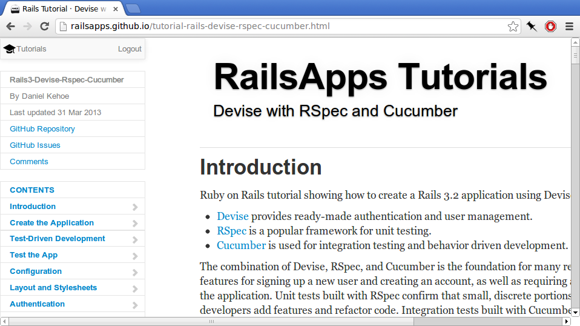
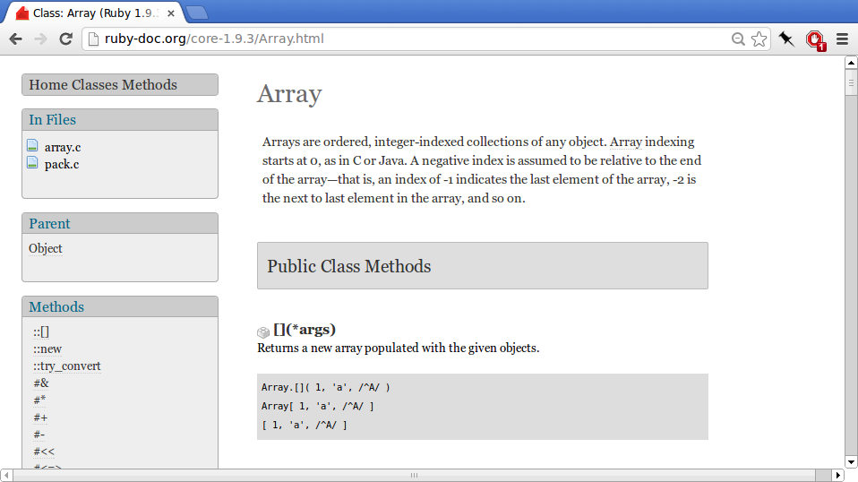

# Learning to Learn
{:.railsgirls}

by Arne Brasseur / [plexus](https://github.com/plexus)

---
{:.big}

## Anecdote

> "I learned MongoDB"

---
{:.subsections .big}

## Learning to learn

There will not always be a coach

There will always be more stuff to learn

Becoming confident in learning will be your most important skill

---
{:.heading}

# Words, so many words

---

{:.bigsections}

## Words, so many words


```notes
Programmers use special words

a new language

80/20

make things seem more complex

Find material that is at your level

Gradually build up your vocab
```

---
{:.heading}

# Play, Feel, Experience

---
{:.big}

## Anecdote

> "Git got us in a mess"

```notes
Learning is best drive by experience

Don't start out with dry theory

Try stuff out, play, become engaged

Be on the lookout for the moment where it's time to dig deeper
```

---

## Play, Feel, Experience


---
{:.heading}

# Types of documentation

---
{:.bigsections}

## Tutorials

Great starting point

Make sure to challenge yourself



Code School

Rails for Zombies

---
{:.bigsections}

## Screencasts

Very engaging

Look over the shoulder of experts


---
{:.bigsections}

## Manuals

For when you really want to dig in to a subject

All the pros and cons of "technical documentation"


---
{:.bigsections}

## API documentation

Generated from the source code

Explains every class/method

Reference for day-to-day programming



---
{:.bigsections}

## Source code

Use the source!

Writing well means reading a lot

There is material out there for all levels

---
{:.bigsections}

## Conclusion

Don't get discouraged!

Find what works for you

Have fun!
