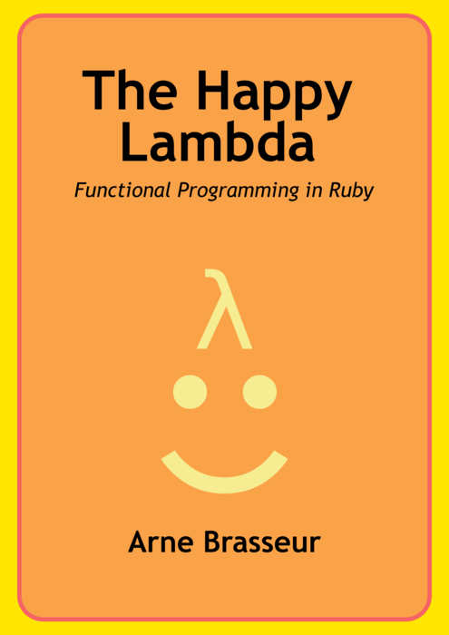

{::options parse_block_html="true" /}

{:.center}
Use the space bar or arrow keys to browse the slides.

---
{:.code}

```
require 'typecheck'

class Checked
  extend Typecheck

  typecheck '[Fixnum], String|#upcase -> Symbol',
  def foo(x, y)
    :z
  end
end

Checked.new([1,2,3], 'foo')
#=> :z
Checked.new([1,2,:z], 'foo')
#=> raise Typecheck::TypeError

```

---
{:.center .first-page}

## Functional Programming in Ruby

RubyConf Taiwan 2014

by Arne Brasseur / 白阿仁 / @plexus

---
{: .whoami .center}

{: .bigger }


 

---
{:.full-image}


----
{:.bullet-points}

## Functional Programming

Values

Functions

Runtime support

---

# Values

---
{:.bullet-points}

## Variables

A name for a place

What's in the place changes over time

```ruby
x = 3
x = 5
x = nil
```

---
{:.bullet-points}

## Values

An unchangeable fact

Different values can reflect facts related to different times

```ruby
{ date: '2014-04-24', temperature: 27 }
{ date: '2014-04-25', temperature: 29 }
```

---
{:.bullet-points}

## Why Values?

Safe to share

Easy to reason about

Make the best interfaces

---
{:.bullet-points}

## Values in Ruby

```ruby
true, false, nil
```

```ruby
23, 42, 5.9999
```

```ruby
:foo, :bar
```

```ruby
Time, Date, Pathname
```

---
{:.bullet-points}

## Values by Choice

The biggest virtue of a Ruby programmer is discipline

Make liberal use of `freeze`

Aggregates of values are also values

---

# Example

---
{:.code}

```ruby
class HTMLElement
  attr_reader :tag, :attrs, :children

  def initialize(tag, attrs, children)
    @tag      = tag
    @attrs    = attrs.freeze
    @children = children.freeze
  end

  def set_attr(attr, value)
    self.class.new(
      tag,
      attrs.merge(attr =&gt; value),
      children
    )
  end
end
```

---
{:.code}

```ruby
gem 'anima'
gem 'adamantium'
```

```ruby
class HTMLElement
  include Anima.new(:tag, :attrs, :children)
  include Anima::Update
  include Adamantium

  def set_attr(attr, value)
    update( attrs: attrs.merge(attr => value) )
  end
end
```

---
{:.vocab}

## per·sis·tent

### /pərˈsistənt/

_adjective_

Continuing to exist or endure over a prolonged period.

---
{:.bullet-points}

## per·sis·tent

Old version stays available after "change"

Can be done in an optimized way

---
{:.bullet-points}

## Persistent Collections

Share memory but keep immutable semantics

Simple example: linked list

---
{:code}

```
 List1
   |
 +---+   +---+   +---+
 | x |-->|   |-->|   |--> nil
 +---+   +---+   +---+


 List2   List1
   |       |
 +---+   +---+   +---+   +---+
 |   |-->| x |-->|   |-->|   |--> nil
 +---+   +---+   +---+   +---+
```

---
{:.bullet-points}

## Persistent Collections

Holy grail: "Hash Array Mapped Trie"

`gem "hamster"` has Hash, List, Set, Stack, Vector, ...

`github: headius/clojr` wraps the Clojure data structures.

---
{:.center}


[http://bit.ly/value_of_values](http://www.youtube.com/watch?v=-6BsiVyC1kM)

---

# Functions

---
{:.bullet-points}

## Pure Functions

Same input ⇒ same output

No observable side effects

Follows naturally from using values

---
{:.boutade}

When everything is a value, programming is mapping one set of values to another.

---
{:.bullet-points}

## Pure Functions

Reproducible results

Naturally parallel

Location independent

Can be memoized

---
{:.bullet-points}

## Pure Functions

Build a core that is purely functional

Call from an "imperative shell"

Best of both worlds

---

# Example

---
{:.lots-of-code}

```ruby
def parse_cli_options(argv)
  opts = OptionParser.new do |opts|
    opts.on('--version', 'Print version') do |name|
      return { message: VERSION }
    end.on('--help', 'Display help') do
      return { message: opts.to_s }
    end
  end

  filenames = opts.parse(argv)
  if filename.length != 2
    return {
      message: "Wrong number of arguments!\n#{opts}",
      exit_code: 1
    }
  end

  { filename: filenames }
end
```

---
{:.code}

```ruby
def run
  result = parse_cli_options(ARGV)

  if result.key?(:filenames)
    perform(result[:filenames])
  end

  if result.key?(:message)
    $stderr.puts result[:message]
  end

  Kernel.exit(result.fetch(:exit_code, 0))
end
```

---
{:.bullet-points}

## Computing Functions

Functions as the unit of reuse

Combine functions into bigger functions

`funkify` gem has interesting approach

---
{:.code}

```ruby
def pred_or(preds)
  ->(value) { preds.any?{|pred| pred.(value) } }
end

def parse_type_list(choices)
  types = choices.split('|').map(&:strip)
  pred_or [
    pred_or(
      types.map {|choice|
        method(:check).to_proc.curry(choice)
      }
    ),
    pred_or(
      types.map {|choice|
        method(:raise).to_proc.curry(choice)
      }
    )
  ]
end
```

---

# Performance

---
{:.bullet-points}

## Performance

Smart persistent data structures

Generational GC

Tail-Call Optimization

Measure!

---
{:.boutade}

Consider the benefits of value semantics when making performance comparisons.

---

# Conclusion

---
{:.bullet-points}

## Conclusion

Ruby can have the best of both worlds

Try it!

Start with values, see where the journey takes you

---
{:.link-image .center}



http://leanpub.com/happylambda

---

# Thank You
