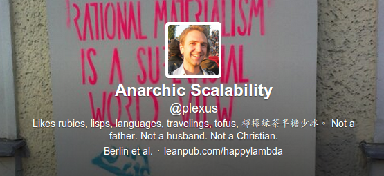

# Slippery Slides

---



&nbsp;

---

```imgseq
slides_awesome.jpg
slides_tiny.jpg
slide_fail2.jpg
slide_fail.jpg
```

---
{:.green}

# Slippery Slides \o/

---

> "100% of people questioned agreed that **slippery slides** are **the best slides**"

---

```imgseq
slippery_slide1.jpg
slippery_slide2.jpg
```

---
{:.big}

```ruby
# Gemfile
source 'https://rubygems.org'
gem 'slippery'
```

---
{:.big}

```ruby
# Rakefile
require 'slippery'
Slippery::RakeTasks.new
```

---
{:.big}

```shell
echo "# Let's see" > talk.md
rake slippery:build:talk
```

---

```ruby
Slippery::RakeTasks.new do
  self.options = {
    type: :reveal_js,
    theme: 'sky',
    transition: 'slide',
  }

  title 'Slippery Slides'
  add_highlighting
  self_contained
end
```

---


---
{: data-background="img/slides_awesome.jpg"}

---
{: data-background="img/slide_fail.jpg"}

---

```imgseq
slides_awesome.jpg
slide_fail.jpg
```