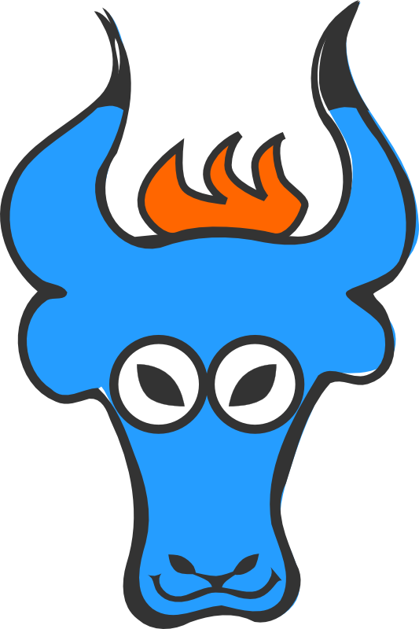

{:.center}
Use the space bar or arrow keys to browse the slide.

Some of the images are pretty big, so if you see an empty slide then wait a bit.

---

{: style="float: right"}


# Yaks

## &nbsp;

## ROSSConf

## 25 April 2015

### Arne Brasseur


---
{:.heading}

# What is it?

---

A library for building APIs

It serializes objects

It's specialized in Hypermedia

---
{:.heading}

# Why?

---

We needed it (we = Ticketsolve)

Not a lot available for Hypermedia

No existing libraries fitted the bill

---
{:.heading}

# Community

---

Small and friendly

Github issues, Gitter chat

Main contributions: improvements to specific formats

---
{:.heading}

# How to contribute?

---

Use it! report back!

Join the discussion

Coding and non-coding skills needed

---
{:.heading}

# What's happening?

---

Recent focus: improving mutation coverage

Better testing story

Better docs, examples

---

Format support: Siren, JSON-LD

Read-write support

Better HTML output

---
{:.heading}

# This afternoon

---

Several issues marked `ROSSConf` or `Beginner Friendly` in Github

---

## Improve HTML output

Ruby / HTML / CSS task

Fun task because creative and immediate feedback

---

## Check the README with Ataru

Tests code examples in documentation

8 out of 30 currently fail

Cool because you learn a useful new tool

---

## Shorthand attribute syntax

Turn this

``` ruby
class FooMapper < Yaks::Mapper
  attributes :bar

  def bar
    object.baz
  end
end
```

into

``` ruby
class FooMapper < Yaks::Mapper
  attribute :bar do
    object.baz
  end
end
```

Slightly more advanced task

---

## Support for Siren

JSON-based format that's becoming popular

Maps very well to Yaks's abstractions

Great for learning about how Yaks works
