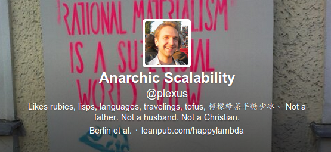

# Slippery Slides

&nbsp;

## RubyConf Belarus

## @plexus &mdash; 22 March 2015

[http://arnebrasseur.net/talks/2015-rubyconf-by-lightning/](http://arnebrasseur.net/talks/2015-rubyconf-by-lightning/)

<!-- --- -->

<!--  -->

<!-- &nbsp; -->

---
{: fullscreen-img="img/slides_awesome.jpg"}

---
{: fullscreen-img="img/slides_tiny.jpg"}

---
{: fullscreen-img="img/slide_fail2.jpg"}

---
{: fullscreen-img="img/slide_fail.jpg"}


---
{:.green}

# Slippery Slides \o/

---

> "100% of people questioned agreed that **slippery slides** are **the best slides**"

---
{: fullscreen-img="img/slippery_slide1.jpg"}

---
{: fullscreen-img="img/slippery_slide2.jpg"}

---
{:.big}

```ruby
# Gemfile
source 'https://rubygems.org'
gem 'slippery'
```

---
{:.big}

```ruby
# Rakefile
require 'slippery'
Slippery::RakeTasks.new
```

---
{:.big}

```shell
echo "# Let's see" > talk.md
rake slippery:build:talk
```

---

```ruby
Slippery::RakeTasks.new do
  title 'Slippery Slides'
  add_highlighting

  js_options theme: 'sky',
             transition: 'none',
             backgroundTransition: 'none',
             loop: true


  pack_assets
end
```

---

```ruby
Slippery::RakeTasks.new do

  processor 'head' do |head|
    H[:head, head.attributes, head.children + [
        H[:meta, charset: 'utf-8'],
        H[:meta, name: 'viewport', content: 'width=1024'],
        H[:meta, "http-equiv" => 'X-UA-Compatible', content: 'IE=edge,chrome=1'],
      ]
    ]
  end

end
```

---

## Still works when Wifi fails!

## All assets downloaded locally

---

```
$ ls assets
  -rw-rw-r-- 1 arne arne     37 Mär 22 16:20 0e65e7177b0cd46d908b7ca9b3ad482b.css
  -rw-rw-r-- 1 arne arne   3170 Mär 22 16:18 8244e91e3efc1ad6285d9beb8125fe4b.js
  -rw-rw-r-- 1 arne arne 229847 Mär 22 16:18 254432ea1e717b4c36602d6c71d5b7b2.png
  -rw-rw-r-- 1 arne arne  21576 Mär 22 16:18 3c7073a635ae457478a9b3b2d50e49bc.ttf
  -rw-rw-r-- 1 arne arne  34112 Mär 22 16:18 56edff6cd9c40bf507851c7af6d724ba.ttf
  -rw-rw-r-- 1 arne arne  33064 Mär 22 16:18 5e1cdd683bb56d6e69d5338e1c33dd79.ttf
  -rw-rw-r-- 1 arne arne  35760 Mär 22 16:18 68b46e7ec5ff26f8c5948686ef0795e9.ttf
  -rw-rw-r-- 1 arne arne  21376 Mär 22 16:18 72989bca4fade05b25bafdad55a59b7c.ttf
```

---

## Output Reveal.js, Impress.js, Deck.js

---

## Kramdown extensions are super powerful

---

```

{: style="width: 90%;"}
> The Web is a distributed hypermedia
> system. The Internet connects information networks across
> boundaries. **Distributed hypermedia** provides a **uniform means** of
> accessing services **through the embedding of action controls within
> the presentation of information.**

{:.center}
— Fielding
```

---

## Use Graphviz for cool graphs!

---

```
 ``` dot
 digraph platypus {
   node[shape=box style=filled fillcolor="#90ee80" fontcolor="#5533ee" color="#ffffff"]
   rankdir=LR

   "Markdown" -> "Kramdown::Document" -> "Hexp::Node" -> "HTML"
 }
 ```
```

---


