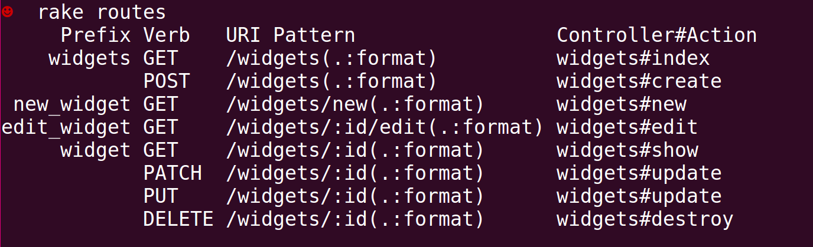
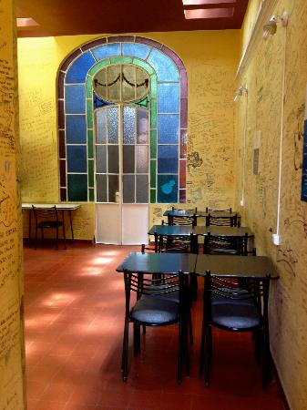
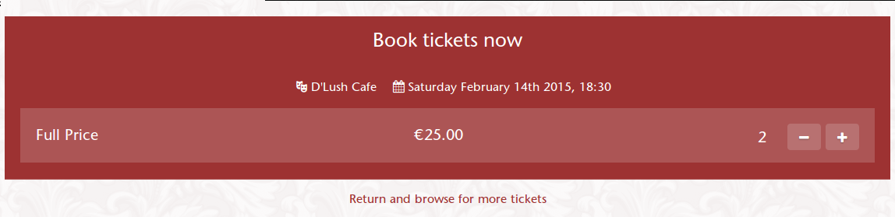
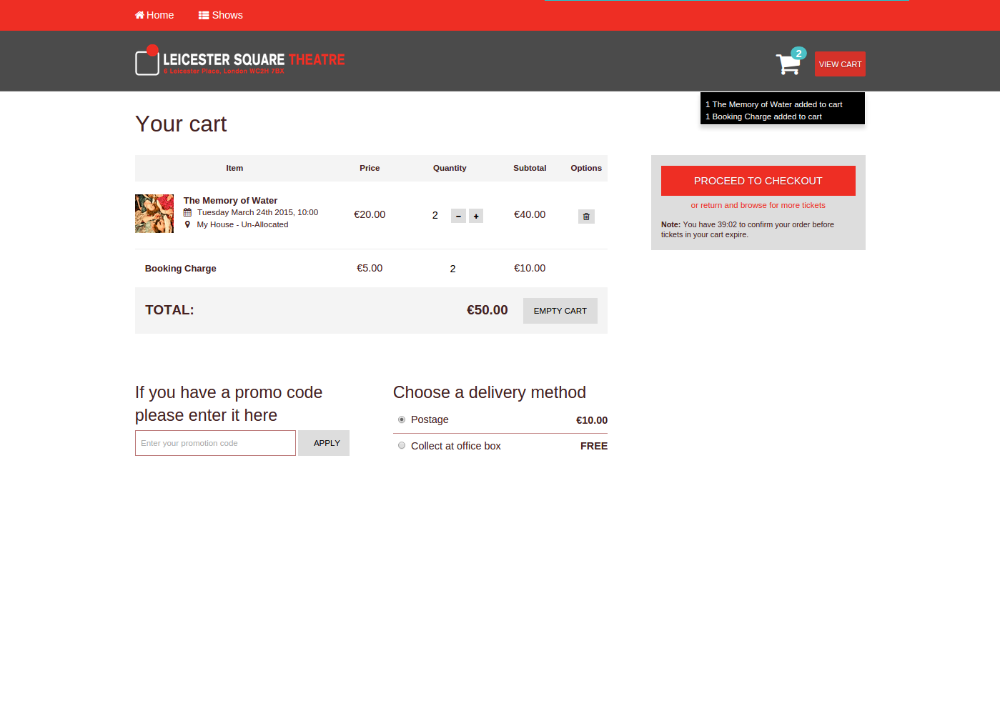
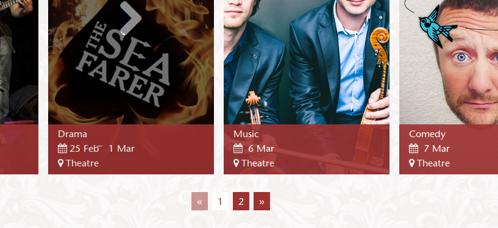

{:.center}
Use the space bar or arrow keys to browse the slide.

Some of the images are pretty big, so if you see an empty slide then wait a bit.

---
{: fullscreen-img="img/rgsoc.png"}

---
{: fullscreen-img="img/rgsoc_teams.png"}

---
{: fullscreen-img="img/rgsoc_sponsors.png"}

<!-- --- -->
<!-- {: fullscreen-img="img/rgsoc_logos.png"} -->

---
{:.center}


---

http://railsgirlssummerofcode.org/campaign/

---
{:.center style="font-size: 70%"}

# Hypermedia In Practice

## &nbsp;

## `/RubyConf\.(LT|BY)/`

## 21/22 March 2015

[http://arnebrasseur.net/talks/2015-rubyconf-lt-by](http://arnebrasseur.net/talks/2015-rubyconf-lt-by)

---

{: style="float: left; margin-left: 150px;"}


{: style="margin-top: 70px;"}
# @plexus

{: style="border: 0;  box-shadow: 0px 0px 0px 0px rgba(0,0,0,0); font-size: 100%;"}
<pre>
Ruby Lambik     Ruby Karaoke
Rails Girls     Ruby Monsters
ClojureBridge   Chestnut
Yaks            Slippery
Emacs Berlin    Euruject
</pre>

---
{: .center .big-image .huge}

&nbsp;

&nbsp;


---
{: .heading}

# A Story

---
{: fullscreen-img="img/it_hurts.jpg"}

---
{: .fragments}

## A Story

September 2013: Rails app is 6 years old

Co-tenancy styling nightmare

New sustainable approach

---
{: .fragments}

## New Front End

Ember app

Responsive Design

Hypermedia API

---
{: fullscreen-img="img/new_frontend.png"}

---
{: fullscreen-img="img/new_frontend_2.png"}

---
{: fullscreen-img="img/new_frontend_3.png"}

---
{: .heading .center}

# Hypermedia*

*also known as REST

---

## Hypertext

> Text and links

{:.center}
— Some guy on stage

---

## Hypermedia

> Hypertext, but also with images, video, etc.

{:.center}
— Some guy on stage

---

## REST

> "Architectural Styles and the Design of Network-based Software Architectures"

{:.center}
— Roy Fielding ([2000](http://www.ics.uci.edu/~fielding/pubs/dissertation/top.htm))

---
{:.fragments}

## REST

After the fact description of how the web works

Uniform interface, URIs, links

Allowed for anarchy at massive scale

<!-- --- -->
<!-- {: fullscreen-img="img/rest_decomposed.jpg"} -->


<!-- --- -->
<!-- {: fullscreen-img="img/uniform_interface.jpg"} -->

---
{:.fragments}

## Some Vocab

**Resource**
Anything abstract or concrete you can refer to

**URI**
Identifier for a resource (URL: pointer to ~)

**Representation** (also: Entity)
Serialization of a resource. Specific to _Format_ and _Time_

---

> REST components perform actions on a **resource** by using a **representation** of the current or intended state of that resource and transferring those representations.

{:.center}
— Roy Fielding

---

{: style="width: 90%;"}
> The Web is a distributed hypermedia system. The Internet connects information networks across boundaries. **Distributed hypermedia** provides a **uniform means** of accessing services **through the embedding of action controls within the presentation of information.**

{:.center}
— Fielding

---

{: style="width: 50%;"}
> embedding of action controls within the presentation of information

{:.center}
— Fielding

---
{:.text-scale-5}

## Embedded Controls

``` html
<ul>
  <li>in-</li>
  <li>for-</li>
  <li>ma-</li>
  <li>tion</li>
</ul>

<a href="...">action</a>
<form action="..." method="...">controls</form>
```

---
{:.fragments}

## Why bother?

Does a browser know the "conventions" your site uses?

Do you need a browser update when a site change?

No! Why not?
Uniform interface: Embedded action controls! (links + forms)

---



{:.fragment}
Resources + Representations? Yes

{:.fragment}
Embedded Action Controls? No

{:.fragment}
Not hyper{text,media} driven is NOT REST

---
{:.fragments}

## Rails-style "RESTful"

Based on pre-shared conventions

Great for exposing DB structure over HTTP

Let's call "Rails-REST" _Resourceful_, and "real REST" _Hypermedia_

---
{:.heading style="margin-top: 70px"}

# Hypermedia

# APIs

---
{: fullscreen-img="img/api_like_the_web.jpg"}

---
{:.text-scale-4}

``` json
{
  "id": 1,
  "total": 107.5,
  "item_count": 12,
  "_links": {
    "http://api.ticketsolve.com/rel/checkout": {
      "href": "/api/checkout"
    }
  },
  "_controls": {
    "empty_cart": {
      "name": "empty_cart",
      "method": "DELETE",
      "href": "/api/cart"
    }
  }
}
```

<!-- --- -->
<!-- {:.fragments} -->

<!-- ## Hypermedia APIs -->

<!-- Data + Controls -->

<!-- Can be JSON, HTML, XML, ... -->

<!-- Existing web standards are being repurposed -->

---
{:.heading .center style="margin-top: 70px;"}

# Media types

## RFC 4288

<!-- --- -->
<!-- {:.text-scale-3} -->

<!-- {: style="background-color: white"} -->
<!-- <pre> -->
<!-- Network Working Group                                           N. Freed -->
<!-- Request for Comments: 4288                              Sun Microsystems -->
<!-- BCP: 13                                                       J. Klensin -->
<!-- Obsoletes: 2048                                            December 2005 -->
<!-- Category: Best Current Practice -->


<!--          Media Type Specifications and Registration Procedures -->

<!-- Abstract -->

<!--    This document defines procedures for the specification and -->
<!--    registration of media types for use in MIME and other Internet -->
<!--    protocols. -->


<!-- </pre> -->

---

## Media Types

> Accept: text/html

> Content-type: application/vnd.collection+json

---
{:.fragments}

## Media Types

Originated in email as MIME types

Mechanism for labeling content

IANA keeps a registry

---
{:.heading .center style="margin-top: 70px;"}

# Web Linking

## RFC5988

<!-- --- -->
<!-- {:.text-scale-3} -->

<!-- {: style="background-color: white"} -->
<!-- <pre> -->
<!-- Internet Engineering Task Force (IETF)                     M. Nottingham -->
<!-- Request for Comments: 5988                                  October 2010 -->
<!-- Updates: 4287 -->
<!-- Category: Standards Track -->
<!-- ISSN: 2070-1721 -->


<!--                               Web Linking -->

<!-- Abstract -->

<!--    This document specifies relation types for Web links, and defines a -->
<!--    registry for them.  It also defines the use of such links in HTTP -->
<!--    headers with the Link header field. -->

<!-- </pre> -->

---
{:.text-scale-3}

## Rels

``` html
<link rel="stylesheet"
  href="/stylesheets.css"
  type="text/css">

<link rel="alternate"
  type="application/atom+xml"
  href="/feed.xml">

<link rel="author"
  href="https://plus.google.com/u/0/112268398775525141261">

<link rel="self" href="http://blog.url.com/feed.xml" />
```

---
{:.fragments}

## Rels

Originated in HTML, spread to: XFN, Atom

Mechanism for labeling links

Microformats & IETF keep a registry

---
{:.fragments}

## Rels

Can be registered keyword:
&nbsp;&nbsp;&nbsp; `alternate`, `self`, `stylesheet`, `profile`

Or custom by using URIs
&nbsp;&nbsp;&nbsp; `http://api.foo.com/rel/product`

Simply identifiers, but great to point to docs

---

## profile rel

> Allows clients to learn about additional semantics (constraints, conventions, extensions)

{:.center}
&mdash; RFC6906

---
{:.heading}

# Story Time

---
{: .fragments}

## New Front End

Feature-flagged "slices"

Work from show listing to checkout

Roll out to volunteer customers

---
{: fullscreen-img="img/new_frontend.png"}

---

## Step 1: Listing page

---

## <strike>Step 1: Listing page</strike>

## Step 0: Groundwork

---
{:.fragments}

## Groundwork

Did a ton of research

Decided to use ActiveModel::Serializers, JSON-API, Ember

In the end only Ember stuck

---
{:.fragments}

## Backend Stack

AMS (at the time) lacking stewardship, buggy

No intermediate representation

JSON-API unstable and lacking hypermedia controls

---
{: fullscreen-img="img/knowlegde_change_graph.png"}

---
{: .yak-heading .center}

# Yaks

---
{:.center .big-image}

 

---
{:.fragments}

## Yaks

v0.0.0 written over a weekend

Already did what AMS was doing before (for us)

Made it easy to switch to HAL

---
{:.fragments}

## Yaks

Since then: 427 commit, 32 releases, 12 contributors

Support for HAL, JSON-API, Collection+JSON, HTML, HALO, Transit

Mutation tested, battle tested

---
{:.fragments}

## Step 1: Listing page

Implement `/api/shows`

Use the Yaks DSL to represent `Show` object

For now shows will link to the legacy show pages

---
{:.text-scale-5}

``` ruby
class ShowMapper < Yaks::Mapper
  attributes :id, :name, :dates, :description

  link rels[:events], '/api/shows/{id}/events'
  link rels[:legacy], '/shows/{id}/events'

  has_many :venues
  has_one :event_category
end
```

---
{:.text-scale-5}

``` json
{
  "id": 7,
  "name": "The Two Gentlemen of Verona",

  "_links": {
    "http://api.ticketsolve.com/rel/legacy": {
      "href": "/shows/7/events"
    }
  },

  "_embedded": {
    "http://api.ticketsolve.com/rel/event_category": {
      "name": "Drama",
    }
  }
}
```

---
{:.text-scale-5}

## HAL

Hypertext Application Language

{: style="width:100%"}
> application/hal+json

``` json
{
  <attributes>,
  "_links": { <rel => link>},
  "_embedded": { <rel => resource> },
}
```

<!-- --- -->

<!-- ## Yaks Pipeline -->

<!-- Model →①→ Yaks::Resource →②→ Raw Data →③→ Bytes -->

<!-- * ① Mapper (CartMapper) -->
<!-- * ② Format (Yaks::Format::HAL) -->
<!-- * ③ Serializer (Yaks::Serializer::JSON) -->

---
{: fullscreen-img="img/yaks_pipeline.jpg"}

---
{:.text-scale-5}

## Yaks::Resource

``` ruby
Yaks::Resource.new(
  attributes: {
    first_name: "Arne",
    last_name: "Brasseur"
  },
  ...
)
```

---
{:.text-scale-5}

## Yaks::Resource

``` ruby
Yaks::Resource.new(
  ...,
  links: [
    Yaks::Resource::Link.new(
      rel: 'collection', uri: '/api/users')
  ]
  ...
)
```

---
{:.text-scale-5}

## Yaks::Resource

``` ruby
Yaks::Resource.new(
  ...,
  subresources: [
    Yaks::Resource.new(
      attributes: { },
      links: [ ]
      subresources: [ ]
    )
  ],
  ...
)
```

---
{:.text-scale-5}

## Yaks::Resource

``` ruby
Yaks::Resource.new(
  ...,
  forms: [
    Yaks::Resource::Form.new(
      name: 'create_talk'
      method: 'POST',
      action: '/api/talk',
      fields: [...]
    )
  ]
)
```

<!-- --- -->
<!-- {:.text-scale-5} -->

<!-- ## Pagination -->

<!-- ``` ruby -->
<!-- class CollectionMapper < Yaks::CollectionMapper -->
<!--    attributes :count, :offset -->

<!--    link :previous, ->{ previous_link } -->
<!--    link :next,     ->{ next_link     } -->

<!--    def offset        ; ... ; end -->
<!--    def count         ; ... ; end -->
<!--    def previous_link ; ... ; end -->
<!--    def next_link     ; ... ; end -->
<!-- end -->
<!-- ``` -->

---
{:.fragments}

## Step 1.5: Pagination

Just use links!

Standard rels for this, `previous` and `next`

Client has minimal knowledge, server is able to change

---
{:.text-scale-4}

{: style="width: 100%"}
> GET /api/shows?offset=50

``` json
{
  "count": 120,
  "offset": 50,

  "_links": {
    "profile": [{"href": "http://api.ts.com/profile/collection"}],
    "previous": {"href": "/api/shows"},
    "next":     {"href": "/api/shows?offset=100"},
  },

  "_embedded": {
    "http://api.ticketsolve.com/rel/shows": [
    ]
  }
}
```

---

## Step 2: Events Page

---
{: fullscreen-img="img/events_list.png"}

---
{: fullscreen-img="img/events_calendar.png"}

---
{:.fragments}

## List or Calendar

Let API decide, frontend stays dumb

Collection will have different profile

Different pagination? No problem

---
{:.text-scale-2}

``` json
{
  "_links": {
    "profile": [
      {"href": "http://api.ticketsolve.com/profile/collection"},
      {"href": "http://api.ticketsolve.com/profile/event_list"}
    ],
    "previous": {"href": "/api/shows7/events"},
    "next":     {"href": "/api/shows7/events?offset=100"},
  },

  "_embedded": {
    "http://api.ticketsolve.com/rel/events": [ ... ]
  }
}
```

---
{:.text-scale-2}

``` json
{
  "_links": {
    "profile": [
      {"href": "http://api.ticketsolve.com/profile/collection"},
      {"href": "http://api.ticketsolve.com/profile/event_calendar"}
    ],
    "previous": {"href": "/api/shows7/events?year_month=2015-02"},
    "next":     {"href": "/api/shows7/events?year_month=2015-04"}
  },

  "_embedded": {
    "http://api.ticketsolve.com/rel/events": [ ... ]
  }
}
```

---
{:.fragments}

## Step 3:  Cart

Time to introduce forms!

Ticket, Product, LineItem: all can "change_quantity"

Form control present ⇒ UI control present

---
{: .text-scale-5}

``` ruby
class TicketPriceMapper < BaseMapper
  attributes :id, :name, :price

  form :change_quantity do
    action '/api/cart/ticket_line_items'
    method 'POST'

    number :quantity
    hidden :ticket_price_id, value: ->{ id }
  end
end
```

---
{: .text-scale-5}

``` json
"_controls": {
  "change_quantity": {
    "name": "change_quantity",
    "method": "POST",
    "media_type": "application/x-www-form-urlencoded",
    "fields": [
      { "name": "quantity", "type": "number" },
      { "name": "ticket_price_id",
        "type": "hidden", "value": 47 }
    ],
    "href": "/api/cart/ticket_line_items"
  }
}
```

---
{: fullscreen-img="img/events_calendar.png"}

---
{: fullscreen-img="img/cart.png"}


<!-- --- -->
<!-- {: .text-scale-3} -->

<!-- ``` coffeescript -->
<!-- Ticketbooth.NumericSpinnerComponent = Ember.Component.extend -->
<!--   changeQuantity: Em.computed.alias "subject.controls.change_quantity" -->

<!--   setQuantity: (newQty)-> -->
<!--     @get("changeQuantity").submit({"quantity": newQty}) -->

<!--   actions: -->
<!--     increment: -> -->
<!--       newQty = @get("actionQuantity") + 1 -->
<!--       return @setQuantity(newQty) -->

<!--     decrement: -> -->
<!--       newQty = @get("actionQuantity") - 1 -->
<!--       return if newQty < 0 -->
<!--       return @setQuantity(newQty) -->
<!-- ``` -->

<!-- --- -->
<!-- {: .text-scale-5} -->

<!-- ``` handlebars -->
<!-- {{input class="numeric-spinner-value" -->
<!--         type="text" -->
<!--         value=quantity}} -->

<!-- {{#if changeQuantityControl}} -->
<!--   <button {{action 'decrement'}}>-</button> -->
<!--   <button {{action 'increment'}}>+</button> -->
<!-- {{/if}} -->
<!-- ``` -->

---

## Step 4: Checkout

---
{: fullscreen-img="img/checkout.png"}

---
{:.fragments}

## Checkout

Another big form

But now: Validation, pre-filling, error reporting

Just like HTML: Form fields contain everything

<!-- --- -->
<!-- {:.text-scale-3} -->

<!-- ``` json -->
<!-- "fields": [ -->
<!--   { -->
<!--     "name": "first_name", -->
<!--     "label": "views.checkout.first_name", -->
<!--     "type": "text", -->
<!--     "required": true, -->
<!--     "value": "Foo", -->
<!--     "maxlength": 96 -->
<!--   }, -->
<!--   { -->
<!--     "name": "address", -->
<!--     "label": "views.checkout.address", -->
<!--     "type": "textarea", -->
<!--     "required": true, -->
<!--     "rows": 2, -->
<!--     "value": "", -->
<!--     "error": { "blank": "can't be blank" } -->
<!--   } -->
<!-- ] -->
<!-- ``` -->

---
{:.heading style="margin-top: 70px;"}

# DEMO

## yaks-html

---
{: .fragments}

## Current Status

Finished end-to-end

In use by a handful of customers

Filling in missing features

<!-- --- -->
<!-- {: .fragments} -->

<!-- ## Conclusion -->

<!-- Very happy we chose this path -->

<!-- API is the engine of the application -->

<!-- Continue to push logic into the API -->

---
{: fullscreen-img="img/yay.jpg"}

---
{: .center style="font-size: 200%;"}

# Q?

---
{: .center style="font-size: 200%;"}

# Thank You!

Twitter: @plexus

github:plexus/yaks

<!-- --- -->
<!-- {:.fragments} -->

<!-- ## Backend Stack -->

<!-- API app built with Grape -->

<!-- Still uses Rails' models and service objects -->

<!-- HAL Format + Form Controls -->

<!-- --- -->
<!-- {:.fragments} -->

<!-- ## Frontend Stack -->

<!-- Ember (*not* ember-data) -->

<!-- ember-rails for Handlebars precompilation -->

<!-- Sprockets (future: Ember CLI) -->

<!-- --- -->
<!-- {:.fragments} -->

<!-- ## Ember Hypermedia -->

<!-- Feels emberish: Ember.Object, futures -->

<!-- Allows navigating links, forms -->

<!-- Not open source (yet) -->


---
{:.center}


---
{:.heading}

# Ship it!


---
{:.text-scale-4}

{: style="width:100%"}
> Content-type: application/halo+json

``` json
{
  "id": 5,
  "expires_at": "2017-02-11T01:23:32+00:00",
  "total": 50.0,
  "item_count": 2,
  "_links": {
    "profile": [
      {"href": "http://api.ticketsolve.com/profile/cart"}
    ],
    "self": {"href": "/api/cart"},
    "http://api.ticketsolve.com/rel/checkout": {
      "href": "/api/checkout"
    }
  },
  "_embedded": { ... },
  "_controls": { ... }
}
```


---

Interesting bits

* invalidates
* ErrorMapper
* FormError
* change_quantity
* presence/abscence of form control reflects on GUI
* Ember hypermedia
** resource/link/form objects
** creates right type


<!-- --- -->
<!-- {: .center} -->

<!--  -->

<!-- --- -->
<!-- {: fullscreen-img="img/calendar.png"} -->

<!-- --- -->
<!-- {: .center} -->

<!--  -->


<!-- --- -->
<!-- {: .center} -->

<!--  -->


<!-- --- -->
<!-- {: fullscreen-img="img/html0.png"} -->

<!-- --- -->
<!-- {: fullscreen-img="img/html.png"} -->


<!-- --- -->
<!-- {: fullscreen-img="img/yaks.png"} -->

---
{: fullscreen-img="img/fin.jpg"}

<!-- --- -->

<!-- --- -->

<!-- ## Hypermedia -->

<!-- > Hypermedia, an extension of the term hypertext, is a **nonlinear** medium of information which includes graphics, audio, video, plain text and **hyperlinks**. -->

<!-- {:.center} -->
<!-- — Wikipedia -->

<!-- --- -->

<!-- ## Hypermedia -->

<!-- > Hypermedia is the simultaneous presentation of **information and controls** such that the **information becomes the affordance** through which the consumer **obtains choices and selects actions** -->

<!-- {:.center} -->
<!-- — Roy Fielding -->

<!-- --- -->

<!-- ## Affordance -->

<!-- > The set of possible actions the user is made aware of -->

---
{:.text-scale-5}

``` ruby
class CartMapper < BaseMapper
  attributes :id, :expires_at, :total, :item_count
  link :self, '/api/cart'

  has_many :line_items,
           collection_mapper: LineItemCollectionMapper
  has_one :promotion_code

  form :promotion_code do
    method 'POST'
    action '/api/cart/promotion_code'

    text :code, label: 'promotion_code.label',
         value: ->{ cart.promotion_code.code }
  end
end
```
