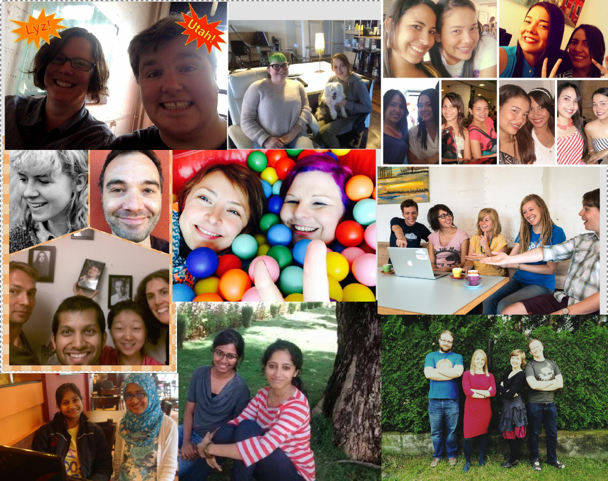
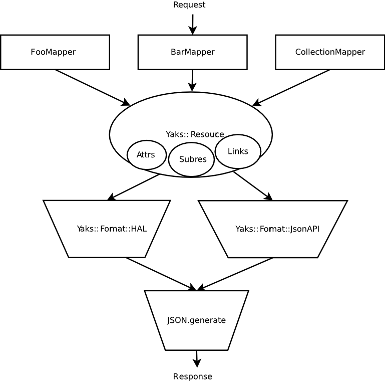

{:.center}
Use the space bar or arrow keys to browse the slide.

Some of the images are pretty big, so if you see an empty slide then wait a bit.

---
{: fullscreen-img="img/rgsoc.png"}

---
{:.center}


---
{: fullscreen-img="img/rgsoc_sponsors.png"}

---
{: fullscreen-img="img/rgsoc_logos.png"}

---
{: fullscreen-img="img/rgsoc_teams.png"}

<!-- --- -->
<!-- {:.center} -->

<!--  -->

---
{:.center style="font-size: 70%"}

# Hypermedia In Practice

## &nbsp;

## RubyConf.{LT,BY}

## 21/22 March 2015

[http://arnebrasseur.net/talks/2015-rubyconf-lt-by](http://arnebrasseur.net/talks/2015-rubyconf-lt-by)

---

{: style="float: left; margin-left: 150px;"}


{: style="margin-top: 150px;"}
# @plexus

---
{: .center .big-image .huge}

&nbsp;

&nbsp;


---
{: .heading}

# A Story

---
{: fullscreen-img="img/once_upon_a_time.jpg"}

---
{: .fragments}

## A Story

September 2013: Rails app is 6 years old

Co-tenancy styling nightmare

Decided time to build a new front-end

---
{: .fragments}

## New Front End

Ember app

Responsive Design

Hypermedia API

---
{: .heading .center}

# Hypermedia*

*also known as REST

---

## REST

> "Architectural Styles and the Design of Network-based Software Architectures"

{:.center}
— Roy Fielding ([2000](http://www.ics.uci.edu/~fielding/pubs/dissertation/top.htm))

---
{:.fragments}

## REST

After the fact description of how the web works

Term has been misused

"Real REST" now referred to as Hypermedia

<!-- --- -->
<!-- {: fullscreen-img="img/rest_decomposed.jpg"} -->


<!-- --- -->
<!-- {: fullscreen-img="img/uniform_interface.jpg"} -->

---
{:.fragments}

## Some Vocab

**Resource**
Anything abstract or concrete you can refer to

**URI**
Identifier for a resource (URL: pointer to ~)

**Representation** (also: Entity)
Serialization of a resource. Specific to _Format_ and _Time_

---

> REST components perform actions on a **resource** by using a **representation** of the current or intended state of that resource and transferring those representations.

{:.center}
— Roy Fielding

---

{: style="width: 90%;"}
> The Web is an Internet-scale distributed hypermedia system. The Internet is about interconnecting information networks across boundaries. **Distributed hypermedia provides a uniform means of accessing services through the embedding of action controls within the presentation of information retrieved from remote sites.**

{:.center}
— Fielding

---

{: style="width: 50%;"}
> embedding of action controls within the presentation of information

{:.center}
— Fielding

---
{:.text-scale-5}

## Embedded Controls

``` html
<ul>
  <li>in-</li>
  <li>for-</li>
  <li>ma-</li>
  <li>tion</li>
</ul>

<a href="...">action</a>
<form action="..." method="...">controls</form>
```

---


{:.fragment}
Resources + Representations? Yes

{:.fragment}
Embedded Action Controls? No

{:.fragment}
Not hyper{text,media} driven is NOT REST

---
{:.fragments}

## Rails-style "RESTful"

Based on pre-shared conventions

Great for exposing DB structure over HTTP

Better called "Resourceful"

---
{:.fragments}

## "RESTful" vs REST

Does a browser know the "conventions" your site uses?

Do you need a browser update when a site change?

No! Why not?
Uniform interface: Embedded action controls! (links + forms)

---
{:.heading}

# Hypermedia APIs

---
{: fullscreen-img="img/api_like_the_web.jpg"}

---
{:.fragments}

## Hypermedia APIs

Data + Controls

Can be JSON, HTML, XML, ...

Existing web standards are being repurposed

---
{:.heading .center}

# Media types

## RFC 4288

---
{:.text-scale-3}

{: style="background-color: white"}
<pre>
Network Working Group                                           N. Freed
Request for Comments: 4288                              Sun Microsystems
BCP: 13                                                       J. Klensin
Obsoletes: 2048                                            December 2005
Category: Best Current Practice


         Media Type Specifications and Registration Procedures

Abstract

   This document defines procedures for the specification and
   registration of media types for use in MIME and other Internet
   protocols.


</pre>

---

## Media Types

> Accept: text/html

> Content-type: application/vnd.collection+json

---
{:.fragments}

## Media Types

Originated in email as MIME types

Mechanism for labeling content

IANA keeps a registry

---
{:.heading .center}

# Web Linking

## RFC5988

---
{:.text-scale-3}

{: style="background-color: white"}
<pre>
Internet Engineering Task Force (IETF)                     M. Nottingham
Request for Comments: 5988                                  October 2010
Updates: 4287
Category: Standards Track
ISSN: 2070-1721


                              Web Linking

Abstract

   This document specifies relation types for Web links, and defines a
   registry for them.  It also defines the use of such links in HTTP
   headers with the Link header field.

</pre>

---
{:.text-scale-3}

## Rels

``` html
<link rel="stylesheet"
  href="/stylesheets.css"
  type="text/css">

<link rel="alternate"
  type="application/atom+xml"
  href="/feed.xml">

<link rel="author"
  href="https://plus.google.com/u/0/112268398775525141261">

<link rel="self" href="http://blog.url.com/feed.xml" />
```

---
{:.fragments}

## Rels

Originated in HTML

Usage spread: XFN, Atom

Microformats & IETF keep a registry

---
{:.fragments}

## Rels

Can be registered keyword: alternate, self

Or custom by using URIs

Simply identifiers, but great to point to docs

---
{:.heading}

# Story Time

---
{: .fragments}

## New Front End

Feature-flagged "slices"

Work from show listing to checkout

Roll out to volunteer customers

---
{: fullscreen-img="img/steps_show_listing.png"}

---

## Step 1: Listing page

---

## <strike>Step 1: Listing page</strike>

## Step 0: Groundwork

---
{:.fragments}

## Groundwork

Did a ton of research

Decided to use ActiveModel::Serializers, JSON-API, Ember

In the end only Ember stuck

---
{:.fragments}

## Backend Stack

AMS (at the time) lacking stewardship, buggy

No intermediate representation

JSON-API unstable and lacking hypermedia controls

---
{: fullscreen-img="img/knowlegde_change_graph.png"}

---
{: .yak-heading .center}

# Yaks

---
{:.center .big-image}

 

---
{:.fragments}

## Yaks

v0.0.0 written over a weekend

Already did what AMS was doing before (for us)

Made it easy to switch to HAL

---
{:.fragments}

## Step 1: Listing page

Implement `/api/shows`

For now shows will link to the legacy show pages

Needs pagination

---
{:.text-scale-5}

``` ruby
class ShowMapper < BaseMapper
  attributes :id, :name, :dates, :description

  link rels[:events], '/api/shows/{id}/events'
  link rels[:legacy], '/shows/{id}/events'

  has_many :venues
  has_one :event_category
end
```

---

## Yaks Pipeline

Model →①→ Yaks::Resource →②→ Raw Data →③→ Bytes

* ① Mapper (CartMapper)
* ② Format (Yaks::Format::HAL)
* ③ Serializer (Yaks::Serializer::JSON)

---
{:.text-scale-5}

## Yaks::Resource

``` ruby
Yaks::Resource.new(
  attributes: {
    first_name: "Arne",
    last_name: "Brasseur",
    city: "Berlin",
    country: "Germany"
  },
  ...
)
```

---
{:.text-scale-5}

## Yaks::Resource

``` ruby
Yaks::Resource.new(
  ...,
  links: [
    Yaks::Resource::Link.new(
      rel: 'collection', uri: '/api/users'),
    Yaks::Resource::Link.new(
      rel: 'http://arnebrasseur.net/rel/talks',
      uri: '/api/talks'),
  ],
  ...
)
```

---
{:.text-scale-5}

## Yaks::Resource

``` ruby
Yaks::Resource.new(
  ...,
  subresources: [
    Yaks::Resource.new(
      attributes: { },
      links: [ ]
      subresources: [ ]
    )
  ],
  ...
)
```

---
{:.text-scale-5}

## Yaks::Resource

``` ruby
Yaks::Resource.new(
  ...,
  forms: [
    Yaks::Resource::Form.new(
      method: 'POST',
      action: '/api/talk',
      fields: [...]
    )
  ]
)
```

---
{:.text-scale-2}

``` json
{ "id": 7,
  "name": "The Two Gentlemen of Verona",
  "dates": ["2015-03-26", "2015-03-27"],
  "description": "Our two gentlemen seek travel, adventure, and love.",
  "_links": {
    "self": {"href": "/api/shows/7"},
    "profile": [{"href": "http://api.ticketsolve.com/profile/show"}],
    "http://.../rel/events": {"href": "/api/shows/7/events"},
    "http://.../rel/legacy": {"href": "/shows/7/events"}
  },
  "_embedded": {
    "http://api.ticketsolve.com/rel/venues": [
      { "name": "Jerome Hynes Theatre", ... },
      "_links": { ... }
    ],
    "http://api.ticketsolve.com/rel/event_category": {
      "name": "Drama",
      "_links": { ... }
    }
```

---
{:.text-scale-1}

``` ruby
class CollectionMapper < Yaks::CollectionMapper
   attributes :count, :offset
   link :previous, ->{ previous_link }
   link :next,     ->{ next_link     }

   def offset ; params.fetch('offset') { 0 }.to_i ; end
   def count  ; full_collection.count             ; end

   alias full_collection collection

   def collection
     full_collection.offset(offset).limit(page_size)
   end

   def previous_link
     URITemplate.new("#{env['PATH_INFO']}{?o}").expand(o: offset - page_size)
   end

   def next_link
     URITemplate.new("#{env['PATH_INFO']}{?o}").expand(o: offset + page_size)
  end
end
```

---

{: style="width: 100%"}
> GET /api/shows?offset=50

``` json
{
  "count": 120,
  "offset": 50,
  "_links": {
    "profile": [{"href": "http://api.ticketsolve.com/profile/collection"}],
    "previous": {"href": "/api/shows"},
    "next":     {"href": "/api/shows?offset=100"},
  },
  "_embedded": {
    "http://api.ticketsolve.com/rel/shows": [
      ...
    ]
  }
}
```

---

## Step 2: Events Page

---
{: fullscreen-img="img/steps_events.png"}

---
{: fullscreen-img="img/steps_book_tickets.png"}

---
{: fullscreen-img="img/events_calendar.png"}

---
{:.fragments}

## List or Calendar

First attempt: decision logic in frontend

We can do better

API drives UI

---

``` json
{
  "count": 120,
  "_links": {
    "profile": [
      {"href": "http://api.ticketsolve.com/profile/collection"},
      {"href": "http://api.ticketsolve.com/profile/event_calendar"}
    ],
    "previous": {"href": "/api/shows7/events?year_month=2015-02"},
    "next":     {"href": "/api/shows7/events?year_month=2015-04"},
    "http://api.ticketsolve.com/rel/date_range": {
      "href": "/api/shows/7/events/?year_month={year}-{month}"
    }
  },
  "_embedded": {
    "http://api.ticketsolve.com/rel/events": [ ... ]
  }
}
```

---

``` json
{
  "count": 120,
  "offset": 50,
  "_links": {
    "profile": [
      { "href": "http://api.ticketsolve.com/profile/collection" },
      { "href": "http://api.ticketsolve.com/profile/event_list" }
    ],
    "previous": {"href": "/api/shows7/events"},
    "next":     {"href": "/api/shows7/events?offset=100"},
  },
  "_embedded": {
    "http://api.ticketsolve.com/rel/events": [ ... ]
  }
}
```

---
{:.fragments}

## Adding Ticket To Cart

First attempt: "template" line item + JSON-PATCH

Eventually added form controls to Yaks

Simplified things a lot

---
{: .text-scale-5}

``` ruby
class TicketPriceMapper < BaseMapper
  attributes :id, :name, :price

  form :change_quantity do
    action '/api/cart/ticket_line_items'
    method 'POST'
    media_type 'application/x-www-form-urlencoded'

    number :quantity
    hidden :ticket_price_id,
      value: -> { id }
    hidden :ticket_allocation_ids,
      value: -> { ticket_allocation_ids.join(',') }
  end
end
```

---
{: .text-scale-5}

``` json
"_controls": {
  "change_quantity": {
    "name": "change_quantity",
    "method": "POST",
    "media_type": "application/x-www-form-urlencoded",
    "fields": [
      { "name": "quantity", "type": "number" },
      { "name": "ticket_price_id",
        "type": "hidden", "value": 47 },
      { "name": "ticket_allocation_ids",
        "type": "hidden", "value": "64" }
    ],
    "href": "/api/cart/ticket_line_items"
  }
}
```

---
{: .text-scale-3}

``` coffeescript
Ticketbooth.NumericSpinnerComponent = Ember.Component.extend
  changeQuantity: Em.computed.alias "subject.controls.change_quantity"

  setQuantity: (newQty)->
    @get("changeQuantity").submit({"quantity": newQty})

  actions:
    increment: ->
      newQty = @get("actionQuantity") + 1
      return @setQuantity(newQty)

    decrement: ->
      newQty = @get("actionQuantity") - 1
      return if newQty < 0
      return @setQuantity(newQty)
```

---
{: .text-scale-5}

**`numeric-spinner.hbs`**

``` handlebars
{{input class="numeric-spinner-value"
        type="text"
        value=quantity}}

{{#if changeQuantityControl}}
  <button {{action 'decrement'}}>-</button>
  <button {{action 'increment'}}>+</button>
{{/if}}
```

&nbsp;

**`ticket-price.hbs`**

``` handlebars
{{numeric-spinner subject=ticketPrice}}
```

---

## Step 3: Cart

---
{: fullscreen-img="img/steps_cart.png"}

---
{:.fragments}

## Cart

This one is easy now: just lots of forms

Change Quantity, Remove line item, Empty Cart

Form control present ⇒ UI control present

---

---

## Step 4: Checkout

---
{: fullscreen-img="img/steps_checkout.png"}

---
{:.heading}

# DEMO

## yaks-html

---
{:.fragments}

## Checkout

Another big form

Validation, pre-filling, error reporting

Just like HTML: Form fields contain everything

---
{:.text-scale-3}

``` json
"fields": [
  {
    "name": "first_name",
    "label": "views.checkout.first_name",
    "type": "text",
    "required": true,
    "value": "Foo",
    "maxlength": 96
  },
  {
    "name": "address",
    "label": "views.checkout.address",
    "type": "textarea",
    "required": true,
    "rows": 2,
    "value": "",
    "error": { "blank": "can't be blank" }
  }
]
```

---
{: fullscreen-img="img/steps_payment.png"}

---
{: fullscreen-img="img/steps_confirmation.png"}

---
{: .fragments}

## Current Status

Finished end-to-end

In use by a handful of customers

Filling in missing features


---
{: .center style="font-size: 200%;"}

# Q?

<!-- --- -->
<!-- {:.fragments} -->

<!-- ## Backend Stack -->

<!-- API app built with Grape -->

<!-- Still uses Rails' models and service objects -->

<!-- HAL Format + Form Controls -->

<!-- --- -->
<!-- {:.fragments} -->

<!-- ## Frontend Stack -->

<!-- Ember (*not* ember-data) -->

<!-- ember-rails for Handlebars precompilation -->

<!-- Sprockets (future: Ember CLI) -->

<!-- --- -->
<!-- {:.fragments} -->

<!-- ## Ember Hypermedia -->

<!-- Feels emberish: Ember.Object, futures -->

<!-- Allows navigating links, forms -->

<!-- Not open source (yet) -->


---
{:.center}



---
{:.heading}

# Ship it!


---
{:.text-scale-4}

{: style="width:100%"}
> Content-type: application/halo+json

``` json
{
  "id": 5,
  "expires_at": "2017-02-11T01:23:32+00:00",
  "total": 50.0,
  "item_count": 2,
  "_links": {
    "profile": [
      {"href": "http://api.ticketsolve.com/profile/cart"}
    ],
    "self": {"href": "/api/cart"},
    "http://api.ticketsolve.com/rel/checkout": {
      "href": "/api/checkout"
    }
  },
  "_embedded": { ... },
  "_controls": { ... }
}
```


---

Interesting bits

* invalidates
* ErrorMapper
* FormError
* change_quantity
* presence/abscence of form control reflects on GUI
* Ember hypermedia
** resource/link/form objects
** creates right type


<!-- --- -->
<!-- {: .center} -->

<!--  -->

<!-- --- -->
<!-- {: fullscreen-img="img/calendar.png"} -->

<!-- --- -->
<!-- {: .center} -->

<!--  -->


<!-- --- -->
<!-- {: .center} -->

<!--  -->


<!-- --- -->
<!-- {: fullscreen-img="img/html0.png"} -->

<!-- --- -->
<!-- {: fullscreen-img="img/html.png"} -->


<!-- --- -->
<!-- {: fullscreen-img="img/yaks.png"} -->

---
{: fullscreen-img="img/fin.jpg"}

<!-- --- -->

<!-- --- -->

<!-- ## Hypermedia -->

<!-- > Hypermedia, an extension of the term hypertext, is a **nonlinear** medium of information which includes graphics, audio, video, plain text and **hyperlinks**. -->

<!-- {:.center} -->
<!-- — Wikipedia -->

<!-- --- -->

<!-- ## Hypermedia -->

<!-- > Hypermedia is the simultaneous presentation of **information and controls** such that the **information becomes the affordance** through which the consumer **obtains choices and selects actions** -->

<!-- {:.center} -->
<!-- — Roy Fielding -->

<!-- --- -->

<!-- ## Affordance -->

<!-- > The set of possible actions the user is made aware of -->

---
{:.text-scale-5}

``` ruby
class CartMapper < BaseMapper
  attributes :id, :expires_at, :total, :item_count
  link :self, '/api/cart'

  has_many :line_items,
           collection_mapper: LineItemCollectionMapper
  has_one :promotion_code

  form :promotion_code do
    method 'POST'
    action '/api/cart/promotion_code'

    text :code, label: 'promotion_code.label',
         value: ->{ cart.promotion_code.code }
  end
end
```
