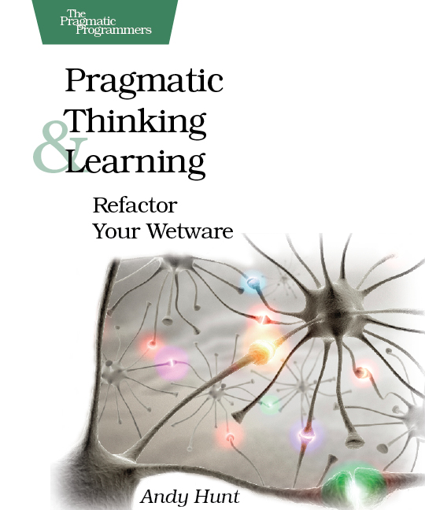

{:.center}
Use the space bar or arrow keys to browse the slide.

Some of the images are pretty big, so if you see an empty slide then wait a bit.

---

# Learn to Learn

---
{:.fragments}

## It's your journey

Learning is something *you* do, not something done *to* you

It's something you can get better at

You can learn (almost) everything

---
{:.center}

<iframe width="560" height="315" src="https://www.youtube.com/embed/xkTcSoQ-q5Q?start=102" frameborder="0" allowfullscreen></iframe>

&nbsp;

Keila Banks at OSCON 2015

<!-- --- -->
<!-- {:.fragments} -->

<!-- ## Use your whole brain -->

<!-- Try different formats: tutorial, screencast, project group -->

<!-- Make notes, sketch -->

<!-- Recap or explain a problem out loud -->

<!-- --- -->
<!-- {:.fragments} -->

<!-- ## Problem-solution Ordering Issues -->

<!-- Notion from game design, watch out for it -->

<!-- Don't understand the "why"? This might be the problem -->

<!-- Just build stuff, come back later -->

---
{:.fragments}

## Know what direction you're heading

Set concrete, realistic goals

Pick projects that motivate you

Consider the context, plan accordingly

---
{:.center}

---
{:.heading}

# FIN

---

## Resources

* [Locked Doors, Headaches, and Intellectual Need](http://mkremins.github.io/blog/doors-headaches-intellectual-need/) - on problem-solution ordering issues

* [Pragmatic Thinking and Learning](https://pragprog.com/book/ahptl/pragmatic-thinking-and-learning)
