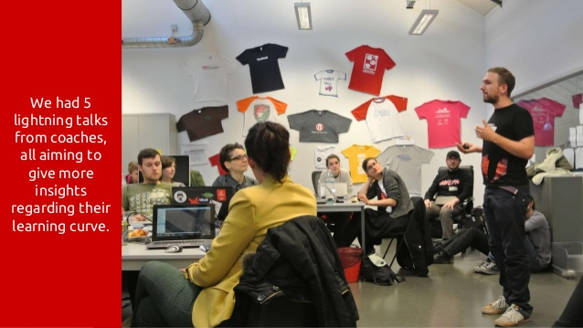
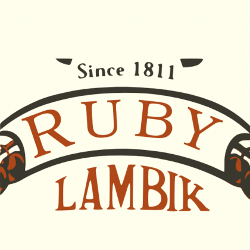
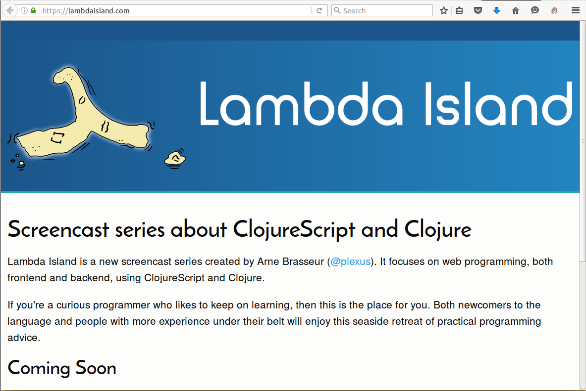
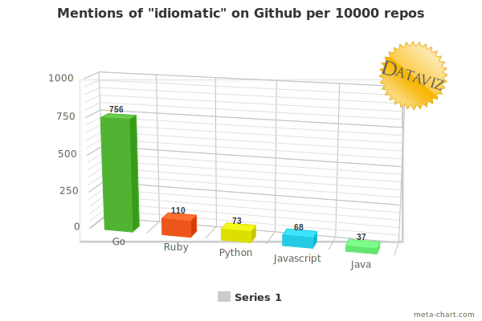
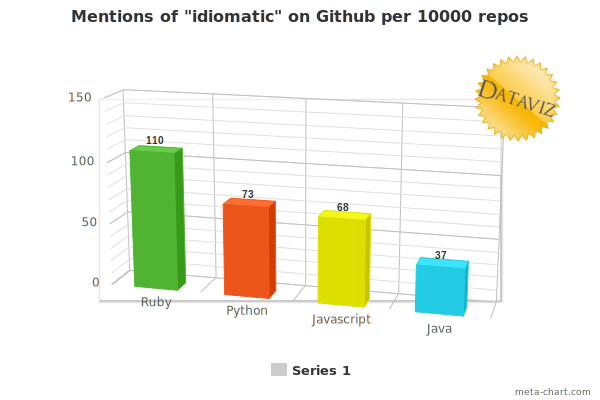

---

{:style="float:left; margin-right: 2em;"}


Arne Brasseur

Twitter/Github: @plexus

----

{:.cover}

----

{:.cover}

----

{:.cover}

----

{:.cover}

----

{:.cover}

----
{:#cover}

## Burn Your Idiomatic Ruby

_by [**Arne Brasseur**](http://arnebrasseur.net)_

_BRUG, Brussels, 19 April 2016_

{:.cover}

{:.attribution}
Image: [Bomber in Flames](https://www.flickr.com/photos/gbaku/3298229052) by John Atherton


<!-- {:.cover} -->

<!-- {:.attribution} -->
<!-- Image: [Fiddling while Rome burns](https://www.flickr.com/photos/shenamt/11015203525) by Shena Tschofen -->


---
{:.chapter}

## Chapter 1

idiom enters the stage

---

## Idiom

<!-- **id·i·o·mat·ic** \i-dē-ə-ˈma-tik\ _adjective_ -->
<!-- Related or conforming to idiom. -->

**id·i·om** \i-dē-əm\ _noun_

1. a peculiar expression that is commonly understood; a colloquial metaphor
2. a way of speaking that is particular to a specific group

---

## Idiom¹

2. a peculiar expression that is commonly understood; a colloquial metaphor

_“you're pulling my leg”_
_“Dat is een ander paar mouwen”_
_“Jouer avec les pieds de quelqu’un”_

---

_“Avaler par le trou du dimanche”_
_“c'est à Houte-si-plou les bains de pied”_
_“les doigts dans le nez”_
_“avoir un oeuf à peler avec quelqu'un”_
_“affonner une biere”_
_“raconter des carabistouilles”_

---

_“avoir la tete dans le cul”_
_“on boit un coup ou on s'encule”_
_“couter la peau du cul”_
_“se peler le cul”_
_“avoir le feu au cul”_

<!-- _“to kick the bucket”_ -->
<!-- _“I wouldn't put it past him”_ -->

<!-- ## Aussie idioms¹ -->

<!-- _“spit the dummy”_ -->
<!-- _“flat out like a lizard drinking”_ -->
<!-- _“fair suck of the sauce bottle”_ -->

---

## Ruby idioms¹

Think: “tiny design pattern”

---

## Ruby idioms¹

A method that memoizes

``` ruby
def sum
  @sum ||= @left + @right
end
```

---

## Ruby idioms¹

Method pre-condition

``` ruby
def filter_negatives(list)
  raise "list can't be empty" if list.empty?

  # ...
end
```

---

## Idiom²

{:style="counter-reset: list 1;"}
2. A way of speaking that is particular to a specific group

* “Eurospeak”
* High school language

---

## Idiom²

Can change over two dimensions

* From group to group

* Over time: Early, middle, modern English

---

## Ruby idioms²

Differs from group to group

* ruby-core Ruby
* Rails Ruby
* Seattle.rb Ruby
* DataMapper/ROM Ruby

---

## Seattle.rb Ruby

{:.linum}
```
def self.filter_files files, ignore = DEFAULT_IGNORE
  ignore_paths = if ignore.respond_to? :read then
                   ignore.read
                 elsif File.exists? ignore then
                   File.read ignore
                 end
   # ...
end
```

---
{:.chapter}

## Chapter 2

in which Ruby's idiom evolves

---

## Ruby anno 2004

``` ruby
def create_method_obj(names, params)
  o = Object.new
  for idx in 0 ... params.length
    o.instance_variable_set('@' + names[idx],
      params[idx])
  end
  o
end
```

---

## Ruby anno 2004

``` ruby
def create_method_obj(names, params)
  o = Object.new
  params.length.times do |idx|
    o.instance_variable_set('@' + names[idx],
      params[idx])
  end
  o
end
```

---

## Ruby anno 2004

``` ruby
def create_method_obj(names, params)
  o = Object.new
  params.each.with_index do |param, idx|
    o.instance_variable_set('@' + names[idx],
      param)
  end
  o
end
```

---

## Ruby anno 2004

``` ruby
def create_method_obj(names, params)
  o = Object.new
  params.zip(names).each do |param, name|
    o.instance_variable_set('@' + name, param)
  end
  o
end
```

---

## Ruby anno 2004

``` ruby
def create_method_obj(names, params)
  returning Object.new do
    params.zip(names).each do |param, name|
      o.instance_variable_set('@' + name, param)
    end
  end
end
```

---

## Ruby anno 2016

``` ruby
def create_method_obj(names, params)
  Object.new.tap do |o|
    params.zip(names).each do |param, name|
      o.instance_variable_set("@#{name}", param)
    end
  end
end
```

---

## Ruby anno 2004

{:.linum}
``` ruby
/Content-Disposition:.* filename="?([^\";]*)"?/ni.match(h)
filename = ($1 or "")

if /Mozilla/ni.match(env_table['HTTP_USER_AGENT']) and
    (not /MSIE/ni.match(env_table['HTTP_USER_AGENT']))
  filename = CGI::unescape(filename)
end
```

---

## Ruby anno 2004

``` ruby
class CGI
  def CGI::escape(string)
    # ...
  end

  def CGI::unescapeHTML(string)
    # ...
  end
end
```

---

## Modern version

{:.linum}
``` ruby
filename = h
  .match /Content-Disposition:.* filename="?([^\";]*)"?/ni
  &.captures
  &.fetch(0, "")

if env_table['HTTP_USER_AGENT'] =~ /Mozilla/ni
    && env_table['HTTP_USER_AGENT'] !~ /MSIE/ni
  filename = CGI.unescape(filename)
end
```

---

## Evolution of Ruby idiom

Early, Middle, and Modern Ruby

---

## Early Ruby: 1995-2005

“The primordial ooze”

Ruby is still very niche
Early adopters from Perl, C, LISP, Smalltalk
Diversity of styles

---

## Middle Ruby: 2005-2010

“Rails runaway train”

Adoption booms through Rails
Idiom crystalizes around Rails
Still lots of flexibility and creativity (Why the Lucky Stiff!)

---

## Modern Ruby: 2010-2015

“They grow up so fast”

Big Rails apps maintained for 5+ years
Desire for best practices, consistency
Wide adoption of a common style

---

## Modern Ruby: 2010-2015

Wide adoption of a common style

* 2011 Ruby Style Guide
* 2012 Rubocop

---

## Modern Ruby: 2010-2015

“The parallel track”

Resurgence of a “pure Ruby” crowd
More open to novel approaches
Develop their own idioms

---
{:.chapter}

## Chapter 3

in which idiom prevails

---

## Idiomatic

Conforming to idiom²

Sounding “natural”

---

## Idiomatic Code

Takes advantage of the language

Is more easily understood by others

Is consistent

---

## Consistency

Important for projects

Shared ownership

Reduced cognitive overhead

---

## Who makes the rules?

In theory: descriptivist, style guide captures what people do

In practice: well known influencers


---

{:style="width: 100%"}

---

{:style="width: 100%"}

---

## Downsides

Extra hurdle for newcomers

Treating idiom as normative hampers innovation

---
{:.chapter}

## Chapter 4

a whole new idiom

---

## Times are changing

The only constant is change

When a society changes, its language changes

When it comes into contact with other language groups, its language changes

---

## Times are changing

Distributed systems, parallelization

Concurrency models, type systems

Go, Idris, Elixir, Elm, Rust

---

## Porting concepts to Ruby

Monads, functional composition, transducers, CSP

Unseen in Ruby

Will look unfamliar by necessity

---

## Kleisli

```ruby
json_string = get_json_from_somewhere

result =
  Try { JSON.parse(json_string) } >-> json {
    Try { json["dividend"].to_i /
          json["divisor"].to_i }
  }
```

---

## Kleisli

```ruby
maybe_user =
  Maybe(user) >-> user {
    Maybe(user.address)
  } >-> address {
    Maybe(address.street)
  }
```

---

## Kleisli

From Call Sheet

```ruby
result.fmap { |value|
  broadcast :"#{step_name}_success", value
  value
}.or { |value|
  broadcast :"#{step_name}_failure", *args, value
  Left(StepFailure.new(step_name, value))
}
```

---

## Transproc

```ruby
transformation = t(:map_array, t(:symbolize_keys)
 .>> t(:rename_keys, user_name: :user))
 .>> t(:wrap, :address, [:city, :street])
```

---

## Transducers

```ruby
T.transduce(
  T.compose(
     T.map(:succ),
     T.filter(:even?)
  ),
  :<<, [], 0..9
)
# => [2, 4, 6, 8, 10]
```

---

## Agent

``` ruby
cw = channel!(Integer, 1)
cr = channel!(Integer, 1)

select! do |s|
  s.case(cr, :receive) { |value| perform(value) }
  s.case(cw, :send, 3)
end
```

---

## Conclusion

Idiom is fluid, treat it as such

Programming is a form of expression, find your own voice

“Idiomatic” does not imply “good” and vice versa, look beyond face-value


---
{:.chapter}

{:style="padding-left: 300px; padding-top: 150px;"}
## FIN
