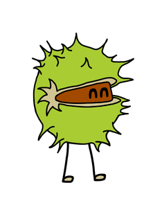

---
{:#cover}

## Burn Your Idiomatic Ruby

_A RubyConf Australia talk by [Arne Brasseur](http://arnebrasseur.net)_


{:.cover}

{:.attribution}
Image: [Fiddling while Rome burns](https://www.flickr.com/photos/shenamt/11015203525) by Shena Tschofen

<style>

</style>

---

## You say idiomatic

{:.big}
What does it mean?

{:.big}
Why would we want it?

---

## Idiomatic

{:.big}
**id·i·o·mat·ic** \i-dē-ə-ˈma-tik\ _adjective_

{:.big}
Relating to, or conforming to idiom

---

## Idiom

From Ancient Greek

**ἴδιος** _ídios_
personal, one's own;  peculiar, separate


**ἰδίωμα** ‎_idíōma_
a peculiarity, a peculiar phraseology, an idiom

---

## Idiom

**id·i·om** \i-dē-əm\ _noun_

1. a way of speaking that is particular to a specific group
2. a peculiar phrase or expression that is commonly understood, even though its meaning isn't self-obvious

---

## Idiom (2)

{:.big}
2. a peculiar phrase or expression that is commonly understood, even though its meaning isn't self-obvious

{:.big}
to kick the bucket
I'm pulling your leg
I wouldn't put it past him

---

## Ruby idioms (2)

{:.big}
Think: "tiny design pattern"

---

<!-- ## Ruby idioms (2) -->

<!-- Optionally executable -->

<!-- ``` ruby -->
<!-- if __FILE__ = $0 -->
<!--   # ... -->
<!-- end -->
<!-- ``` -->

<!-- --- -->

## Ruby idioms (2)

A method that memoizes

``` ruby
def sum
  @sum ||= @left + @right
end
```

---

## Ruby idioms (2)

Method pre-condition

``` ruby
def filter_negatives(list)
  raise "list can't be empty" if list.empty?

  # ...
end
```


---

## Idiom (1)

{:.big}
1. a way of speaking that is particular to a specific group

{:.big}
“Eurospeak”
High school language

---

## Ruby idioms (1)

{:.big}
Rails Ruby
ruby-core Ruby
Seattle.rb Ruby
DataMapper/ROM Ruby

---

## Ruby idioms

{:.big}
Have evolved over time

<!-- --- -->

<!-- ## Middle Ruby -->

<!-- {:.small} -->
<!-- ``` ruby -->
<!-- module SOAP -->

<!-- class WSDLDriverFactory -->
<!--   def ... -->
<!--   end -->

<!-- private -->

<!--   def ... -->
<!--   end -->
<!-- end -->
<!-- ``` -->

---

## Middle Ruby

``` ruby
def create_method_obj(names, params)
  o = Object.new
  for idx in 0 ... params.length
    o.instance_variable_set('@' + names[idx],
      params[idx])
  end
  o
end
```

---

## Middle Ruby

{:.linum}
{:.small}
``` ruby
/Content-Disposition:.* filename="?([^\";]*)"?/ni.match(h)
filename = ($1 or "")
if /Mac/ni.match(env_table['HTTP_USER_AGENT']) and
    /Mozilla/ni.match(env_table['HTTP_USER_AGENT']) and
    (not /MSIE/ni.match(env_table['HTTP_USER_AGENT']))
  filename = CGI::unescape(filename)
end
```

---

## Middle Ruby

``` ruby
class CGI
  def CGI::escape(string)
    # ...
  end

  def CGI::unescapeHTML(string)
    # ...
  end
end
```

---

## Idiomatic

{:.big}
Conforming to idiom(1)

{:.big}
Sounding “natural”

---

## Idiomatic Code

{:.big}
Takes advantage of the language

{:.big}
Is more easily understood by others

---

## Consistency

{:.big}
Important for projects

{:.big}
Shared ownership

{:.big}
Reduced cognitive overhead

---

## Evolution of

## Ruby idiom

{:.big}
First, second, and modern era

---

## The first era: 1995-2005

{:.big}
“The primordial ooze”

{:.big}
Ruby is still very niche
Early adopters from Perl, C, LISP, Smalltalk
Diversity of styles

---

## The second era: 2005-2010

{:.big}
“Rails runaway train”

{:.big}
Adoption booms through Rails
Idiom crystalizes around Rails
Still lots of flexibility and creativity (_why!)

---

## The modern era: 2010-2015

{:.big}
“They grow up so fast”

{:.big}
Big Rails apps maintained for 5+ years
Desire for best practices, consistency
Wide adoption of a common style

---

## The modern era: 2010-2015

{:.big}
“The parallel track”

{:.big}
Resurgence of a “pure Ruby” crowd
More open to novel approaches
Develop their own idioms

---

## Who makes the rules?

{:.big}
In theory: descriptivist, style guide captures what “the people” do

{:.big}
In practice: well known influencers

---

## Downsides

{:.big}
Extra hurdle for newcomers

{:.big}
Treating idiom as normative hampers innovation

---

## Times are changing

{:.big}
The only constant is change

{:.big}
When a society changes, its language changes

{:.big}
When it comes into contact with other language groups, its language changes

---

## Times are changing

{:.big}
Distributed systems, parallelization

{:.big}
Concurrency models, type systems

{:.big}
Go, Idris, Elixir, Elm, Rust

---

## Porting concepts to Ruby

{:.big}
Monads, functional composition, transducers, CSP

{:.big}
Unseen in Ruby

{:.big}
Will look unfamliar by necessity

---

## Kleisli

```ruby
json_string = get_json_from_somewhere

result =
  Try { JSON.parse(json_string) } >-> json {
    Try { json["dividend"].to_i /
          json["divisor"].to_i }
  }
```

---

## Kleisli

```ruby
maybe_user =
  Maybe(user) >-> user {
    Maybe(user.address)
  } >-> address {
    Maybe(address.street)
  }
```

---

## Kleisli

From Call Sheet

```ruby
result.fmap { |value|
  broadcast :"#{step_name}_success", value
  value
}.or { |value|
  broadcast :"#{step_name}_failure", *args, value
  Left(StepFailure.new(step_name, value))
}
```

---

## Transproc

```ruby
transformation = t(:map_array, t(:symbolize_keys)
 .>> t(:rename_keys, user_name: :user))
 .>> t(:wrap, :address, [:city, :street])
```

---

## Transducers

```ruby
T.transduce(
  T.compose(
     T.map(:succ),
     T.filter(:even?)
  ),
  :<<, [], 0..9
)
# => [2, 4, 6, 8, 10]
```

---

## Agent

``` ruby
cw = channel!(Integer, 1)
cr = channel!(Integer, 1)

select! do |s|
  s.case(cr, :receive) { |value| perform(value) }
  s.case(cw, :send, 3)
end
```

---

## Conclusion

{:.big}
Idiom is fluid, treat it as such

{:.big}
Programming is a form of expression, find your own voice

{:.big}
“Idiomatic” does not imply “good” and vice versa, look beyond face-value

---
{:.center}

## @plexus

{:.img-yaks}


{:.img-chestnut}


{:style="padding-left: 120px;"}
### Yaks &nbsp; &nbsp;&nbsp; &nbsp;&nbsp; Chestnut

---
{:.center}

{:style="padding-top: 350px;"}
# FIN

---

---

---

## Idiom

From Ancient Greek

&nbsp;

**ἴδιος** (_ídios_)
“private, personal, one's own;  peculiar, separate”.

&nbsp;

**ἰδιοῦσθαι** ‎(_idioûsthai_)
“to make one's own, appropriate to oneself”

&nbsp;

**ἰδίωμα** ‎(_idíōma_)
“a peculiarity, property, a peculiar phraseology, idiom”

---

## Idiot
From Ancient Greek, Latin

&nbsp;

**ἴδιος** (_ídios_)
“private, personal, one's own;  peculiar, separate”.

&nbsp;

**ἰδιώτης** (_idiōtēs_) “person lacking professional skill, a private citizen, individual”

&nbsp;

In Late Latin:

&nbsp;

**idiota**
“uneducated or ignorant person”

---

## Idiom

A way a certain group of people speak.

_I had studied Arabic before, but was not familiar with the local idiom._

An expression whose meaning can't be inferred from the words that make up the expression.

_you're pulling my leg_, _in your neck of the woods_, _I’ve been a rubyist for donkey’s years._

The style of a particular artist or school or movement

---

## Idiomatic

The "natural" way to phrase something

_come with me_ vs _follow me along_

---

It's about being able to personally express yourself.

It's about being understood.

---

“”
