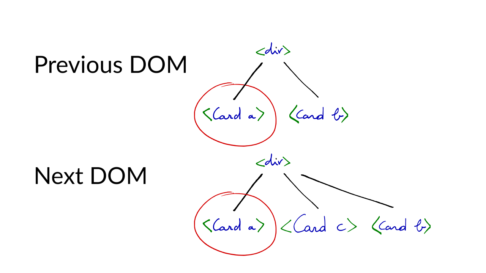

---

Why <span style="text-decoration: underline;">React</span> & <span style="text-decoration: underline;">re-frame</span><br>are fast <br> in 7 <br> Performance Hacks
---
{: style="font-size: 6rem; margin-left: 20%;"}

---

Why <span style="text-decoration: underline;">React</span> & <span style="text-decoration: underline;">re-frame</span><br>are fast <br> in <del>7</del> 8 Performance Hacks
---
{: style="font-size: 6rem; margin-left: 20%;"}


----

{:.cover}

---

React
---
{: style="font-size: 12rem; margin-left: 30%; margin-top: 15%;"}

Reagent style
---
{: style="font-size: 3rem; margin-left: 32%"}

----

## React Big Ideas

* Self-contained Components
* UI as a pure function (vs. mutable DOM) <br> &nbsp; `app-state -> DOM`
* one way data flow (vs. two way data binding)

----

## Components

``` clojure
(defn comment [c]
  [:div
   "Comment by " (:author c)
   [:div.body (:body c)]])

(defn comment-list [cs]
  [:div
   [:h3 "Comments"]
   (for [c cs]
     [comment c])])
```
{:style="float:left; margin-right: 40px;"}

A component is a **function**
It receives **properties**
It returns an **element**

----

## Elements

``` clojure
[:div {:class "comment-list"}
  [:h3 "Comments"]
  [comment {:author ,,, :body ,,,}]
  [comment {:author ,,, :body ,,,}]
```

An element has a **type**, which is either a HTML tag, or a component
It takes **properties** and **children**

----

## Elements

Properties and children either correspond with DOM properties and children

``` clojure
[:div {:class "foo"} "Hello"]
```

Or serve as arguments to the component

``` clojure
[comment {:author "Arne" :body "Reactive!"}]
```

<!-- ---- -->

<!-- ``` clojure -->
<!-- (def app-state (r/atom {:comments [{:author "Arne" -->
<!--                                     :body "Reactive!"}]})) -->

<!-- (defn comment [c] -->
<!--   [:div.comment -->
<!--    "Comment by " (:author c) -->
<!--    [:div.body (:body c)]]) -->

<!-- (defn comment-list [cs] -->
<!--   [:div.comment-list -->
<!--    [:h3 "Comments"] -->
<!--    (for [c cs] ^{:key (:id c)} [comment c])]) -->

<!-- (defn app [] -->
<!--   [comment-list (:comments @app-state)]) -->

<!-- (reagent/render [app] (js/document.getElementById "app")) -->
<!-- ``` -->

---

## Events

``` clojure
[:a {:on-click #(do-something %)}
 "do something"]
```

----

## UI as a Pure Function

Each **state change** results in **new DOM**

Naive approach: on each change **recreate** the DOM

But... lots of things are attached to the DOM

Changing the **DOM makes browsers do work**

----

## Virtual DOM

Solution: use a "fake" DOM

Made of plain JS objects

Lightweight, easy to create and discard

No ~~strings~~ browser attached

----

## Reconciliation

Changes still need to make it to the "real" DOM

This is known as "reconciliation"

`diff -u browser.dom virtual.dom`

Results in a set of "updates" which are "flushed" to the DOM

----

Hacks
---
{: style="font-size: 12rem; margin-left: 30%; margin-top: 15%;"}

---

## Performance Hack 1.

**Full tree diff is expensive**, `O(n^3)`, not an option

Can we get a **"good enough"** diff?

Assume **nodes never move** to a different parent

Do a **single pass**, top-to-bottom, left-to-right: `O(n)`

Trades off speed of diffing vs. minimal change set

----

## Performance Hack 2.

Skip components of different types

``` clojure
[:div [:h3 "foo"]
      [comment-list]]

[:div [:h3 "bar"]
      [menu-bar]]
;;=>
[(change "foo" "bar")
 (remove comment-list)
 (add menu-bar)]
```


----

## Performance Hack 3.

Force the programmer to add a unique `key` to siblings

Detect sibling moves based on `key`

----

## Keys

``` clojure
(defn comment-list [cs]
  [:div.comment-list
   [:h3 "Comments"]
   (for [c cs]
     [comment c])])
```

---

## Keys

``` clojure
(defn comment-list [cs]
  [:div.comment-list
   [:h3 "Comments"]
   (for [c cs]
     ^{:key (:id c)} [comment c])])

```


---

{:style="width: 110%"}

---

{:style="width: 110%"}

---

{:style="width: 110%"}

---

{:style="width: 110%"}

---

{:style="width: 110%"}

---

{:style="width: 110%"}

---

{:style="width: 110%"}

---

{:style="width: 110%"}

---

{:style="width: 110%"}

---

{:style="width: 110%"}

---

{:style="width: 110%"}

---

{:style="width: 110%"}

---

{:style="width: 110%"}

---

{:style="width: 110%"}

----

## Performance Hack 4.

Replacing DOM nodes means removing and re-creating event handlers

Instead register **global handlers**

Implement own **"synthetic" event system**

Look up parent by simple string manipulation

---

``` html
<div class="comments" data-reactid=".0">
  <div class="comment" data-reactid=".0.0:0">
    <div class="header" data-reactid=".0.0:0.0">
      ...
    </div>
    <div class="body" data-reactid=".0.0:0.1">
      <div data-reactid=".0.0:0.1.0">
        <p data-reactid=".0.0:0.1.0.0">
          ...
        </p>
      </div>
    </div>
  </div>
</div>
```
{:style="font-size: 1.2rem;"}

---

Reagent (et al)
---
{: style="font-size: 12rem; margin-left: 30%; margin-top: 15%;"}

----

## Performance Hack 5.

Components should **only update when properties change**

If props are **JS objects: expensive** to compare

Comparing **Functional Data Structures: instantaneous**

Reagent, Om, implement `shouldComponentUpdate` to achieve this

---

``` clojure
(fn shouldComponentUpdate [nextprops nextstate]
  (this-as c
    (let [old-argv (.. c -props -argv)
          new-argv (.. nextprops -argv)]
      (not= old-argv new-argv))))
```


----

reagent atom
---
{: style="font-size: 12rem; margin-left: 30%; margin-top: 15%;"}


---


## Performance Hack 6.

Reagent tracks which components make use of which `reagent/atom`

Result: when state changes it knows immediately which are "dirty"

Instead of rendering the whole tree, render only the "dirty" components with `forceUpdate`

----

``` clojure
(def a (reagent/atom "I'm x"))
(def b (reagent/atom "I'm y"))

(def x []
  [:div @a])

(def y []
  [:div @b])

(swap! a (constantly "Even more x"))
```

----

## Performance Hack 7.

App state may change several times in a short time

No need to update the UI quicker than the browser can handle

Reagent batches dirty components and flushes them all in a `requestAnimationFrame`

----

re-frame
---
{: style="font-size: 12rem; margin-left: 30%; margin-top: 15%;"}

----

## Performance Hack 8.

Apps typically use **one atom** containing app state

Many components will reference this atom

If state changes, **all components are re-rendered**

Solution: Reactive **signal graph**.

----

``` clojure
(reg-sub :todos (fn [db _]
                  (:todos db)))

(reg-sub :todos-count :<- [:todos]
         (fn [todos _]
           (count todos)))

(reg-sub :completed-count :<- [:todos]
         ,,,)

(reg-sub :footer-counts :<- [:todos-count]
                        :<- [:completed-count]
         (fn [[count completed] _]
           [(- count completed) completed]))

```


----

## Performance Hack ∞.

React is working on a new Reconciliation algorithm called "Fiber".

MOAR HACKS are on the way!

---

{:.cover style="font-size: 15rem"}
## FIN
