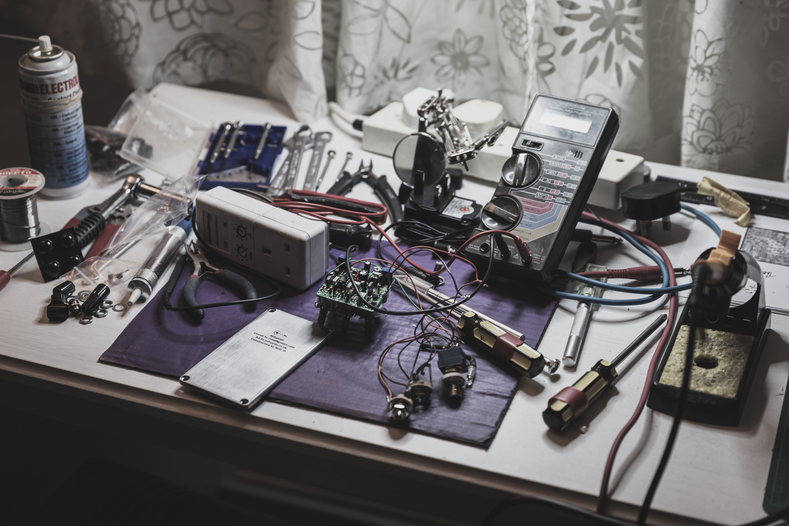
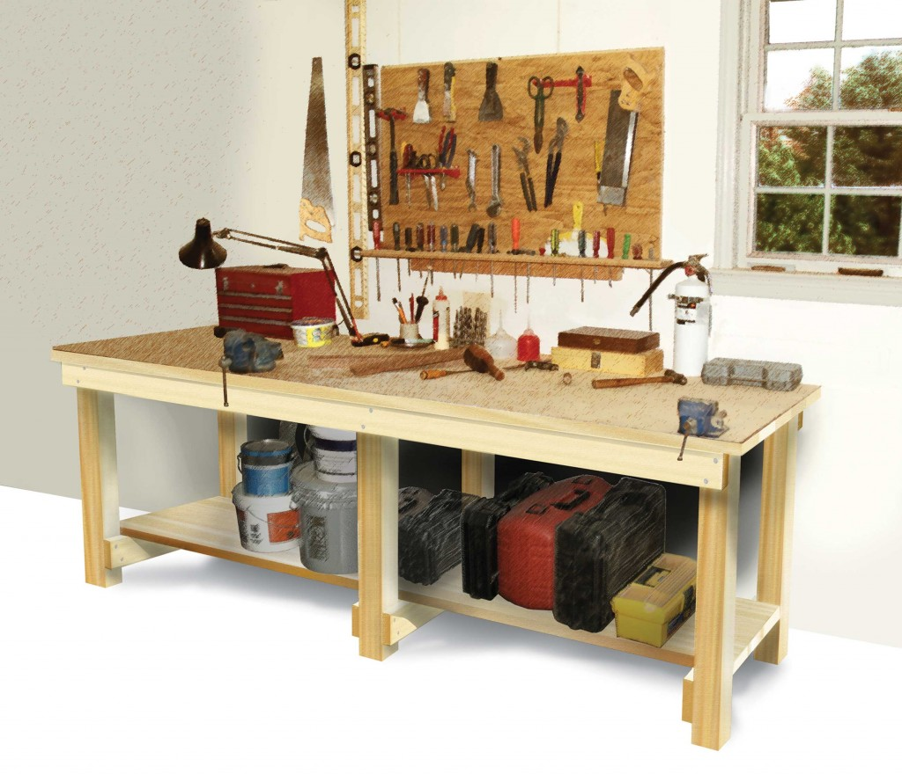
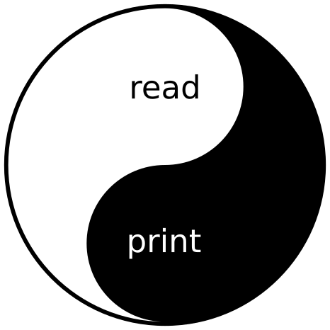

{::options parse_block_html="true" /}

<div class="tc white mt4 pv4 bg-black-40">
## Clojure REPLs
{:style="color:white; font-size:70px"}
### Closing the Loop
{:style="font-size: 50px"}

<p class="mt3" style="margin-bottom: 10px">by _Arne Brasseur_ </p>
</div>


{:width="120%" style="max-width: 120%;" .cover}


----

## Workbench 工作台

Wikipedia:

> A WORKBENCH is a sturdy table at which manual **work is done**. They range from **simple to complex** designs that may be considered **tools in themselves**. Their size and design varies depending on the type of work that is being done.

{:width="100%" style="max-width: 100%; opacity: 0.3" .cover}

---

## Workbench 工作台

* A place where you put the thing you're working on
* Provides access to tools
* Let's you work comfortably

{:width="100%" style="max-width: 100%; opacity: 0.3" .cover}

----

## Programmer's Workbench?

* A place where you put the thing you're working on
* Provides access to tools
* Let's you work comfortably

----

## Programmer's Workbench?

* A place where you put the thing you're working on
* Provides access to tools
* Let's you work comfortably

{:.f1.highlight}
Editor!


----

## Workbench / Editor <br> should provide access to tools

As a Clojure programmer, what's the most important tool in your toolbox?

---

## Workbench / Editor <br> should provide access to tools

As a Clojure programmer, what's the most important tool in your toolbox?

{:.f1.highlight style="margin-bottom:0"}
REPL

{:.highlight}
Because it's a meta-tool.
It's a tool that provides access to tools.
It's a tool that lets you build your own tools.

----

## REPL

``` clojure
(loop []
  (-> (read *in*)
      (eval)
      (println))
  (recur))
```

---

## Read

String -> Data

``` clojure
(read *in*)
;;=> [1 2 3]

(read-str "[1 2 3]")
;;=> [1 2 3]
```

---

## Eval

Data -> Data

``` clojure
(eval '(+ 1 2))
;;=> 3
```

---

## Print

Data -> String

``` clojure
(prn [1 2 3])
;; *out*| [1 2 3]

(prn-str [1 2 3])
;;=> "[1 2 3]"
```

---

## Read & Print

```clojure
(-> "[1 2 3]"
    read-string
    prn-str
    read-string
    prn-str
    (= "[1 2 3]"))
;;=> true
```

---
{:.repl}

## Read & Print

``` clojure
user=> (def identity (comp read-string prn-str))
#'user/identity
user=> (identity 1)
1
user=> (identity [1 2 3])
[1 2 3]
user=> (identity {:meetup :Taipei})
{:meetup :Taipei}
```

---

{:.center.db width="450px"}


<!-- --- -->

<!-- ## REPL -->

<!-- @plexus -->

<!-- > A REPL is an interface through which **programming is done**. They range from **simple to complex** designs, that may be considered **tools in themselves**. Their function and design varies depending on the type of programming that is being done. -->

<!-- --- -->

<!-- ## REPLs -->

<!-- - `clj --repl` -->
<!-- - `lein repl` -->
<!-- - `boot` -->
<!-- - `nREPL` -->
<!-- - `lumo` -->
<!-- - `planck` -->

---
{:.f1}

## REPL Uses

<div class="flex">
<div>
Explore 探索
Observe 觀察
</div>
<div>
Control 控制
Change 改變
</div>
</div>

---
{:.repl}

## Explore 探索

``` clojure
user=> (require 'clj-slack.users)
nil
user=> (def conn {:api-url "https://slack.com/api"})
#'user/conn
user=> (def res (clj-slack.users/list conn))
#'user/res
user=> (type res)
clojure.lang.PersistentList
user=> (length res)
12532
user=> (type (first res))
clojure.lang.PersistentArrayMap
user=> (keys (first res))
(:id :name :real_name :is_admin :is_owner :profile)
```

<!-- --- -->
<!-- {:.repl} -->

<!-- ## Exploration -->

<!-- ```clojure -->
<!-- user=> (require '[clojure.string :as str]) -->
<!-- nil -->
<!-- user=> (str/split "1\n2\n3\n" #"\n") -->
<!-- ["1" "2" "3"] -->
<!-- user=> (str/split "1\n2\n3\n" #"^") -->
<!-- ["1\n2\n3\n"] -->
<!-- user=> (str/split "1\n2\n3\n" #"(?m)^") -->
<!-- ["1\n" "2\n" "3\n"] -->
<!-- ``` -->

---
{:.repl}

## Observe 觀察

``` clojure
user=> (keys reloaded.repl/system)
(:http :datomic :handler :mail-queue)
user=> (.totalMemory (java.lang.Runtime/getRuntime))
315621376
user=> (:roles (user-by-login (db) "plexus"))
(:admin :member)
```

---
{:.repl}

## Control 控制

``` clojure
user=> (go)
Starting system...
user=> (reset)
Suspending...
Reloading files...
Restarting...
user=> (add-workers! 5)
nil
user=> (enable-maintenance-mode!)
:enabled
```

---
{:.repl}

## Change 改變

``` clojure
user=> (alter-var-root! application
                        assoc-in [:api :token] "new-token")
#'application
user=> (defn previously-buggy-function [& args]
          new-definition-that-fixes-the-bug)
#'previously-buggy-function
```

<!-- --- -->
<!-- {:.repl} -->

<!-- ## 5. Test -->

<!-- ``` -->
<!-- my.tests=> (use 'clojure.test) -->
<!-- nil -->
<!-- my.tests=> (run-tests) -->
<!-- Testing my.tests -->

<!-- Ran 5 tests containing 12 assertions. -->
<!-- 0 failures, 0 errors. -->
<!-- {:test 0, :pass 5, :fail 0, :error 0, :type :summary} -->
<!-- ``` -->

----

## REPL

<div class="flex f1">
<div>
Explore 探索
Observe 觀察
</div>
<div>
Control 控制
Change 改變
</div>
</div>

{:.highlight}
All of these combined are used to **create** (production code, tests, data)

----

## REPL & Editor

Your "workbench" should provide handy access to your "tools".

Don't walk to the other side of the room each time you need a screwdriver.

Get yourself a **Connected REPL**.

---


---

## Connected REPL

- Emacs + CIDER
- Atom + ProtoREPL
- Cursive (IntelliJ)
- Vim + Fireplace
- NightCode

---

## Connected REPL

Basic operation: eval form in source file

- `*in*` how do you select a form?
- `*out*` where does the result go?

---

## `*in*` how do you select a form?

- before point
- outermost, e.g. `(defn ,,,)`
- "surrounding", i.e the form that you're currently "in"
- whole buffer

---

## `*out*` where does the output go?

- REPL buffer / terminal
- overlay
- back into current file / buffer
- comment
- saved to file

---

## Closing the Loop!

By inserting the REPL result back into the buffer, it can be used again as data or code.

We have come full circle, the printed form can be read again.

---


---

<div class="tc mt6 pv4">
## Practical Tips
{:style="font-size:70px"}
</div>

<div class="w-100 tc">
§
{:style="font-size: 300px; opacity: 0.1; font-family: serif; margin-top:-400px; text-align: center;"}
</div>

---

## Create a `user.clj`

REPL helpers that should always be available.

`lein repl` automatically loads this file.

Remember: a workbench needs to be convenient, comfortable, easy to use.

---

## `user.clj` ideas

- reloaded workflow (start/stop/reset)
- `(add-dependency [some-jar "0.1.0"])`
- `(db)`, `(conn)`
- `(last-request)`, `(last-response)`

---

## Reloaded Workflow

Combination of code reloading (clojure.tools.namespace), and some lifecycle manager (Component, Integrant, Mount)

Provides a way to get to a clean slate

Why: because you don't want to have to restart your REPL process!

---

## Pomegranate and Alembic

Hot load dependencies

Good for quickly trying out dependencies

Again: prevent having to restart the process

---

## Data helpers (global state)

Create helpers for common types of arguments

- Ring request map
- Pedestal context map
- Ring session
- Datomic DB
- Datomic connection

------
{:.repl}

## Data helpers

cider-Store request/response history in memory, so you can have

``` clojure
user=> (request)
{:uri "/" :request-method :get ,,,}
user=> (response)
{:status 200 :body ,,,}
user=> (session-id)
"abcxyz"
user=> (session)
{,,,}
```

---

## Local state

When debugging you might want to evaluate forms inside a function, but local variables will be a problem.

- create a `let`
- just `def` the values
- use `vvvvalvalval/scope-capture`

---
{:.repl}

## scope-capture

``` clojure
user=> (require 'sc.api)
nil
user=> (defn sum [a b] (sc.api/spy (+ a b)))
SPY <-1> :1
 At Code Site -1, will save scope with locals [a b]
#'user/sum
user=> (sum 10 20)
SPY [1 -1] :1
  At Execution Point 1, Code Site -1, saved locals [a b]
SPY [1 -1] :1
(+ a b) => 30
30
user=> (sc.api/letsc 1 (+ a b))
30
user=> (sum 99 42)
SPY [2 -1] :1
  At Execution Point 2, Code Site -1, saved locals [a b]
SPY [2 -1] :1
(+ a b) => 141
141
user=> (sc.api/letsc 2 a)
99
```

---

## REPL files

Create a `repl/` or `scratch/` directory, with per-topic "repl files"

- **Don't** put it on the classpath
- **Do** check it into the repo (if possible)

---

## REPL/scratch files

Encourages experimentation (go ahead, make a mess)
Explicitly keeps history
Shows thought process
Demonstrates usage
Provides a home for useful snippets

---

## REPL & Tests

Using a REPL does not absolve you of writing tests

Using a REPL is in many ways like writing tests, call a function with various inputs

→ Make a habit of using `eval-and-insert`, then later copy to test namespace

REPL/scratch file can also be a good source for test inspiration
