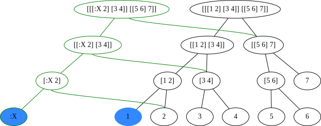

# The Art of Tree Shaping with Zippers

----
{: fullscreen-img="img/title_image.png"}

----
## About me

My name is Arne Brasseur (@plexus)

I'm from Belgium, but based in Berlin.
{:.next}

I do Clojure consulting & training.
{:.next}

---
## Lambda Island

Detailed screencasts about all things Clojure & ClojureScript.

Been going for ~2.5 years.
{:.next}

You should check it out.
{:.next}

---
## Agenda

- `clojure.zip` API
- Functional Zipper concept
- Clojure implementation
- fast-zip & rewrite-clj

---
{:.header}

# clojure.zip API

---
## What is a zipper?

A zipper (or loc) combines two pieces of information

- some kind of tree-shaped data structure
- a pointer to a node within the tree

zipper = tree + path

---
## What does it do?

The zipper API allows you to

- Move around in the tree
- Modify the tree at your current location

---
## Getting started

``` clojure
(require '[clojure.zip :as z])

(def loc (z/vector-zip [[1 2] [3 4]]))
```

Note: I'm using loc, location, and zipper interchangeably.

---
## What qualifies as a tree?

- Nested vectors `(z/vector-zip v)`
- Nested sequences `(z/seq-zip s)`
- XML documents `(z/xml-zip doc)`
- Anything that has nodes and child nodes `(z/zipper ... root)`

---
## An example

{: viz="tree"}
``` clojure
(-> [[1 2] [3 [4 5] 6]]
    z/vector-zip)
```

---
## An example

{: viz="tree"}
``` clojure
(-> [[1 2] [3 [4 5] 6]]
    z/vector-zip
    z/down)
```

---
## An example

{: viz="tree"}
``` clojure
(-> [[1 2] [3 [4 5] 6]]
    z/vector-zip
    z/down
    z/right)
```

---
## An example

{: viz="tree"}
``` clojure
(-> [[1 2] [3 [4 5] 6]]
    z/vector-zip
    z/down
    z/right
    z/down)
```

---
## An example

{: viz="tree"}
``` clojure
(-> [[1 2] [3 [4 5] 6]]
    z/vector-zip
    z/down
    z/right
    z/down
    z/rightmost)
```

---
## An example

{: viz="tree"}
``` clojure
(-> [[1 2] [3 [4 5] 6]]
    z/vector-zip
    z/down
    z/right
    z/down
    z/rightmost
    z/left)
```

---
## An example

{: viz="tree"}
``` clojure
(-> [[1 2] [3 [4 5] 6]]
    z/vector-zip
    z/down
    z/right
    z/down
    z/rightmost
    z/left
    (z/append-child :x))
```

---
## An example

{: viz="tree"}
``` clojure
(-> [[1 2] [3 [4 5] 6]]
    z/vector-zip
    z/down
    z/right
    z/down
    z/rightmost
    z/left
    (z/append-child :x)
    z/up)
```

---
## An example

``` clojure
(-> [[1 2] [3 [4 5] 6]]
    z/vector-zip
    z/down
    z/right
    z/down
    z/rightmost
    z/left
    (z/append-child :x)
    z/up
    z/node)
;;=> [3 [4 5 :x] 6]
```

---
## An example

``` clojure
(-> [[1 2] [3 [4 5] 6]]
    z/vector-zip
    z/down
    z/right
    z/down
    z/rightmost
    z/left
    (z/append-child :x)
    z/root)
;;=> [[1 2] [3 [4 5 :x] 6]]
```

---
## xml-zip

``` xml
<cart>
    <line-items>
        <product sku="CH56" qty="1" price="2.5">Chocolate</product>
        <product sku="CA94" qty="1" price="1.7">Candy</product>
        <discount amount="10%" />
    </line-items>
    <customer>
        <name>Arne</name>
        <address>Berlin</address>
    </customer>
</cart>
```

---
## xml-zip

{: viz="eval"}
```clojure
(require '[clojure.java.io :as io]
         '[clojure.xml :as xml])

(def cart-xml
  (-> "zipper_demo/cart.xml"
      io/resource
      io/file
      xml/parse))
```

---
## xml-zip

```clojure
cart-xml
;;=>
{:tag "cart", :attrs {}
 :content
 [{:tag "line-items", :attrs {}
   :content
   [{:tag "product"
     :attrs {:sku "CH56"
             :qty "1"
             :price "2.5"}
     :content ["Chocolate"]}
    ,,,]}
  {:tag "customer" ,,,}]}

```

---
## xml-zip

{: viz="tree"}
```clojure
(def cart-zipper
  (z/xml-zip cart-xml))

cart-zipper
```

---
## xml-zip

{: viz="tree"}
```clojure
(-> cart-zipper
    z/down)
```

---
## xml-zip

{: viz="tree"}
```clojure
(-> cart-zipper
    z/down
    z/down)
```

---
## xml-zip

{: viz="tree"}
```clojure
(-> cart-zipper
    z/down
    z/down
    z/right)
```

---
## xml-zip

{: viz="tree"}
```clojure
(-> cart-zipper
    z/down
    z/down
    z/right
    z/right)
```

---
## xml-zip

{: viz="tree"}
```clojure
(-> cart-zipper
    z/down
    z/down
    z/right
    z/right
    z/leftmost)
```


---
## xml-zip

{: viz="tree"}
```clojure
(-> cart-zipper
    z/down
    z/down
    z/right
    z/right
    z/leftmost
    z/down)
```

---
## xml-zip

{: viz="tree"}
```clojure
(-> cart-zipper
    z/down
    z/down
    z/down
    (z/replace
      "luxury chocolate"))
```

---
## xml-zip

{: viz="tree"}
```clojure
(-> cart-zipper
    z/down
    z/down
    z/down
    (z/replace
      "luxury chocolate")
    z/up)
```

---
## xml-zip

{: viz="tree"}
```clojure
(-> cart-zipper
    z/down
    z/down
    z/down
    (z/replace
      "luxury chocolate")
    z/up
    (z/edit
      assoc-in [:attrs :price] 2.9))
```

---
## xml-zip

```clojure
(-> cart-zipper
    z/down
    z/down
    z/down
    (z/replace
      "luxury chocolate")
    z/up
    (z/edit
      assoc-in [:attrs :price] 2.9)
    z/root)
;;=> {:tag "cart", ...}
```

---
## API : Creating Zippers

``` clojure
vector-zip
xml-zip
seq-zip
zipper
```

---
## API: Navigating

``` clojure
up
down
left
right
leftmost
rightmost
root
```

---
## API: Updating

``` clojure
insert-left
insert-right
append-child ;; rightmost
insert-child ;; leftmost
edit
remove
replace
make-node
```

---
## API: Inspecting

``` clojure
lefts
rights
children
node
path
branch?
```

---
## API: Walking

``` clojure
next
prev
end?
```

---
## Walking

{: viz="tree"}
```
(nth
  (iterate z/next cart-zipper)
  0)
```

---
## Walking

{: viz="tree"}
```
(nth
  (iterate z/next cart-zipper)
  1)
```

---
## Walking

{: viz="tree"}
```
(nth
  (iterate z/next cart-zipper)
  2)
```
---
## Walking

{: viz="tree"}
```
(nth
  (iterate z/next cart-zipper)
  3)
```
---
## Walking

{: viz="tree"}
```
(nth
  (iterate z/next cart-zipper)
  4)
```

---
## Walking

{: viz="tree"}
```
(nth
  (iterate z/next cart-zipper)
  5)
```

---
## Walking

{: viz="tree"}
```
(nth
  (iterate z/next cart-zipper)
  6)
```

---
## Walking

{: viz="tree"}
```
(nth
  (iterate z/next cart-zipper)
  7)
```

---
## Walking

{: viz="tree"}
```
(nth
  (iterate z/next cart-zipper)
  8)
```

---
## Walking

{: viz="tree"}
```
(nth
  (iterate z/next cart-zipper)
  9)
```

---
## Walking

{: viz="tree"}
```
(nth
  (iterate z/next cart-zipper)
  10)
```

---
## Walking

{: viz="tree"}
```
(nth
  (iterate z/next cart-zipper)
  11)
```

---
## Walking

{: viz="tree"}
```
(nth
  (iterate z/next cart-zipper)
  12)
```

---

## Caveats

- No boundary checks. Don't fall off!
- No way back from `:end`
- It's not a cursor: beware of empty containers

---
## Caveats: no boundary checks

``` clojure
(-> [[1 2]]
    z/vector-zip
    z/down ;; [1 2]
    z/down ;; 1
    z/down
    )
;;=> nil
;; ... oops ...
```

---
## Caveats: no boundary checks

```clojure
(if-let [l (z/left loc)]
  (do-something-with l)
  (do-something-else loc))
```

---
## Caveats: no way back from `:end`

``` clojure
(-> [[1 2]]
    z/vector-zip
    z/next ;; [1 2]
    z/next ;; 1
    z/next ;; 2
    z/next ;; :end
    z/prev)
;; => nil
;; ... oops ...
```

---

## Caveats: not a cursor

A zipper points *at* a node, not *in between* nodes.

Corrolary: a zipper can not enter an empty container.

---

## Caveats: not a cursor

``` clojure
(-> [[1 2]]
    z/vector-zip
    z/down
    z/down
    z/remove
    z/remove
    (z/insert-left 3))
;;=> ???
```

---

## Caveats: not a cursor

{: viz="tree"}
``` clojure
(-> [[1 2]]
    z/vector-zip)
```
---

## Caveats: not a cursor

{: viz="tree"}
``` clojure
(-> [[1 2]]
    z/vector-zip
    z/down)
```
---

## Caveats: not a cursor

{: viz="tree"}
``` clojure
(-> [[1 2]]
    z/vector-zip
    z/down
    z/down)
```

---
## Caveats: not a cursor

{: viz="tree"}
``` clojure
(-> [[1 2]]
    z/vector-zip
    z/down
    z/down
    z/remove)
```

---
## Huh?

``` clojure
(defn remove
  "Removes the node at loc, returning the loc that
  would have preceded it in a depth-first walk."
  {:added "1.0"}
  [loc]
  ,,,)
```


----
## Caveats: not a cursor

{: viz="tree"}
``` clojure
(-> [[1 2]]
    z/vector-zip
    z/down
    z/down
    z/remove)
```

---
## Caveats: not a cursor

{: viz="tree"}
``` clojure
(-> [[1 2]]
    z/vector-zip
    z/down
    z/down
    z/remove
    z/remove)
```

---
## Caveats: not a cursor

``` clojure
(-> [[1 2]]
    z/vector-zip
    z/down
    z/down
    z/remove
    z/remove
    (z/insert-left 3))

;; Exception: Insert at top
```

---
## Caveats: not a cursor

{: viz="tree"}
``` clojure
(-> [[:x :y] [1 2]]
    z/vector-zip
    z/down
    z/right)
```

---
## Caveats: not a cursor

{: viz="tree"}
``` clojure
(-> [[:x :y] [1 2]]
    z/vector-zip
    z/down
    z/right
    z/remove)
```

---
{:.header}

# Functional Zippers

---
## What **is** a zipper?

``` clojure
(ns ^{:doc "Functional hierarchical zipper,
            with navigation, editing,
            and enumeration.  See Huet"
      :author "Rich Hickey"}
    clojure.zip)
```

---
{: fullscreen-img="img/zipper_paper.png"}

---
## Gérard Huet

> A path is like a zipper, allowing one to rip the tree structure down to a
certain location. It contains its list `l` of left siblings , its father path `p`,
and its list `r` of right siblings.

```
path = Top | (left siblings, parent path, right siblings)
```

> A location in the tree adresses a subtree, together with its path

```
location = (current node, path)
```

---
## xml-zip

{: viz="zipper"}
```clojure
(-> cart-zipper)
```

---
## xml-zip

{: viz="zipper"}
```clojure
(-> cart-zipper
    z/down)
```

---
## xml-zip

{: viz="zipper"}
```clojure
(-> cart-zipper
    z/down
    z/down)
```

---

## xml-zip

{: viz="zipper"}
```clojure
(-> cart-zipper
    z/down
    z/down
    z/right)
```

---
## xml-zip

{: viz="zipper"}
```clojure
(-> cart-zipper
    z/down
    z/down
    z/right
    z/right)
```

---
## xml-zip

{: viz="zipper"}
```clojure
(-> cart-zipper
    z/down
    z/down
    z/right
    z/right
    z/leftmost)
```

---
## xml-zip

{: viz="zipper"}
```clojure
(-> cart-zipper
    z/down
    z/down
    z/right
    z/right
    z/leftmost
    z/down)
```

---
## xml-zip

{: viz="zipper"}
```clojure
(-> cart-zipper
    z/down
    z/down
    z/down
    (z/replace
      "luxury chocolate"))
```

---
## xml-zip

{: viz="zipper"}
```clojure
(-> cart-zipper
    z/down
    z/down
    z/down
    (z/replace
      "luxury chocolate")
    z/up)
```

---
## xml-zip

{: viz="zipper"}
```clojure
(-> cart-zipper
    z/down
    z/down
    z/down
    (z/replace
      "luxury chocolate")
    z/up
    z/up)
```

---
## xml-zip

{: viz="zipper"}
```clojure
(-> cart-zipper
    z/down
    z/down
    z/down
    (z/replace
      "luxury chocolate")
    z/up
    z/up
    z/up)
```

---
{:.header}

# Clojure Implementation

---
## clojure.zip/zipper

``` clojure
(zipper branch? children make-node root)
```

``` clojure
;; Can this node have children?
(branch? node) ;;=> bool
```

``` clojure
;; Return the children of a branch node.
(children node) ;;=> sequence
```

``` clojure
;; Given an existing node and a new set of child nodes,
;; return a new node with those children.
(make-node node seq) ;;=> node
```

---
## clojure.zip/zipper

``` clojure
(defn zipper [branch? children make-node root]
  ^{:zip/branch? branch?
    :zip/children children
    :zip/make-node make-node}
  [root nil])
```

---
## clojure.zip/zipper

``` clojure
(defn vector-zip
  "Returns a zipper for nested vectors, given a root vector"
  [root]
  (zipper vector?
          seq
          (fn [node children]
            (with-meta (vec children) (meta node)))
          root))
```

---
## ^meta polymorphism

``` clojure
(defn branch?
  [loc]
  ((:zip/branch? (meta loc)) (node loc)))

(defn children
  [loc]
  ((:zip/children (meta loc)) (node loc)))

(defn make-node
  [loc node children]
  ((:zip/make-node (meta loc)) node children))
```

---
## clojure.zip/zipper

``` clojure
(vector-zip [[1 2] [3 [4 5] 6]])
;;=> [ [[1 2] [3 [4 5] 6]] nil ]
```

``` clojure
(meta (vector-zip [[1 2] [3 [4 5] 6]]))
;;=>
{:zip/branch? #function[clojure.core/vector?--5314],
 :zip/children #function[clojure.core/seq--5302],
 :zip/make-node #function[clojure.zip/vector-zip/fn--9127]}
```

---
## An example

{: viz="result"}
``` clojure
(-> [[1 2] [3 [4 5] 6]]
    z/vector-zip)
```

---
## An example

{: viz="result"}
``` clojure
(-> [[1 2] [3 [4 5] 6]]
    z/vector-zip
    z/down)
```

---
## An example

{: viz="result"}
``` clojure
(-> [[1 2] [3 [4 5] 6]]
    z/vector-zip
    z/down
    z/right)
```

---
## An example

{: viz="result"}
``` clojure
(-> [[1 2] [3 [4 5] 6]]
    z/vector-zip
    z/down
    z/right
    z/down)
```

---
## An example

{: viz="result"}
``` clojure
(-> [[1 2] [3 [4 5] 6]]
    z/vector-zip
    z/down
    z/right
    z/down
    z/rightmost)
```

---

## An example

{: viz="result"}
``` clojure
(-> [[1 2] [3 [4 5] 6]]
    z/vector-zip
    z/down
    z/right
    z/down
    z/rightmost
    z/left)
```

---

## An example

{: viz="result"}
``` clojure
(-> [[1 2] [3 [4 5] 6]]
    z/vector-zip
    z/down
    z/right
    z/down
    z/rightmost
    z/left
    (z/append-child :x))
```

---
## An example

{: viz="result"}
``` clojure
(-> [[1 2] [3 [4 5] 6]]
    z/vector-zip
    z/down
    z/right
    z/down
    z/rightmost
    z/left
    (z/append-child :x)
    z/up)
```

---
## An example

``` clojure
(-> [[1 2] [3 [4 5] 6]]
    z/vector-zip
    z/down
    z/right
    z/down
    z/rightmost
    z/left
    (z/append-child :x)
    z/up
    z/node)
;;=> [3 [4 5 :x] 6]
```

---

## An example

``` clojure
(-> [[1 2] [3 [4 5] 6]]
    z/vector-zip
    z/down
    z/right
    z/down
    z/rightmost
    z/left
    (z/append-child :x)
    z/root)
;;=> [[1 2] [3 [4 5 :x] 6]]
```

---
{:.header}

# Fast-zip & rewrite-clj

---
## What's next?

``` clojure
{fast-zip {:mvn/version "0.7.0"}}
```

``` diff
- (:require [clojure.zip :as z])
+ (:require [fast-zip.core :as z])
```

Identical API, but faster!

Careful not to rely on implementation details.

---
## What's next?

``` clojure
{rewrite-clj {:mvn/version "0.6.1"}}
```

``` clojure
(require '[rewrite-clj.zip :as z])

(def loc (z/of-string (slurp "burrito.clj")))
```

- Zipper over source code, Retains whitespace
- Extra goodies: `z/find`, `z/sexpr`, ...

---
## rewrite-clj: base for tooling

- cljfmt
- zprint
- lein-ancient
- refactor-nrepl
- mutant
- ...

---
## Real world example

``` clojure
(defn update-requires [loc renames]
  (loop [loc loc]
    (cond
      (z/end? loc) loc

      (and (z/list? loc) (-> loc z/down z/sexpr (= :require)))
      (recur (-> loc z/down (update-requires* renames) z/next))

      :else
      (recur (z/next loc)))))
```

---
{:.header}

# THE END

---

``` clojure
(-> [[[1 2] [3 4]] [[5 6] 7]]
    z/vector-zip
    z/down
    z/down
    z/down
    (z/replace :X)
    z/root)

(assoc-in [[[1 2] [3 4]] [[5 6] 7]]
          [0 0 0]
          :X)
```

---


