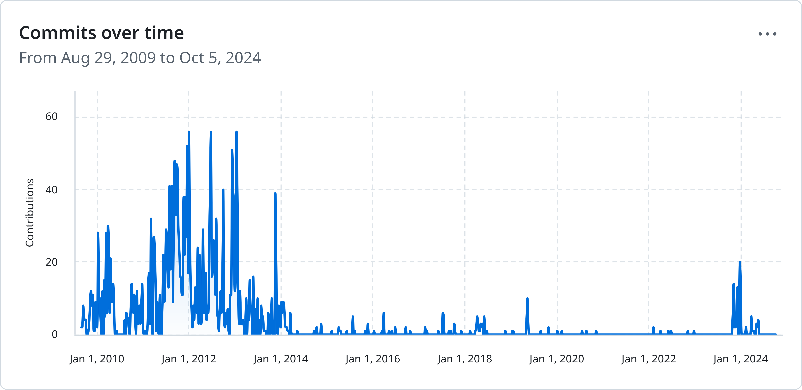

# The Next 10 Years of **Overtone**
{:#title}

Clojure/conj 2024, Washington DC
{:.location}

Arne Brasseur, @plexus@toot.cat
{:.me}

----

```git
$ git log --reverse | head -4 

commit 83db1b9ad1df92d964d7c3d77dd43634d32182e3
Author:  Jeff Rose <rosejn@gmail.com>
Date:    Wed Sep 2 17:26:51 2009 +0200

    first commit
```

----

# **Overtone**

----

> Overtone is an open source audio environment designed to explore new musical
> ideas from **synthesis** and sampling to instrument building, **live-coding**
> and collaborative jamming. We combine the powerful <strong>SuperCollider audio
> engine</strong>, with Clojure, a state of-the-art lisp, to create an
> intoxicating interactive sonic experience.

----



----

## My Overtone story

- Started learning Clojure Spring of 2013
- Overtone is what really got me hooked
- Revisited it every so often to do some creative coding

----

## Fast Forward to 2023

- Try to run my old Overtone code, and can't get it to boot
- Version on Clojars is from 2019, and is broken
- Bit more luck with latest git version, but still many issues

----

## Sad Face

----

- Managed to get a hold of Sam, got commit bit and permission to do releases
- Did a new release with accrued improvements (0.10.6)
- Spent the winter of 2023-2024 cleaning things up
- Three more releases since

---

- Dropped libscsynth
- Improved Supercollider boot/connect logic
- PipeWire (as a Jack server)
- Java
- Lots of docstrings
- More consistent modern style
- Merged some (very) old PRs
- Tried to clean up some issues (still _many_ left open)

----

```
$ git diff --stat 0.10.6..0.11.0
57 files changed, 1302 insertions(+), 303 deletions(-)

$ git diff --stat 0.11.0..v0.14.3199
113 files changed, 3741 insertions(+), 2908 deletions(-)
```

----

## Result: Overtone actually "just works"

----

## Spelunking and Archaelogy

----

## What Were They Thinking?

----

## Open for Business
