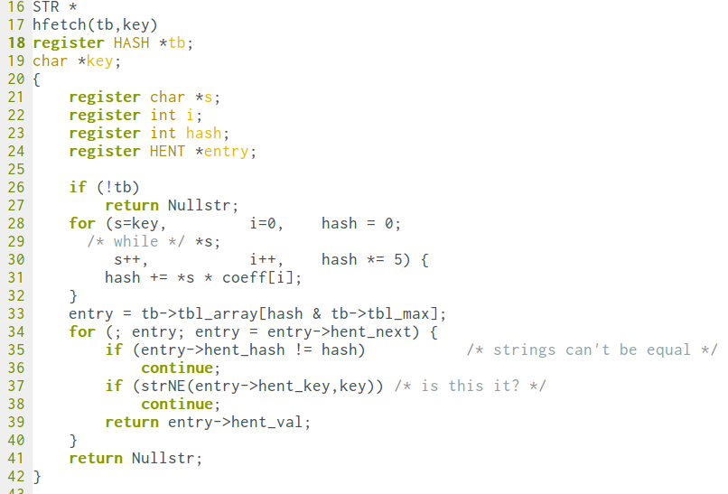

```
commit 8d063cd8450e59ea1c611a2f4f5a21059a2804f1
Author: Larry Wall <lwall@jpl-devvax.jpl.nasa.gov>
Date:   Fri Dec 18 00:00:00 1987 +0000

    a "replacement" for awk and sed
```

Line 16-42 of hash.c, implementing hfetch.

Larry Wall, 1987. C, mostly K&R style. Mixed tabs and spaces. Tab-width: 8.


In this initial implementation of Perl's hash fetch routine a single
pass through the NULL terminated string yields its hash value. Larry
took some creative liberties with the for loop, utilizing C's comma
operator to initialize, and update three variables all at once. In the
pattern of simultaneously updating a string pointer and an index
variable we can recognize an early rendition of what we now know as
`each_with_index`.

The comment "is this it?" puzzles the reader. Was Larry surprised
that, indeed, this was all it took? Had he a sense of anticipation
that maybe an edge case was overlooked? In any case the comment was
left unchanged until Perl 3, two years later.
